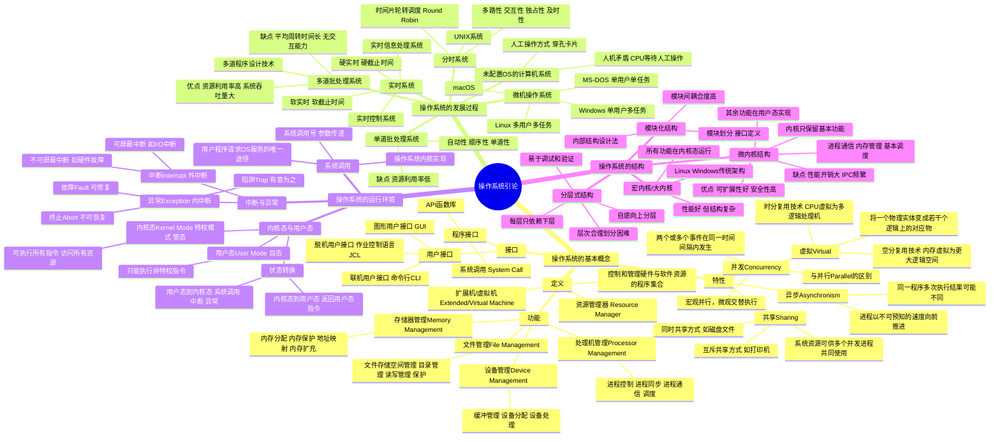

# 第1章 操作系统引论

> **本章题库**：[第01章 真题](真题分类/第01章_操作系统引论_真题.md) | [名校真题汇总](真题分类/名校真题汇总.md)

## 思维导图



---

## 1.1 操作系统的基本概念

### 1.1.1 操作系统的定义

操作系统（Operating System, OS）是管理计算机硬件与软件资源的系统软件，是计算机系统中最基本的系统软件。关于操作系统的定义，有以下经典表述：

| 学者/来源                 | 定义要点                                                                                                                                                                                        |
| ------------------------- | ----------------------------------------------------------------------------------------------------------------------------------------------------------------------------------------------- |
| **Andrew S. Tanenbaum**   | 从两个视角定义：①**资源管理器**（Resource Manager）：管理并分配CPU时间、内存空间、I/O设备、文件等资源；②**扩展机/虚拟机**（Extended/Virtual Machine）：为用户提供比裸机更方便、更强大的使用界面 |
| **Silberschatz & Galvin** | 操作系统是一组控制和管理计算机硬件与软件资源、合理地对各类作业进行调度，以及方便用户使用的程序的集合                                                                                            |
| **国产教材（汤小丹等）**  | 操作系统是一组能有效地组织和管理计算机硬件与软件资源，合理地对各类作业进行调度，以及方便用户使用的程序的集合                                                                                    |

**操作系统的两个基本视角：**

1. **从系统角度看**：操作系统是资源管理者（ResourceManager），负责分配和管理CPU、内存、I/O设备、文件等资源。
2. **从用户角度看**：操作系统是用户与硬件之间的桥梁，提供一个比裸机功能更强、使用更方便的虚拟机。

> **注意**：操作系统本身也是系统软件，但不同于普通应用软件，它常驻内存、管理硬件，是其他软件运行的基础。

### 1.1.2 操作系统的四大特性

#### （1）并发（Concurrency）

**定义**：指两个或多个事件在同一**时间间隔**内发生。

- **宏观上**：多个程序"同时"在运行
- **微观上**：单CPU上实际上是交替执行的（分时轮流）

**并发 vs 并行（Parallelism）的区别：**

| 比较项   | 并发                    | 并行                  |
| -------- | ----------------------- | --------------------- |
| 含义     | 同一时间间隔内发生      | 同一时刻发生          |
| 硬件要求 | 单CPU即可实现           | 需要多核/多CPU        |
| 实现方式 | 时间片轮转、交替执行    | 真正同时执行          |
| 举例     | 一个CPU交替运行多个进程 | 多核CPU各运行一个进程 |

> **并发性是操作系统最重要的特征**，引入并发使得资源利用率大幅提高，但也带来了资源竞争、数据不一致等问题，需要OS来协调。

#### （2）共享（Sharing）

**定义**：系统中的资源可供内存中多个并发执行的进程共同使用。

**两种共享方式：**

| 共享方式                         | 说明                               | 举例                     |
| -------------------------------- | ---------------------------------- | ------------------------ |
| **互斥共享（Mutual Exclusion）** | 同一时刻只允许一个进程访问该资源   | 打印机、扫描仪           |
| **同时共享（Simultaneous）**     | 在一段时间内允许多个进程"同时"访问 | 磁盘文件（宏观同时读写） |

> 并发和共享是操作系统的两个**最基本特征**，二者互为存在条件。

#### （3）虚拟（Virtual）

**定义**：将一个物理实体变成若干个逻辑上的对应物。

**两种虚拟技术：**

| 技术                                        | 说明                       | 举例                                             |
| ------------------------------------------- | -------------------------- | ------------------------------------------------ |
| **时分复用（Time-Division Multiplexing）**  | 将物理设备在时间上分片复用 | CPU虚拟为多个逻辑处理机（多进程感觉各自独占CPU） |
| **空分复用（Space-Division Multiplexing）** | 将物理资源在空间上划分复用 | 内存虚拟为更大的逻辑地址空间（虚拟内存技术）     |

#### （4）异步（Asynchronism）

**定义**：进程是以用户不可预知的速度向前推进的。

- 多道程序环境下，由于资源竞争和并发，进程的执行不是"一气呵成"的，而是"走走停停"的
- 同一程序多次运行，其执行顺序和完成时间可能不同
- 操作系统必须保证程序在多次运行时获得**相同的结果**（确定性）

> 异步性是并发性的必然结果，OS需要通过进程同步等机制来保证程序执行的正确性。

### 1.1.3 操作系统的四大功能

#### （1）处理机管理（Processor Management）

- **进程控制**：创建、撤销、阻塞、唤醒进程
- **进程同步**：协调多个进程的执行顺序，解决资源竞争
- **进程通信**：在进程间传递信息
- **处理机调度**：按照一定算法将CPU分配给就绪进程（作业调度、进程调度、中级调度）

#### （2）存储器管理（Memory Management）

| 功能         | 说明                                           |
| ------------ | ---------------------------------------------- |
| **内存分配** | 为程序运行分配内存空间（连续/非连续分配）      |
| **内存保护** | 防止用户程序访问OS内核区域或其他进程的内存空间 |
| **地址映射** | 逻辑地址到物理地址的转换（重定位）             |
| **内存扩充** | 通过虚拟内存技术从逻辑上扩大内存容量           |

#### （3）设备管理（Device Management）

| 功能                     | 说明                                             |
| ------------------------ | ------------------------------------------------ |
| **缓冲管理**             | 在CPU与I/O设备之间设置缓冲区，缓解速度不匹配问题 |
| **设备分配**             | 根据一定策略分配设备（独占/共享/虚拟设备）       |
| **设备处理（驱动程序）** | 直接控制设备完成I/O操作                          |

#### （4）文件管理（File Management）

| 功能                 | 说明                                     |
| -------------------- | ---------------------------------------- |
| **文件存储空间管理** | 为文件分配外存空间，管理空闲空间         |
| **目录管理**         | 通过目录结构组织和检索文件               |
| **文件读/写管理**    | 控制文件的读写操作                       |
| **文件保护**         | 控制用户对文件的访问权限（读、写、执行） |

### 1.1.4 操作系统的两类接口

| 接口类型     | 说明                         | 举例                                                                   |
| ------------ | ---------------------------- | ---------------------------------------------------------------------- |
| **用户接口** | 提供给用户操作计算机的界面   | 命令行界面(CLI)、图形用户界面(GUI)、批处理命令(JCL)                    |
| **程序接口** | 提供给程序员请求OS服务的接口 | **系统调用（System Call）**，如 Linux 的 `fork()`、`read()`、`write()` |

**用户接口的三种形式：**

1. **联机用户接口（命令行CLI）**：用户通过终端输入命令，OS解释执行
2. **脱机用户接口（批处理JCL）**：用户将作业和控制命令写成作业说明书提交，OS自动执行（如DCL、JCL）
3. **图形用户接口（GUI）**：通过窗口、图标、菜单、鼠标操作与系统交互（WIMP范式）

---

## 1.2 操作系统的发展过程

### 1.2.1 未配置操作系统的计算机系统

**人工操作阶段（1940s~1950s）：**

- 程序员将程序写在穿孔纸带/卡片上
- 由操作员手工装入计算机
- **人机矛盾严重**：CPU在等待人工操作时完全空闲
- CPU运行速度与人工操作速度之间存在严重的速度不匹配

**矛盾**：高速的CPU等待低速的I/O设备和人工操作，资源利用率极低。

### 1.2.2 单道批处理系统（Simple Batch Processing）

**核心思想**：在监控程序（Monitor）的控制下，计算机自动顺序地从作业流中读取、执行作业，无需人工干预。

**三大特征：**

| 特征       | 说明                                   |
| ---------- | -------------------------------------- |
| **自动性** | 作业自动依次执行，无需人工干预         |
| **顺序性** | 各作业按提交顺序依次执行（先到先服务） |
| **单道性** | 内存中始终只有一道作业在运行           |

**优点**：减少了CPU的空闲等待时间。

**缺点**：

- 内存中只有一道作业，当作业需要I/O时，CPU仍然空闲等待
- **资源利用率仍然很低**

### 1.2.3 多道批处理系统（Multiprogrammed Batch Processing）

**核心思想**：在内存中同时存放多道作业，当一道作业因等待I/O而阻塞时，CPU立即切换到另一道就绪作业，使CPU和I/O设备都尽可能保持忙碌。

**工作原理示意：**

```
作业A: 计算 ████░░░░░░████░░░░
作业B:       ░░░░████░░░░░░████
作业C:             ░░░░████░░░░░░
CPU:     ████████████████████████
I/O:     ░░░░░░░░████░░░░░░████
         ↑ ↑↑↑↑        ↑↑↑↑
         交替执行，CPU利用率大幅提高
```

**优点：**

| 优点             | 说明                       |
| ---------------- | -------------------------- |
| **资源利用率高** | CPU和I/O设备交替忙碌工作   |
| **系统吞吐量大** | 单位时间内完成的作业数增加 |

**缺点：**

| 缺点               | 说明                       |
| ------------------ | -------------------------- |
| **平均周转时间长** | 作业需在后备队列中等待     |
| **无交互能力**     | 用户无法与作业进行交互操作 |

> **多道程序设计（Multiprogramming）** 是操作系统发展史上最重要的概念之一。其本质是利用 **I/O等待时间** 让CPU服务其他作业。

**需要解决的关键问题：**

1. 处理机管理问题
2. 内存管理问题（多道作业同时驻留内存）
3. I/O设备分配问题
4. 文件管理问题
5. 作业管理问题

### 1.2.4 分时系统（Time-Sharing System）

**定义**：在一台主机上连接多个终端，同时允许多个用户通过终端以交互方式使用计算机，每个用户都感觉自己"独占"了一台计算机。

**三大特征：**

| 特征                        | 说明                                       |
| --------------------------- | ------------------------------------------ |
| **多路性（Multitenancy）**  | 多个用户同时使用同一台主机                 |
| **交互性（Interactivity）** | 用户通过终端与系统进行人机对话             |
| **独占性（Independence）**  | 每个用户感觉独占一台主机（通过时间片实现） |
| **及时性（Timeliness）**    | 用户的请求能在较短时间内得到响应           |

**关键技术：时间片轮转调度（Round Robin）**

```
用户1: [0.1s] → 用户2: [0.1s] → 用户3: [0.1s] → 用户1: [0.1s] → ...
        ↑                                            ↑
        ←──────── 一个时间片轮转周期 ────────────────→
```

**典型代表：UNIX系统**

- 1969年由Ken Thompson和Dennis Ritchie在Bell Lab开发
- 最早的分时操作系统之一

### 1.2.5 实时系统（Real-Time System）

**定义**：系统能够在确定的时间范围内对外部事件做出响应的系统。

**两种类型：**

| 类型                 | 说明                                         | 举例                                 |
| -------------------- | -------------------------------------------- | ------------------------------------ |
| **实时控制系统**     | 要求计算机将测量数据进行实时处理并驱动执行器 | 工业过程控制、自动驾驶、导弹制导     |
| **实时信息处理系统** | 要求对信息进行及时的检索和处理               | 航空订票系统、银行交易系统、股票交易 |

**两种实时要求：**

| 类型                         | 截止时间                     | 说明                               |
| ---------------------------- | ---------------------------- | ---------------------------------- |
| **硬实时（Hard Real-Time）** | 硬截止时间，绝对不允许超出   | 火车刹车控制、心脏起搏器、飞行控制 |
| **软实时（Soft Real-Time）** | 软截止时间，偶尔超出可以接受 | 网页浏览、视频播放、在线游戏       |

**实时系统与分时系统的比较：**

| 比较项   | 分时系统               | 实时系统                       |
| -------- | ---------------------- | ------------------------------ |
| 目标     | 为多用户提供交互式服务 | 对特定事件做出快速、确定性响应 |
| 响应时间 | 秒级（可接受）         | 毫秒甚至微秒级（必须保证）     |
| 交互性   | 重要目标               | 不是主要目标                   |
| 可靠性   | 重要                   | **极其重要**（关系生命安全）   |
| 时间片   | 固定或可变             | 严格的优先级调度               |

### 1.2.6 微机操作系统

| 代表系统    | 特点                           | 发展脉络                  |
| ----------- | ------------------------------ | ------------------------- |
| **CP/M**    | 最早的微机OS之一（1974年）     | 被MS-DOS取代              |
| **MS-DOS**  | 单用户、单任务、字符界面       | Microsoft为IBM PC开发     |
| **Windows** | 单用户多任务、图形界面、GUI    | Windows 1.0→XP→10→11      |
| **Linux**   | 多用户多任务、开源免费、类UNIX | Linus Torvalds 1991年创建 |
| **macOS**   | 多用户多任务、基于UNIX内核     | Apple开发，基于Darwin内核 |
| **Android** | 基于Linux内核的移动设备OS      | Google开发，开源          |
| **iOS**     | 基于Darwin内核的移动设备OS     | Apple开发                 |

---

## 1.3 操作系统的运行环境

### 1.3.1 内核态与用户态

为保护操作系统内核不受用户程序的破坏，CPU设置两种运行状态：

| 特性         | 内核态（Kernel Mode）                | 用户态（User Mode）                      |
| ------------ | ------------------------------------ | ---------------------------------------- |
| **别名**     | 管态、特权模式、系统模式             | 目态、用户模式                           |
| **权限**     | 可执行**所有指令**，访问**所有资源** | 只能执行**非特权指令**，访问**受限资源** |
| **运行内容** | 操作系统内核代码                     | 用户应用程序代码                         |
| **状态位**   | PSW中模式位 = 0                      | PSW中模式位 = 1                          |
| **内存访问** | 可访问全部内存空间                   | 只能访问用户空间                         |
| **I/O操作**  | 可直接执行I/O操作                    | 不能直接执行I/O操作                      |

**状态转换：**

```
用户态 ─────────────────→ 内核态
        系统调用 / 中断 / 异常 / 陷入

内核态 ─────────────────→ 用户态
        执行返回用户态指令（如 IRET）
```

**何时进入内核态？**

1. **系统调用（System Call）**：用户程序主动请求OS服务
2. **中断（Interrupt）**：外部设备发出的信号（如I/O完成）
3. **异常（Exception）**：CPU执行指令时发生的错误（如缺页、除零）
4. **陷入（Trap）**：调试断点等有意触发

> **特权指令**举例：I/O指令、设置时钟、关中断、修改PSW、停机指令等。若用户态程序试图执行特权指令，CPU将产生**陷入（Trap）**，由OS进行处理（通常终止该程序）。

### 1.3.2 中断与异常

**中断（Interrupt）/外中断：**

- 来自CPU**外部**的事件
- 与当前正在执行的指令无关
- **可屏蔽中断**：可被OS暂时忽略（如键盘输入、鼠标移动）
- **不可屏蔽中断（NMI）**：OS必须立即处理（如硬件故障、电源掉电）

**异常（Exception）/内中断：**

- 来自CPU**内部**的事件
- 由当前正在执行的指令引起

| 异常类型 | 英文名 | 说明                               | 可否修复                 |
| -------- | ------ | ---------------------------------- | ------------------------ |
| **故障** | Fault  | 可能被修复的异常（如缺页中断）     | 是，修复后重新执行该指令 |
| **陷阱** | Trap   | 有意触发的异常（如系统调用、断点） | 是，执行下一条指令       |
| **终止** | Abort  | 不可恢复的致命错误（如硬件故障）   | 否，终止该进程或系统     |

**中断处理过程：**

1. 关中断（保护现场期间不再响应新中断）
2. 保存断点（程序计数器PC和程序状态字PSW入栈）
3. 识别中断源
4. 保存现场（通用寄存器等）
5. 执行中断处理程序
6. 恢复现场
7. 开中断，返回断点继续执行

### 1.3.3 系统调用

**定义**：操作系统提供给应用程序的接口，是用户程序**请求OS服务的唯一途径**。

**系统调用的执行过程：**

```
用户程序                OS内核
   │                     │
   │ ① 执行系统调用指令    │
   │ ────Trap陷入────→    │
   │                     │ ② 检查系统调用号
   │                     │ ③ 获取用户传递的参数
   │                     │ ④ 执行相应的内核功能
   │                     │ ⑤ 将结果放回用户空间
   │ ←─────返回──────────  │
   │ ⑥ 继续执行用户程序    │
```

**系统调用分类：**

| 分类         | 常见系统调用举例                         |
| ------------ | ---------------------------------------- |
| **进程控制** | `fork()`, `exec()`, `exit()`, `wait()`   |
| **文件操作** | `open()`, `read()`, `write()`, `close()` |
| **设备管理** | `ioctl()`, `read()`, `write()`           |
| **内存管理** | `brk()`, `mmap()`, `munmap()`            |
| **信息维护** | `getpid()`, `time()`, `alarm()`          |
| **通信**     | `pipe()`, `shmget()`, `socket()`         |
| **保护**     | `chmod()`, `chown()`, `umask()`          |

> **系统调用与函数调用的区别**：
>
> - 函数调用运行在**用户态**，系统调用通过**陷入**切换到内核态
> - 函数调用的开销小，系统调用需要**模式切换**，开销大
> - 函数调用不涉及特权级变化，系统调用涉及**CPU特权级从用户态切换到内核态**

---

## 1.4 操作系统的结构

### 1.4.1 模块化结构（Modular Structure）

**设计方法**：内部结构设计法，将OS按功能划分为若干模块。

**特点：**

- 将OS分解为若干相对独立的模块
- 通过定义良好的接口进行模块间通信
- **主要缺点**：模块间耦合度高，一个模块的错误可能扩散到其他模块；模块间的关系复杂，难以理清调用关系

**举例：** 早期的UNIX系统就采用了模块化结构，包含进程管理模块、存储管理模块、文件系统模块、I/O模块等。

### 1.4.2 分层式结构（Layered Structure）

**设计方法**：将OS分为若干层，每层只使用其下层提供的功能和服务。

**典型分层（自底向上）：**

```
第N层 用户接口
  ↑
第4层  外部设备管理
  ↑
第3层  通信管理（进程通信）
  ↑
第2层  内存管理
  ↑
第1层  处理机调度/CPU管理
  ↑
第0层  硬件（裸机）
```

**优点：**

- 易于调试：可以在某层发现和定位错误
- 易于验证：从底层开始逐层验证正确性
- 每层只依赖下层，接口清晰

**缺点：**

- 层次划分困难：需要精心设计各层的边界
- 某些功能（如中断处理）需要跨越多个层次，效率较低
- 层数较多时，系统效率可能下降

> **代表系统**：THE系统（Dijkstra设计，1968年）、IBM OS/2、Windows NT早期版本

### 1.4.3 微内核结构（Microkernel）

**设计思想**：将OS的核心功能移到微内核中，其余功能以服务的形式在用户态运行。

**微内核只保留最基本的功能：**

- 进程间通信（IPC）
- 基本的内存管理
- 基本的进程调度
- 中断处理

**其他功能（在用户态作为服务进程运行）：**

- 设备驱动程序
- 文件系统
- 网络协议栈
- 用户管理

**微内核 vs 宏内核（大内核）对比：**

| 比较项       | 微内核（Microkernel）                  | 宏内核/大内核（Monolithic Kernel）         |
| ------------ | -------------------------------------- | ------------------------------------------ |
| **内核大小** | 小（仅包含核心功能）                   | 大（包含所有内核功能）                     |
| **运行模式** | 大部分服务在用户态                     | 所有内核服务在内核态                       |
| **可扩展性** | 好（新服务在用户态添加）               | 差（需要修改内核代码）                     |
| **安全性**   | 高（服务隔离，一个服务崩溃不影响其他） | 低（一个内核模块出错可能导致整个系统崩溃） |
| **性能**     | 较低（频繁的IPC上下文切换）            | 较高（直接函数调用，无需模式切换）         |
| **可靠性**   | 高（微内核代码量小，易于验证）         | 较低（内核代码庞大，难以全面验证）         |
| **代表系统** | Minix、QNX、L4、Mach                   | Linux、传统UNIX、Windows（混合型）         |

> **现代趋势**：越来越多的系统采用**混合型内核（Hybrid Kernel）**结构，结合微内核和宏内核的优点，如Windows NT、macOS（XNU内核）。

### 1.4.4 其他OS结构

| 结构                               | 说明                                                 |
| ---------------------------------- | ---------------------------------------------------- |
| **外核（Exokernel）**              | 比微内核更激进，内核只负责资源保护，不做资源分配     |
| **虚拟机监控器（VMM/Hypervisor）** | 在物理硬件之上运行多个虚拟机，每个虚拟机运行自己的OS |
| **库操作系统（Library OS）**       | OS功能以库的形式链接到应用程序中                     |

---

## 常见考点

### 考点1：操作系统的基本概念辨析

1. **并发与并行的区别**：并发是同一时间间隔内发生，需要交替执行；并行是同一时刻发生，需要多CPU/多核
2. **四大特性的关系**：并发性和共享性是操作系统最基本的两个特征，二者互为存在条件；虚拟性和异步性是并发和共享的延伸
3. **操作系统的定义**：从资源管理器和扩展机两个角度理解

### 考点2：各类操作系统对比

| 特征           | 单道批处理 | 多道批处理 | 分时系统   | 实时系统    |
| -------------- | ---------- | ---------- | ---------- | ----------- |
| 内存驻留作业数 | 1道        | 多道       | 多个用户   | 一个或多个  |
| 交互性         | 无         | 无         | 有         | 弱          |
| 响应时间       | —          | 较长       | 秒级       | 毫秒/微秒级 |
| 典型调度算法   | FCFS       | FCFS       | 时间片轮转 | 优先级调度  |

### 考点3：系统态与用户态

- **何时从用户态转为内核态**：系统调用、中断、异常
- **哪些指令是特权指令**：I/O指令、关中断指令、修改PSW指令、停机指令
- **用户态执行特权指令的后果**：产生陷入（Trap），由OS处理（通常终止程序）

### 考点4：中断处理过程

关中断→保存断点→识别中断源→保存现场→执行中断处理程序→恢复现场→开中断→返回断点

### 考点5：操作系统结构对比

| 结构   | 优点             | 缺点               |
| ------ | ---------------- | ------------------ |
| 模块化 | 易于开发         | 耦合度高           |
| 分层式 | 易于调试验证     | 层次划分难，效率低 |
| 微内核 | 安全可靠，可扩展 | 性能开销大         |
| 宏内核 | 性能好           | 结构复杂，可靠性差 |

### 考点6：多道程序设计的意义

- 多道程序设计的目的是**提高资源利用率和系统吞吐量**
- 引入多道程序设计后，**程序的执行时间不一定缩短**，甚至可能增加（因为需要等待更多资源竞争）
- 多道程序设计增加了**系统开销**（上下文切换、内存管理等）
