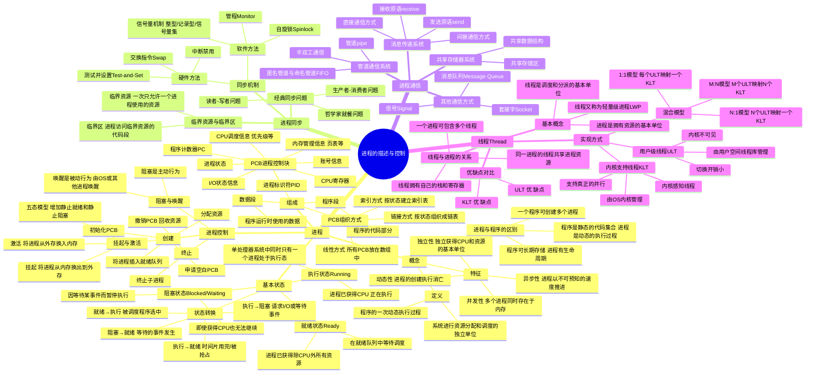
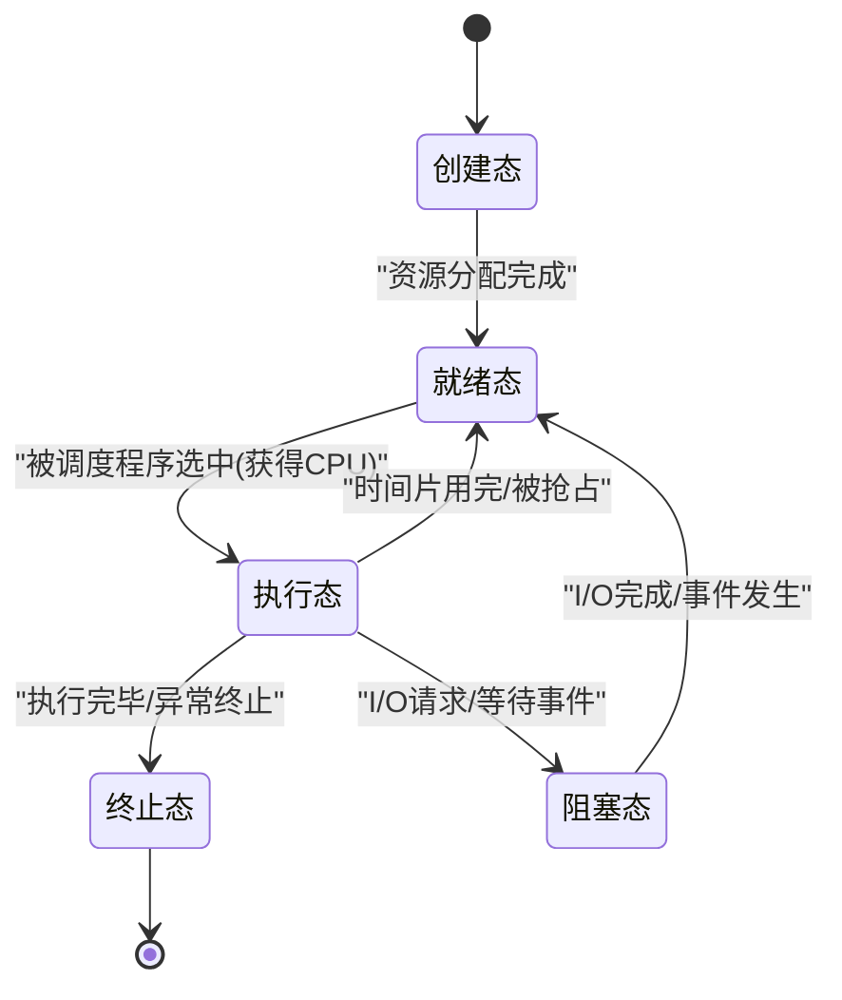
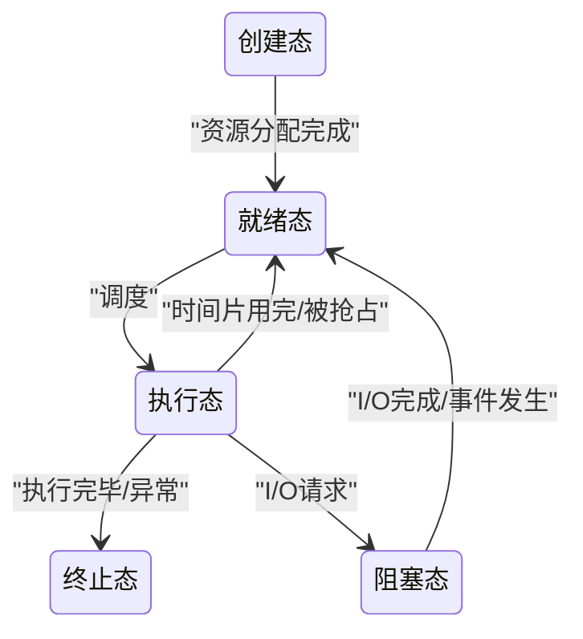
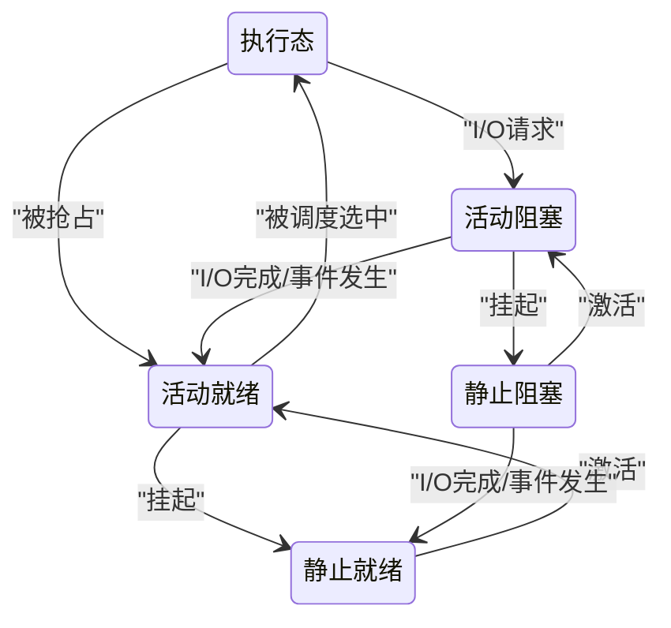
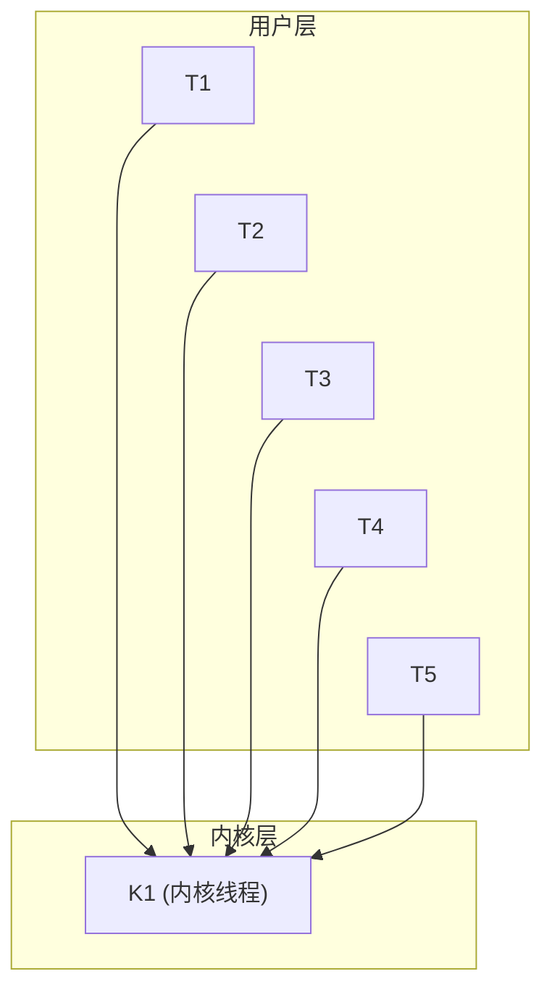
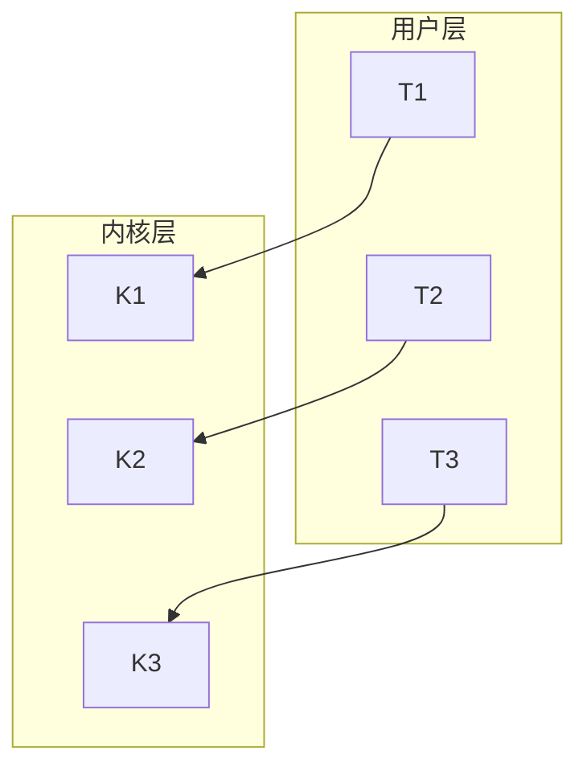
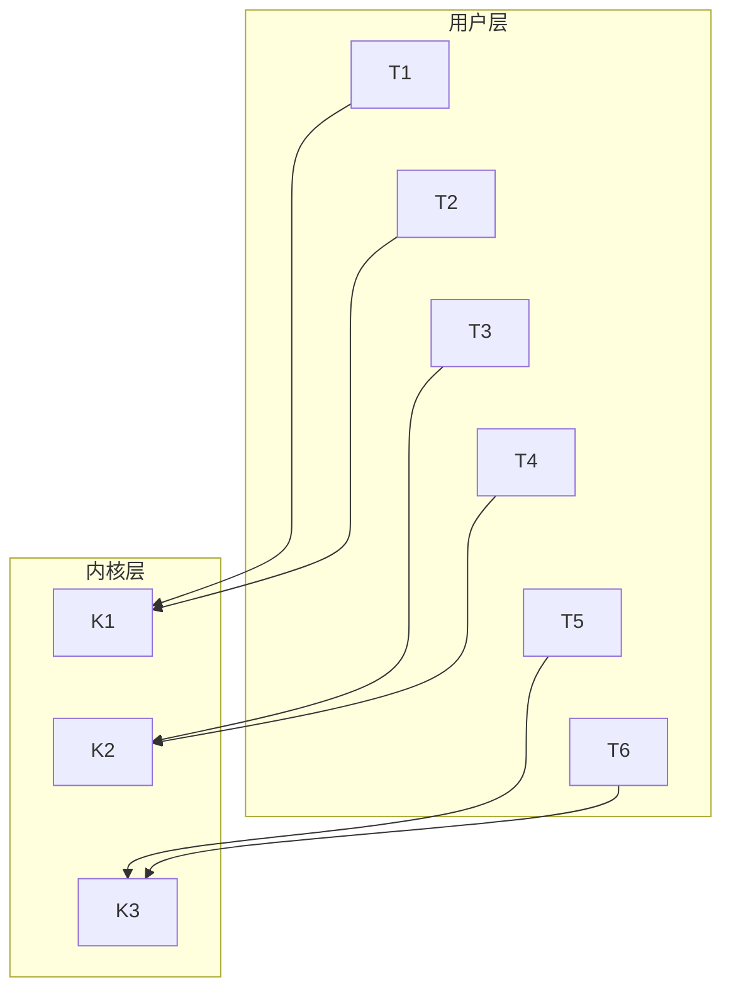

# 第2章 进程的描述与控制

> **本章题库**：[第02章 真题](真题分类/第02章_进程的描述与控制_真题.md) | [名校真题汇总](真题分类/名校真题汇总.md)

## 思维导图



---

## 2.1 进程的基本概念

### 2.1.1 进程的定义

进程（Process）是操作系统中最核心的概念之一。关于进程的定义，有以下经典表述：

| 学者/来源 | 定义要点 |
|-----------|---------|
| **Silberschatz & Galvin** | 一个正在执行中的程序的实例，包括当前活动（PC、寄存器值）和相关资源集合 |
| **Andrew S. Tanenbaum** | 进程是程序的一次执行过程，是系统进行资源分配和调度的独立单位 |
| **汤小丹等（国产教材）** | 进程是程序的一次动态执行过程，是系统进行资源分配和调度的独立单位 |

**完整定义（四个要素）：**

进程是**程序**的一次**动态**执行过程，是系统进行**资源分配**和**调度**的**独立单位**。进程由以下部分组成：

1. **PCB（进程控制块）**
2. **程序段（Code Segment）**
3. **数据段（Data Segment）**

> 一句话理解：程序是"菜谱"，进程是"按照菜谱做菜的整个过程"。

### 2.1.2 进程与程序的区别

| 比较维度 | 程序（Program） | 进程（Process） |
|---------|----------------|----------------|
| **本质** | 静态的代码和数据集合 | 程序的一次动态执行过程 |
| **存在形式** | 存储在磁盘上（二进制文件） | 占据内存，是资源分配的单位 |
| **生命周期** | 长期存在，不随执行变化 | 动态创建、调度、消亡 |
| **并发性** | 无并发概念 | 多个进程可并发执行 |
| **对应关系** | 一个程序可创建多个进程 | 一个进程只对应一个程序实例 |
| **组成** | 代码和数据 | PCB + 程序段 + 数据段 |
| **状态** | 无状态概念 | 有创建、就绪、执行、阻塞、终止等状态 |
| **所属单位** | 操作系统中的文件 | 内存中的实体，是OS管理的基本单位 |

**经典表述：**
- 程序是**静态的**，进程是**动态的**
- 程序是**永久的**（存于外存），进程是**临时的**（存在于内存）
- 进程是程序在数据集上的一次**执行活动**
- 程序是**制作过程的描述**，进程是**制作过程本身**

### 2.1.3 进程的特征

| 特征 | 说明 | 举例 |
|------|------|------|
| **动态性** | 进程具有生命周期：创建→执行→消亡 | 一个程序可以被多次执行，每次创建一个新的进程 |
| **并发性** | 多个进程可以同时存在于内存中，并发执行 | 同时运行浏览器、编辑器、音乐播放器 |
| **独立性** | 进程是系统进行资源分配和调度的独立单位 | 每个进程拥有独立的地址空间和资源 |
| **异步性** | 进程的执行速度不可预知，各进程走走停停 | CPU调度导致进程的执行是间断的 |

> **并发性**是进程最重要的特征，也是引入进程的**根本原因**。

---

## 2.2 进程的基本状态与转换

### 2.2.1 进程的三种基本状态

#### （1）就绪态（Ready）

- **定义**：进程已获得除CPU以外的所有必需资源，处于**准备执行**的状态
- **条件**：只要获得CPU，进程就能立即执行
- **位置**：多个就绪进程排列在**就绪队列**中，等待调度
- **进入条件**：创建完成、从执行态被抢占、从阻塞态被唤醒

#### （2）执行态（Running）

- **定义**：进程已获得CPU，其程序正在执行
- **特点**：在**单处理器系统**中，任何时刻**最多只有一个**进程处于执行态
- **在多处理器系统**中，可以有多个进程同时处于执行态
- **进入条件**：被调度程序选中，从就绪队列中取出

#### （3）阻塞态（Blocked / Waiting）

- **定义**：因发生某事件而使进程的执行受到**阻塞**，即使给它CPU也无法继续执行
- **又称**：等待态（Waiting）
- **进入条件**：请求I/O操作、等待同步信号、等待某事件发生
- **位置**：多个阻塞进程排列在**阻塞队列**中

### 2.2.2 进程状态转换图



**六个状态转换条件详解：**

| 转换方向 | 转换原因 | 说明 |
|---------|---------|------|
| **就绪态 → 执行态** | 被调度程序选中 | 调度程序根据调度算法（FCFS、SJF、RR等）从就绪队列中选中该进程 |
| **执行态 → 就绪态** | 时间片用完 / 被高优先级进程抢占 | 时间片轮转调度中时间片耗尽；或实时系统中高优先级进程到来 |
| **执行态 → 阻塞态** | 请求I/O操作 / 等待事件发生 | 进程主动放弃CPU，进入等待（如调用`read()`等待输入） |
| **阻塞态 → 就绪态** | I/O完成 / 等待的事件发生 | I/O操作完成后，由OS或中断处理程序唤醒该进程，放入就绪队列 |
| **创建 → 就绪态** | 进程创建完成 | 新进程创建完毕并初始化PCB后，进入就绪队列 |
| **执行态 → 终止** | 进程执行完毕 / 发生不可恢复的错误 | OS回收该进程的所有资源，撤销PCB |

**关键约束（容易出错的考点）：**

1. **阻塞态 → 执行态** ❌ **不可能直接转换**，必须先变为就绪态
2. **就绪态 → 阻塞态** ❌ **不可能**，只有正在执行的进程才能请求I/O而阻塞
3. **执行态**是唯一可以**自发改变**状态的（主动阻塞或被动被抢占）

### 2.2.3 五态模型与七态模型

**五态模型**（在三态基础上增加创建态和终止态）：



**七态模型**（在五态基础上增加挂起状态）：

| 新增状态 | 说明 |
|---------|------|
| **静止就绪态（Suspended Ready）** | 进程在外存中，已具备执行条件，等待换入内存 |
| **静止阻塞态（Suspended Blocked）** | 进程在外存中，等待某个事件发生 |

**挂起的原因：**
1. 用户需要调试程序
2. 父进程需要检查子进程状态
3. 操作系统需要将不活动的进程换出到外存，以释放内存
4. 系统负载过重，需要减少内存中的进程数

---

## 2.3 进程控制

进程控制是进程管理的基础功能，主要由操作系统内核中的**原语（Primitive）**实现。原语是原子操作，执行期间不可中断。

### 2.3.1 进程的创建

**引起创建进程的事件：**
1. 用户登录（交互式系统）
2. 作业调度（批处理系统）
3. 提供服务（如打印服务进程）
4. 应用请求（父进程创建子进程）

**进程创建的过程：**

| 步骤 | 操作 | 说明 |
|------|------|------|
| 1 | 申请空白PCB | 从PCB集合中获取一个空闲PCB |
| 2 | 分配资源 | 为进程分配必要的内存、I/O设备等资源 |
| 3 | 初始化PCB | 设置进程标识符、初始状态（就绪态）、程序计数器、优先级等 |
| 4 | 建立链接 | 将新进程插入就绪队列 |

**PCB初始化内容：**

```
┌──────────────────────────────────────────┐
│ PCB初始化                                │
├──────────────────────────────────────────┤
│ • 进程标识符PID（唯一标识）               │
│ • 父进程标识符PPID                       │
│ • 进程状态 → 设置为"就绪态"              │
│ • 程序计数器PC → 指向程序入口地址         │
│ • CPU寄存器 → 全部清零                   │
│ • CPU调度信息 → 设置优先级、时间片等       │
│ • 内存管理信息 → 设置页表指针、基址等      │
│ • I/O状态信息 → 已分配设备列表、打开文件   │
│ • 账号信息 → CPU使用时间计数器            │
└──────────────────────────────────────────┘
```

**Linux中的进程创建：`fork()` + `exec()`**

```c
pid_t pid = fork();    // 创建子进程，复制父进程
if (pid == 0) {
    // 子进程
    exec("/bin/ls", args);  // 加载新程序，替换子进程的地址空间
} else if (pid > 0) {
    // 父进程
    wait(NULL);            // 等待子进程结束
} else {
    // 创建失败
    perror("fork failed");
}
```

> **`fork()`的特点**：调用一次，返回两次。在父进程中返回子进程PID，在子进程中返回0。子进程获得父进程地址空间的副本（写时复制 Copy-on-Write）。

### 2.3.2 进程的终止

**引起进程终止的事件：**

| 事件类型 | 具体情况 |
|---------|---------|
| **正常结束** | 程序执行到最后的`exit()`/`return`语句 |
| **异常结束** | 越界错误、非法指令、除以零、运行超时、I/O故障 |
| **外界干预** | 父进程终止子进程（如`kill()`）、父进程请求终止子进程、OS强制终止（如内存不足） |

**进程终止的过程：**

1. **检索PCB**，获取进程状态
2. 若该进程处于执行态，则**立即终止**该进程的执行
3. **终止所有子进程**（级联终止）
4. 将该进程拥有的**资源归还**给父进程或OS
5. **删除PCB**

### 2.3.3 进程的阻塞与唤醒

**阻塞（Block）—— 主动行为：**

进程**自己**调用阻塞原语，主动放弃CPU。

**阻塞过程：**
1. 进程调用阻塞原语`block()`
2. 停止执行该进程
3. 将进程状态从"执行态"改为"阻塞态"
4. 将该进程的PCB插入相应的**阻塞队列**

**唤醒（Wakeup）—— 被动行为：**

由**其他进程**或**OS的中断处理程序**唤醒。

**唤醒过程：**
1. 在阻塞队列中找到被唤醒进程的PCB
2. 将其状态从"阻塞态"改为"就绪态"
3. 将该进程的PCB插入**就绪队列**

> **重要规则**：阻塞和唤醒必须**成对出现**。一个进程被阻塞后，必须由另一个进程来唤醒。**不能自己唤醒自己**。

### 2.3.4 进程的挂起与激活

**挂起（Suspend）：**

| 步骤 | 操作 |
|------|------|
| 1 | 在内存中找到被挂起进程的PCB |
| 2 | 将该进程的状态改为"静止就绪"或"静止阻塞" |
| 3 | 将该进程的全部或部分内存空间**换出到外存**（对换） |
| 4 | 修改PCB中的相关信息 |

**激活（Activate）：**

| 步骤 | 操作 |
|------|------|
| 1 | 将目标进程从外存换入内存 |
| 2 | 检查进程状态：若为静止就绪则改为活动就绪；若为静止阻塞则改为活动阻塞 |
| 3 | 将PCB插入相应队列 |

**挂起状态的转换图：**



---

## 2.4 进程的组织

### 2.4.1 进程的三个组成部分

| 组成部分 | 说明 |
|---------|------|
| **PCB（Process Control Block）** | 进程控制块，是进程存在的**唯一标志**，存储OS管理进程所需的全部信息 |
| **程序段（Code Segment）** | 程序的可执行代码，多个进程可以共享同一个程序段（如多个进程运行同一个程序） |
| **数据段（Data Segment）** | 程序运行时使用的数据，包括全局变量、静态变量、动态分配的数据等 |

### 2.4.2 PCB的详细结构

PCB是操作系统中**最重要的数据结构之一**，是进程存在的**唯一标志**。

| 字段类别 | 具体内容 | 说明 |
|---------|---------|------|
| **进程标识符** | PID（内部标识）| OS用来唯一标识进程的编号 |
| | PPID（父进程标识）| 标识创建该进程的父进程 |
| | UID（用户标识）| 标识进程所属的用户 |
| **进程状态** | state | 就绪、执行、阻塞、终止等 |
| **程序计数器** | PC | 指向下一条要执行的指令地址 |
| **CPU寄存器** | 通用寄存器、累加器等 | 上下文切换时需要保存/恢复 |
| **CPU调度信息** | 优先级、队列指针、时间片等 | 用于调度算法的决策 |
| **内存管理信息** | 页表指针、段表指针、基址寄存器、限长寄存器 | 用于地址映射 |
| **I/O状态信息** | 已分配的I/O设备列表、打开文件列表 | I/O资源分配情况 |
| **账号信息** | CPU使用时间、内存使用量、时间限制 | 用于记账和资源限制 |
| **进程间通信信息** | 消息队列指针、信号量、共享内存地址 | 用于进程同步和通信 |
| **进程链接信息** | 前向指针、后向指针 | 用于PCB的组织（链表） |

> **PCB是OS中被访问最频繁的数据结构之一**，通常被放在内存中的特定区域（内核空间），并常驻内存。

### 2.4.3 PCB的组织方式

PCB的数量可能很多，操作系统需要有效的方式来组织和管理这些PCB。

#### （1）线性方式

```
┌──────┬──────┬──────┬──────┬──────┐
│ PCB0 │ PCB1 │ PCB2 │ PCB3 │ PCB4 │ ... → PCB数组
└──────┴──────┴──────┴──────┴──────┘
```

- 所有PCB放在一个**线性数组**中
- 优点：实现简单
- 缺点：查找效率低，需要遍历整个数组

#### （2）链接方式（链表）

```
就绪队列:  [PCB]→[PCB]→[PCB]→[PCB]→NULL
阻塞队列:  [PCB]→[PCB]→[PCB]→NULL
空闲队列:  [PCB]→[PCB]→...→NULL
```

- 按照进程的状态，将PCB组织成**多个链表**
- 就绪队列、阻塞队列（可能有多个，按等待事件细分）、空闲PCB链表
- 优点：按状态分组，便于管理
- 缺点：查找某个特定进程需要遍历链表

#### （3）索引方式

```
索引表:
  ┌─────┐  ┌─────┐  ┌─────┐
  │就绪 │  │阻塞 │  │执行 │
  │指针 │  │指针 │  │指针 │
  └──┬──┘  └──┬──┘  └──┬──┘
     ↓         ↓        ↓
  [PCB]→[PCB] [PCB]   [PCB]
```

- 建立一张**索引表**，表中每一项指向一个PCB链表的首节点
- 优点：查找效率较高
- 缺点：需要维护索引表，占用额外空间

**三种组织方式对比：**

| 组织方式 | 实现 | 优点 | 缺点 | 适用场景 |
|---------|------|------|------|---------|
| 线性方式 | 数组 | 简单，空间连续 | 查找慢（O(n)） | 进程数少且固定 |
| 链接方式 | 链表 | 按状态分组，增删方便 | 需要指针空间，查找慢 | 通用，最常用 |
| 索引方式 | 索引表+链表 | 查找较快 | 需要额外索引空间 | 进程数较多 |

---

## 2.5 进程同步

### 2.5.1 临界资源与临界区

**临界资源（Critical Resource）：** 一次只允许一个进程使用的资源。如打印机、共享变量、共享缓冲区等。

**临界区（Critical Section）：** 每个进程中访问临界资源的那段代码。

```
进程Pi的结构：
┌────────────────────────────┐
│ 进入区（Entry Section）     │  ← 检查是否可以进入临界区
│ 临界区（Critical Section）  │  ← 访问临界资源的代码
│ 退出区（Exit Section）     │  ← 释放临界资源，允许其他进程进入
│ 剩余区（Remainder Section）│  ← 其余代码
└────────────────────────────┘
```

**进程同步机制的四个准则：**

| 准则 | 说明 |
|------|------|
| **空闲让进** | 临界区空闲时，允许一个进程进入 |
| **忙则等待** | 有进程在临界区时，其他进程必须等待 |
| **有限等待** | 对请求进入临界区的进程，应在有限时间内获得进入 |
| **让权等待** | 进程不能进入临界区时，应立即释放CPU（避免忙等待） |

### 2.5.2 硬件同步机制

#### （1）关中断/中断禁用

```c
// 进入临界区
disable_interrupts();    // 关中断
/* 临界区代码 */
enable_interrupts();     // 开中断
```

- **优点**：简单高效
- **缺点**：只适用于单处理器系统；关中断时间过长影响系统效率

#### （2）测试并设置（Test-and-Set, TS）

```c
// 硬件原子指令
bool test_and_set(bool *lock) {
    bool old = *lock;
    *lock = true;
    return old;
}

// 使用TS指令进入临界区
while (test_and_set(&lock))
    ;   // 忙等待
/* 临界区代码 */
lock = false;
```

#### （3）交换指令（Swap）

```c
// 硬件原子指令
void swap(bool *a, bool *b) {
    bool temp = *a;
    *a = *b;
    *b = temp;
}

// 使用Swap指令进入临界区
bool key = true;
while (key == true)
    swap(&lock, &key);
/* 临界区代码 */
lock = false;
```

> **硬件同步机制的共同特点**：都使用了原子指令（不可中断），但都存在**忙等待（Busy Waiting）**问题。在单CPU系统且等待时间短的情况下，忙等待的开销可能比上下文切换更小。

### 2.5.3 信号量机制（Semaphore）

信号量（Semaphore）是Dijkstra于1965年提出的一种**经典同步机制**，是最重要的进程同步工具。

#### 整型信号量

```c
// 定义
int S = 1;  // 初始值为1（表示资源可用）

// P操作（等待/减）
void P(int *S) {
    while (*S <= 0)
        ;   // 忙等待
    *S = *S - 1;
}

// V操作（释放/加）
void V(int *S) {
    *S = *S + 1;
}
```

**缺点**：P操作中存在**忙等待**，不符合"让权等待"准则。

#### 记录型信号量（最常用）

```c
// 数据结构
typedef struct {
    int value;               // 信号量值
    struct process *list;    // 等待队列
} semaphore;

// P操作（等待/减）
void P(semaphore *S) {
    S->value--;
    if (S->value < 0) {
        // 将当前进程加入等待队列
        add_to_list(S->list, current_process);
        block();    // 阻塞当前进程（进程主动放弃CPU）
    }
}

// V操作（释放/加）
void V(semaphore *S) {
    S->value++;
    if (S->value <= 0) {
        // 从等待队列中取出一个进程
        process *p = remove_from_list(S->list);
        wakeup(p);  // 唤醒该进程
    }
}
```

**记录型信号量的特点：**
- **value > 0**：表示当前可用资源的数量
- **value = 0**：表示资源刚好被用完，无等待进程
- **value < 0**：其绝对值表示当前等待队列中的进程数
- P操作和V操作是**原语**，不可中断

#### 信号量的经典应用

**1. 实现互斥（Mutex）：**

```c
semaphore mutex = 1;  // 初值为1

// 进程Pi
P(mutex);        // 进入临界区
/* 临界区代码 */
V(mutex);        // 退出临界区
/* 剩余区代码 */
```

**2. 实现同步（Synchronization）：**

```c
// 保证操作A在操作B之前执行
semaphore S = 0;  // 初值为0

// 进程A（先执行）
/* 代码A */
V(S);            // 唤醒进程B

// 进程B（后执行）
P(S);            // 等待进程A完成
/* 代码B */
```

### 2.5.4 经典同步问题

#### （1）生产者-消费者问题（Producer-Consumer Problem）

**问题描述：** 一组生产者进程和一组消费者进程共享一个大小为n的有界缓冲区。生产者向缓冲区中放入产品，消费者从缓冲区中取出产品。

**信号量设置：**

```c
semaphore mutex = 1;    // 互斥信号量，保护缓冲区
semaphore empty = n;    // 同步信号量，空缓冲区数
semaphore full = 0;     // 同步信号量，满缓冲区数

// 生产者进程
void producer() {
    while (1) {
        produce_item();          // 生产产品
        P(empty);                // 空缓冲区数-1（等待空位）
        P(mutex);                // 进入临界区
        put_item_to_buffer();    // 放入缓冲区
        V(mutex);                // 退出临界区
        V(full);                 // 满缓冲区数+1
    }
}

// 消费者进程
void consumer() {
    while (1) {
        P(full);                 // 满缓冲区数-1（等待产品）
        P(mutex);                // 进入临界区
        get_item_from_buffer();  // 从缓冲区取出
        V(mutex);                // 退出临界区
        V(empty);                // 空缓冲区数+1
        consume_item();          // 消费产品
    }
}
```

> **注意P操作的顺序**：必须先执行同步信号量的P操作，再执行互斥信号量的P操作。如果顺序颠倒，可能导致**死锁**（所有进程都持有互斥锁但无法继续）。

#### （2）读者-写者问题（Readers-Writers Problem）

**问题描述：** 多个读者可以同时读取共享数据，但写者不能与任何其他进程（读者或写者）同时访问数据。

```c
semaphore rw_mutex = 1;   // 读写互斥信号量
semaphore mutex = 1;      // 保护read_count
int read_count = 0;       // 当前正在读的进程数

// 读者进程
void reader() {
    while (1) {
        P(mutex);
        read_count++;
        if (read_count == 1)  // 第一个读者锁住写者
            P(rw_mutex);
        V(mutex);

        /* 读取数据 */

        P(mutex);
        read_count--;
        if (read_count == 0)  // 最后一个读者释放写锁
            V(rw_mutex);
        V(mutex);
    }
}

// 写者进程
void writer() {
    while (1) {
        P(rw_mutex);    // 锁住读写
        /* 写入数据 */
        V(rw_mutex);
    }
}
```

> **问题**：上述方案可能导致**写者饥饿**（不断有读者到来，写者始终无法获得锁）。需要引入公平策略来解决。

#### （3）哲学家就餐问题（Dining Philosophers Problem）

**问题描述：** 5个哲学家围坐在圆桌旁，每人面前有一碗饭，每人两边各放一支筷子。每位哲学家交替思考和进餐，进餐时需要同时拿起左右两支筷子。

**信号量设置：**

```c
semaphore chopstick[5] = {1, 1, 1, 1, 1};  // 5支筷子

// 哲学家i（i = 0, 1, 2, 3, 4）
void philosopher(int i) {
    while (1) {
        think();                    // 思考
        P(chopstick[i]);            // 拿起左边筷子
        P(chopstick[(i+1) % 5]);   // 拿起右边筷子
        eat();                      // 就餐
        V(chopstick[(i+1) % 5]);   // 放下右边筷子
        V(chopstick[i]);            // 放下左边筷子
    }
}
```

> **死锁风险**：如果5个哲学家同时拿起左边筷子，就会产生死锁。解决方案：
> 1. 限制就餐人数（最多4人同时拿筷子）
> 2. 奇数号哲学家先拿左边，偶数号先拿右边
> 3. 使用同时拿起两支筷子的原子操作

---

## 2.6 进程通信

进程间通信（Inter-Process Communication, IPC）是指进程之间传递数据和信息的机制。

### 2.6.1 共享存储器系统（Shared Memory）

**原理：** 两个或多个进程共享同一块内存区域，通过读写共享内存来交换信息。

| 类型 | 说明 |
|------|------|
| **共享数据结构** | 进程共享某些数据结构（如缓冲区、队列） |
| **共享存储区** | 进程共享一块大的内存区域，通过约定协议进行通信 |

**特点：**
- 通信速度最快（直接读写内存）
- 需要进程自己解决同步问题（通常配合信号量使用）
- 是UNIX中最常用的IPC方式之一

**Linux实现：** `shmget()`创建共享内存段，`shmat()`将共享内存映射到进程地址空间。

### 2.6.2 消息传递系统（Message Passing）

**原理：** 进程通过发送和接收**格式化的消息**来交换数据，不需要共享任何地址空间。

**两种通信方式：**

| 方式 | 说明 | 举例 |
|------|------|------|
| **直接通信** | 发送进程必须指明接收进程的名称/ID | `send(P, message)` / `receive(Q, message)` |
| **间接通信** | 消息发送到一个中间实体（信箱/消息队列） | `send(mailbox, message)` / `receive(mailbox, message)` |

**基本通信原语：**

| 原语 | 功能 |
|------|------|
| `send(destination, message)` | 向目标进程/信箱发送消息 |
| `receive(source, message)` | 从源进程/信箱接收消息 |

**消息的组织方式：**

| 方式 | 说明 |
|------|------|
| **定长消息** | 每条消息大小固定，实现简单，但不利于传输长消息 |
| **变长消息** | 每条消息大小可变，灵活但实现复杂 |

**Linux实现：** `msgget()`创建消息队列，`msgsnd()`发送消息，`msgrcv()`接收消息。

### 2.6.3 管道通信系统（Pipe）

**原理：** 在进程间建立一个**单向通信通道**，一端写入数据，另一端读取数据，类似水管。

**管道的特点：**

| 特性 | 说明 |
|------|------|
| **单向通信** | 数据只能单向流动（半双工） |
| **先进先出** | 数据按写入顺序被读取 |
| **面向字节流** | 管道传输的是无格式的字节流 |
| **同步机制** | 管道满时写阻塞，管道空时读阻塞 |
| **需要父子进程** | 匿名管道只能用于有亲缘关系的进程 |

**管道的类型：**

| 类型 | 说明 |
|------|------|
| **匿名管道（Pipe）** | 只能用于父子进程之间通信 |
| **命名管道（Named Pipe / FIFO）** | 可用于任意两个进程之间的通信，通过文件名标识 |

**Linux中的管道示例：**

```c
int fd[2];
pipe(fd);          // 创建管道，fd[0]为读端，fd[1]为写端

if (fork() == 0) {
    // 子进程：写入管道
    close(fd[0]);  // 关闭读端
    write(fd[1], "Hello", 6);
    close(fd[1]);
} else {
    // 父进程：读取管道
    close(fd[1]);  // 关闭写端
    char buf[100];
    read(fd[0], buf, sizeof(buf));
    close(fd[0]);
    printf("Received: %s\n", buf);
}
```

### 2.6.4 其他通信方式

| 通信方式 | 说明 |
|---------|------|
| **信号（Signal）** | 内核向进程发送的通知，用于处理异步事件（如`SIGKILL`、`SIGTERM`） |
| **信号量（Semaphore）** | 严格来说是同步机制，但也可以用于传递简单的状态信息 |
| **套接字（Socket）** | 支持不同主机间进程的网络通信（分布式系统） |
| **内存映射（mmap）** | 将文件或共享内存映射到进程的虚拟地址空间 |

**进程通信方式对比：**

| 通信方式 | 速度 | 复杂度 | 适用场景 | 数据量 |
|---------|------|--------|---------|--------|
| 共享内存 | 最快 | 较高（需自行同步） | 大数据量频繁交换 | 大 |
| 消息传递 | 中等 | 中等 | 结构化信息传递 | 中 |
| 管道 | 中等 | 低 | 简单的流式数据传递 | 中 |
| 套接字 | 较慢 | 中等 | 网络通信 | 可变 |
| 信号 | 快 | 低 | 简单事件通知 | 无数据（仅信号值） |

---

## 2.7 线程

### 2.7.1 线程的基本概念

**定义：** 线程（Thread）是进程中的一个执行单元，是**CPU调度和分派的基本单位**。线程又称**轻量级进程（Lightweight Process, LWP）**。

**核心理解：**
- **进程是资源分配的基本单位**（拥有地址空间、文件描述符等）
- **线程是调度和执行的基本单位**（拥有栈、寄存器、程序计数器等）

### 2.7.2 进程与线程的对比

| 比较项 | 进程（Process） | 线程（Thread） |
|--------|----------------|---------------|
| **本质** | 资源分配的基本单位 | CPU调度和执行的基本单位 |
| **拥有资源** | 拥有独立的地址空间、文件、信号等 | 共享所属进程的资源，只拥有少量私有资源（栈、寄存器、PC） |
| **创建开销** | 大（需复制地址空间等） | 小（只需创建栈和寄存器） |
| **切换开销** | 大（需切换地址空间、刷新TLB等） | 小（同一进程内切换只需保存/恢复少量寄存器） |
| **通信方式** | 需要IPC机制（管道、共享内存等） | 直接读写共享变量 |
| **健壮性** | 一个进程崩溃不影响其他进程 | 同一进程中一个线程崩溃可能导致整个进程终止 |
| **并发性** | 进程间并发 | 除了进程间并发，还有进程内线程间并发 |

**线程的组成：**

| 线程私有资源 | 线程共享资源（共享所属进程） |
|-------------|--------------------------|
| 程序计数器（PC） | 地址空间（代码段、数据段） |
| 栈（Stack） | 打开的文件描述符 |
| 寄存器集合 | 信号处理 |
| 线程控制块（TCB） | 进程ID和用户ID |

### 2.7.3 线程的实现方式

#### （1）内核支持线程（Kernel-Level Thread, KLT）

**定义：** 由操作系统内核感知和管理的线程。

**特点：**
- 内核维护每个线程的上下文信息（TCB）
- 线程的创建、切换、调度由内核完成
- 内核可以将同一进程的不同线程分配到不同的CPU上并行执行
- 一个线程执行I/O阻塞时，内核可以调度同一进程的其他线程

**优点：**
- 支持真正的并行（多CPU）
- 一个线程阻塞不会阻塞整个进程
- 内核可以对线程进行精细的调度

**缺点：**
- 线程切换需要从用户态切换到内核态，开销较大
- 每创建一个线程就需要进入内核，代价较高

#### （2）用户级线程（User-Level Thread, ULT）

**定义：** 由用户空间的线程库管理的线程，内核完全不感知。

**特点：**
- 线程的创建、切换、调度在用户空间完成，不涉及内核
- 内核只将整个进程视为一个调度单位
- 线程库负责管理线程的上下文切换

**优点：**
- 线程切换不需要进入内核态，开销极小
- 可以在不支持线程的操作系统上实现线程
- 调度算法可由用户定制

**缺点：**
- 一个线程执行系统调用阻塞，**整个进程都被阻塞**（内核只看到进程）
- 同一进程的线程不能利用多CPU并行执行（内核只调度进程）
- 线程发生缺页中断时，整个进程都被阻塞

#### （3）混合模型与线程模型

| 模型 | 说明 | 优点 | 缺点 |
|------|------|------|------|
| **N:1模型** | N个ULT映射到1个KLT | ULT切换开销小 | 不能并行；一个ULT阻塞全部阻塞 |
| **1:1模型** | 每个ULT对应一个KLT | 真正并行；一个阻塞不影响其他 | 每个ULT对应一个KLT，开销较大 |
| **M:N模型** | M个ULT映射到N个KLT | 兼顾并行和效率 | 实现复杂；需要混合调度 |

**典型系统的线程模型：**

| 操作系统 | 线程模型 | 说明 |
|---------|---------|------|
| **Linux** | 1:1模型（NPTL） | 每个用户线程对应一个内核线程 |
| **Windows** | 1:1模型 | 内核级线程，支持纤程（Fiber）作为用户级补充 |
| **Solaris** | M:N模型 | 支持多种线程模型 |
| **FreeBSD** | M:N模型 | 早期使用，后改为1:1 |
| **Java** | 平台相关 | 在1:1平台上用1:1模型，在其他平台用M:N模型 |

### 2.7.4 多线程模型详解

#### 多对一模型（N:1）



- 多个用户级线程映射到**一个**内核线程
- 线程管理在用户空间完成
- **不能并行执行**（内核只看到一个调度单位）

#### 一对一模型（1:1）



- 每个用户线程映射到**一个**内核线程
- 提供了**最佳的并发能力**
- 每创建一个用户线程就创建一个内核线程，开销相对较大

#### 多对多模型（M:N）



- M个用户线程映射到N个内核线程（M >= N）
- 既支持并发，又减少了内核线程数量
- **实现最复杂**

---

## 常见考点

### 考点1：进程与程序的区别

**必背表格：**

| 比较维度 | 程序 | 进程 |
|---------|------|------|
| 本质 | 静态代码集合 | 动态执行过程 |
| 存储 | 磁盘（永久） | 内存（临时） |
| 并发 | 不支持 | 支持 |
| 组成 | 代码+数据 | PCB+程序段+数据段 |

### 考点2：进程状态转换

**必背要点：**
- 阻塞态 → 执行态：❌ 不可能
- 就绪态 → 阻塞态：❌ 不可能
- 只有执行态可以**自发**改变状态（主动阻塞或被动被抢占）
- 阻塞态的唤醒是由**其他进程/OS**完成的，不能自己唤醒自己

### 考点3：PCB的组成和作用

- PCB是进程存在的**唯一标志**
- PCB包含：进程标识符、进程状态、PC、寄存器、调度信息、内存管理信息、I/O状态信息
- PCB的组织方式：线性、链接、索引

### 考点4：信号量机制

- **P操作（wait/down）**：`S->value--; if S->value < 0 then block()`（先减后判断）
- **V操作（signal/up）**：`S->value++; if S->value <= 0 then wakeup()`（先加后判断）
- 信号量初值为1 → 实现**互斥**
- 信号量初值为0 → 实现**同步**
- P和V操作必须在**同一进程中配对出现**

### 考点5：经典同步问题

| 问题 | 核心约束 | 信号量设置 | 关键点 |
|------|---------|-----------|--------|
| 生产者-消费者 | 有界缓冲区 | mutex=1, empty=n, full=0 | P操作顺序：先同步后互斥 |
| 读者-写者 | 多读单写 | rw_mutex=1, mutex=1, read_count | 第一个读者锁写者，最后读者释放 |
| 哲学家就餐 | 不能同时拿相邻筷子 | chopstick[5]={1,1,1,1,1} | 可能死锁，需解决策略 |

### 考点6：进程通信方式对比

| 通信方式 | 速度 | 复杂度 | 数据量 | 适用场景 |
|---------|------|--------|--------|---------|
| 共享内存 | 最快 | 高 | 大 | 高频大数据交换 |
| 消息传递 | 中等 | 中等 | 中 | 结构化通信 |
| 管道 | 中等 | 低 | 中 | 简单流式传输 |
| 信号 | 快 | 低 | 无 | 事件通知 |

### 考点7：内核级线程vs用户级线程

| 特性 | KLT（内核支持线程） | ULT（用户级线程） |
|------|---------------------|-------------------|
| 管理者 | OS内核 | 用户空间线程库 |
| 切换开销 | 大（需进入内核态） | 小（用户态完成） |
| 并行能力 | 支持多CPU并行 | 不支持 |
| 阻塞影响 | 一个线程阻塞不影响其他 | 一个线程阻塞整个进程阻塞 |
| 创建开销 | 大 | 小 |
| 代表系统 | Windows, Linux(NPTL) | 早期Green Threads(Java) |

### 考点8：死锁的必要条件（预习）

- **互斥条件**：资源一次只能被一个进程使用
- **请求与保持条件**：进程已持有资源，又请求新资源
- **不可剥夺条件**：已获得的资源不能被强制收回
- **循环等待条件**：存在进程间的循环等待链

> 四个条件**同时满足**时才会发生死锁，破坏其中任何一个条件都可以预防死锁。
