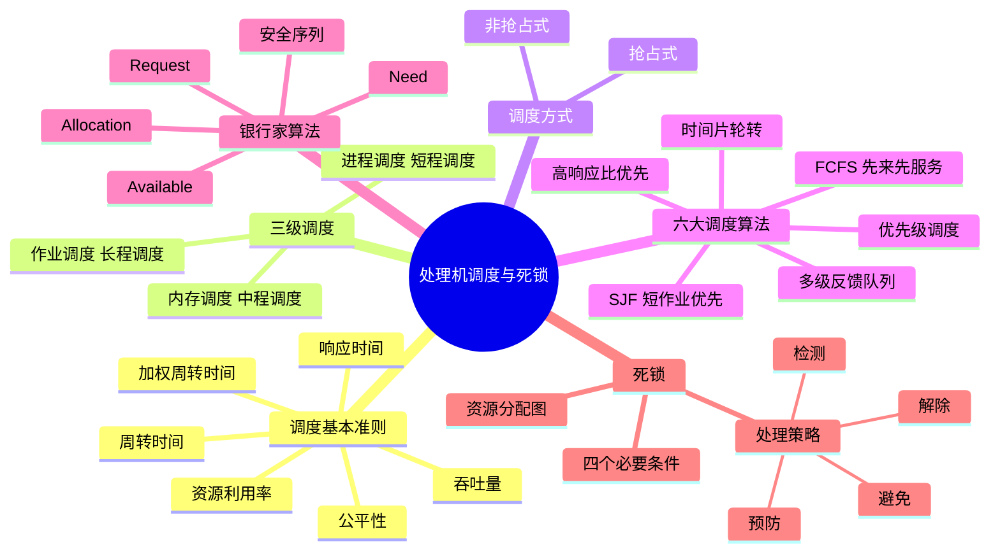

# 第3章 处理机调度与死锁

> **本章题库**：[第03章 真题](真题分类/第03章_处理机调度与死锁_真题.md) | [名校真题汇总](真题分类/名校真题汇总.md)



---

## 3.1 调度的基本概念与准则

### 3.1.1 什么是处理机调度

处理机调度是操作系统的核心功能之一，其本质是**从就绪队列中按照某种策略选择一个进程，将处理机分配给它执行**。调度发生在多个层次，决定了系统资源的分配效率和用户的使用体验。

一个作业从提交到完成，通常需要经历多次调度。调度算法的好坏直接影响系统的整体性能。

### 3.1.2 调度的基本准则

| 准则 | 含义 | 计算方式 | 优化目标 |
|------|------|----------|----------|
| **CPU利用率** | CPU处于忙碌状态的时间比例 | CPU忙碌时间 / 总时间 × 100% | 尽量高（通常40%~90%） |
| **系统吞吐量** | 单位时间内完成的作业/进程数 | 完成的作业数 / 总时间 | 尽量大 |
| **公平性** | 每个进程都能获得合理的CPU时间 | — | 避免饥饿 |
| **响应时间** | 从提交请求到首次产生响应的时间 | 首次响应时刻 - 提交时刻 | 尽量短（交互式系统关键指标） |
| **周转时间** | 作业从提交到完成所经历的总时间 | 完成时刻 - 提交时刻 | 尽量短 |
| **加权周转时间** | 周转时间与服务时间的比值 | 周转时间 / 服务时间 | 尽量接近1 |

**补充说明：**

- **CPU利用率**：现代操作系统中，CPU利用率通常在40%~90%之间。过低说明系统空闲浪费，过高（接近100%）则可能导致进程频繁等待，反而降低整体效率。
- **吞吐量**与**周转时间**往往相互矛盾：吞吐量优先会倾向于短作业，而长作业的周转时间会变差。
- **公平性**与**效率**之间也存在矛盾：完全公平（如轮转法）可能牺牲整体吞吐量。
- 在**交互式系统**中，响应时间比周转时间更重要；在**批处理系统**中，吞吐量和周转时间更重要。

---

## 3.2 三级调度

操作系统中存在三个层次的调度，它们各自负责不同粒度的资源分配。

### 3.2.1 三级调度详细对比

| 对比项 | 作业调度（高级调度/长程调度） | 内存调度（中级调度/中程调度） | 进程调度（低级调度/短程调度） |
|--------|------|------|------|
| **调度对象** | 作业（Job） | 进程（挂起/激活） | 进程/线程 |
| **触发频率** | 最低（几分钟一次） | 中等 | 最高（毫秒级） |
| **调度开销** | 大（需创建PCB、分配资源） | 中等 | 小（仅切换上下文） |
| **执行时间** | 毫秒~秒级 | 毫秒级 | 微秒级 |
| **决策依据** | 作业的资源需求、优先级、预估运行时间 | 内存使用情况、进程活跃度 | 进程状态、时间片、优先级 |
| **主要功能** | 决定哪些作业进入内存 | 内存紧张时将进程换出到外存 | 决定哪个就绪进程获得CPU |
| **影响范围** | 决定多道程序度 | 调节内存中的进程数量 | 直接影响响应速度 |
| **对应队列** | 外存后备队列 | 内存就绪队列/挂起队列 | CPU就绪队列 |

### 3.2.2 详细解释

**作业调度（长程调度）：**
- 从外存的**后备队列**中选取若干作业装入内存，为其创建进程并分配必要资源。
- 控制系统的**多道程序度**（内存中同时存在的进程数）。
- 常见策略：先来先服务、短作业优先、优先级调度。
- 在批处理系统中尤为重要。

**内存调度（中程调度）：**
- 当内存空间紧张时，将某些进程**挂起**（换出到外存的对换区）。
- 当内存空闲或这些进程需要执行时，再将其**激活**（换入内存）。
- 引入**挂起状态**（静止就绪/阻塞挂起）的概念。
- 是虚拟存储管理中的关键机制。

**进程调度（短程调度）：**
- 从就绪队列中选取一个进程，将CPU分配给它。
- 触发时机：进程执行完毕、时间片用完、发生I/O请求、被更高优先级进程抢占等。
- 执行频率最高，因此算法开销必须极小。

---

## 3.3 进程调度方式

### 3.3.1 非抢占式调度（Non-preemptive）

- **含义**：进程一旦获得CPU，就一直运行下去，直到**自愿放弃**（如完成、阻塞等待I/O）或**终止**，才会释放CPU。
- **优点**：实现简单，上下文切换少，系统开销低。
- **缺点**：紧急事件无法及时响应，不适合实时系统。
- **适用场景**：早期批处理系统、某些实时性要求不高的系统。

### 3.3.2 抢占式调度（Preemptive）

- **含义**：操作系统可以在进程执行过程中**强制剥夺**其CPU使用权，分配给其他进程。
- **抢占原则**（常见）：
  - 时间片用完（轮转调度）
  - 有更高优先级的进程进入就绪队列
  - 进程从等待态变为就绪态且优先级高于当前进程
- **优点**：响应性好，适合交互式系统和实时系统。
- **缺点**：可能导致数据竞争和同步问题（需配合同步机制），上下文切换开销大。
- **适用场景**：现代分时系统、实时操作系统。

---

## 3.4 六大进程调度算法详解

### 3.4.1 先来先服务（FCFS - First Come First Served）

**基本思想：** 按照进程到达就绪队列的先后顺序依次调度，先到达的进程先获得CPU。

**特点：**
- 最简单的调度算法，可用**FIFO队列**实现。
- 属于**非抢占式**调度。
- 对长作业有利，对短作业不利（"护航效应"：一个长作业排在前面，后面所有短作业都要等待）。

**示例：** 进程P1(24ms), P2(3ms), P3(3ms) 依次到达

| 进程 | 到达时间 | 服务时间 | 开始时间 | 完成时间 | 周转时间 | 等待时间 |
|------|---------|---------|---------|---------|---------|---------|
| P1 | 0 | 24 | 0 | 24 | 24 | 0 |
| P2 | 0 | 3 | 24 | 27 | 27 | 24 |
| P3 | 0 | 3 | 27 | 30 | 30 | 27 |

平均周转时间 = (24+27+30)/3 = 27ms
平均等待时间 = (0+24+27)/3 = 17ms

---

### 3.4.2 短作业优先（SJF - Shortest Job First）

**基本思想：** 优先调度**估计运行时间最短**的进程。

**特点：**
- 可以是抢占式（**SRTF - 最短剩余时间优先**）或非抢占式。
- 在所有算法中，**平均等待时间最小**（可证明）。
- 缺点：
  - 无法预知进程的实际运行时间（通常用历史运行时间的指数加权平均来估计）。
  - 对**长作业不利**，可能导致**饥饿**（长作业永远得不到调度）。

**SRTF（最短剩余时间优先）：** 当新进程到达时，若其服务时间小于当前进程的剩余时间，则抢占当前进程。

**示例（SRTF）：**

| 进程 | 到达时间 | 服务时间 |
|------|---------|---------|
| P1 | 0 | 7 |
| P2 | 2 | 4 |
| P3 | 4 | 1 |
| P4 | 5 | 4 |

执行顺序：P1(0-2) -> P2(2-6) -> P3(6-7) -> P4(7-11) -> P1(11-15)
（注：在t=2时，P2(4) < P1剩余(5)，抢占；t=4时P3(1) < P2剩余(2)，抢占；t=5时P3(1) < P4(4)且P3(1) < P2剩余(1)，P3先完成；t=6时P2剩余1继续完成，t=7时P4(4)继续）

---

### 3.4.3 优先级调度算法（Priority Scheduling）

**基本思想：** 为每个进程分配一个**优先级**，优先级最高的进程先获得CPU。

**特点：**
- 可以是抢占式或非抢占式。
- 优先级的确定方式：
  - **静态优先级**：进程创建时确定，运行期间不变。依据：进程类型（系统进程>用户进程）、资源需求、用户紧迫程度。
  - **动态优先级**：运行过程中可动态调整。例如：随等待时间增长而提高优先级（防止饥饿）。

**缺点：**
- **饥饿问题**：低优先级进程可能长期得不到调度。
- **解决办法**：**老化（Aging）** 技术——随时间推移逐渐提高长时间等待进程的优先级。

---

### 3.4.4 高响应比优先（HRRN - Highest Response Ratio Next）

**基本思想：** 优先调度**响应比最高**的进程。

**计算公式：**

$$
响应比 R_p = \frac{等待时间 + 要求服务时间}{要求服务时间} = 1 + \frac{等待时间}{要求服务时间}
$$

**特点：**
- 属于**非抢占式**调度。
- 兼顾了**短作业**和**长作业**：
  - 短作业的服务时间小，容易获得高响应比（利于短作业）。
  - 长作业随着等待时间增加，响应比也会提高（防止长作业饥饿）。
- 每次调度时需要计算所有就绪进程的响应比，**开销较大**。

**示例：**

| 进程 | 到达时间 | 服务时间 | 完成时间 | 等待时间 |
|------|---------|---------|---------|---------|
| P1 | 0 | 24 | 24 | 0 |
| P2 | 1 | 3 | 27 | 23 |
| P3 | 2 | 3 | 30 | 25 |
| P4 | 3 | 4 | 24(先执行) | — |

在t=3时，就绪进程：P1(已运行3ms,剩余21ms), P2(等待2ms), P3(等待1ms), P4(等待0ms)
- P1的响应比 = (3+21)/21 = 24/21 ≈ 1.14
- P2的响应比 = (2+3)/3 = 5/3 ≈ 1.67
- P3的响应比 = (1+3)/3 = 4/3 ≈ 1.33
- P4的响应比 = (0+4)/4 = 4/4 = 1.00

选择P2执行（响应比最高）。

---

### 3.4.5 时间片轮转（RR - Round Robin）

**基本思想：** 将CPU时间划分为等长的**时间片（Quantum）**，就绪队列中的进程轮流获得一个时间片的CPU时间。

**特点：**
- **抢占式**调度。
- 是**分时系统**的典型调度算法。
- 时间片大小的选择很关键：
  - **过大**：退化为FCFS算法。
  - **过小**：上下文切换开销过大，CPU有效利用率下降。
  - **一般选择**：让80%的进程能在1个时间片内完成。

**时间片轮转的平均周转时间通常较大**（因为进程频繁被中断），但**响应时间短且均匀**。

**示例（时间片q=4）：**

进程到达顺序：P1(0), P2(1), P3(2)，服务时间：P1=24, P2=3, P3=4

执行序列：
- P1(0-4) -> P2(4-7)完成 -> P3(7-11)完成 -> P1(11-15) -> P1(15-19) -> ... -> P1最终完成

---

### 3.4.6 多级反馈队列（MFQ - Multilevel Feedback Queue）

**基本思想：** 设置**多个就绪队列**，每个队列具有不同的优先级和时间片大小。新进程进入最高优先级队列，若未完成则逐级降级，直到在最低级队列中按时间片轮转执行。

**关键规则：**
1. 设置多个队列，优先级从高到低递减。
2. 各队列的时间片大小**递增**（通常上一级是下一级的2倍）。
3. 新进程进入**第一级队列**（最高优先级）。
4. 进程在当前队列的一个时间片内未完成，则**降入下一级队列**。
5. 仅当第1~i-1级队列为空时，才调度第i级队列的进程。
6. 进程在低级队列中可使用**时间片轮转**。
7. **抢占机制**：若有新进程进入高级队列，则新进程抢占低级队列进程的CPU。

**优点：**
- 兼顾**短进程**和**长进程**：短进程在高优先级队列快速完成，长进程在低优先级队列中慢慢执行。
- 被认为是最优的通用调度算法之一。

**缺点：**
- 需要对队列数量、时间片大小、降级策略进行合理设计，参数选择不当可能退化为其他简单算法。
- 长进程可能长期处于低优先级队列，需要适当提升机制。

---

### 3.4.7 六大调度算法综合对比

| 特性 | FCFS | SJF/SRTF | 优先级 | HRRN | RR | 多级反馈队列 |
|------|------|----------|--------|------|-----|------------|
| **类型** | 批处理 | 批处理 | 通用 | 批处理 | 分时 | 通用 |
| **抢占** | 否 | 可抢占(SRTF) | 可抢占 | 否 | 是 | 是 |
| **实现复杂度** | 简单 | 中等 | 中等 | 中等 | 简单 | 复杂 |
| **平均等待时间** | 较大 | 最小 | 不确定 | 较小 | 较大 | 较小 |
| **响应时间** | 较长 | 较短 | 不确定 | 较短 | 短且均匀 | 短 |
| **公平性** | 好 | 差（饥饿） | 取决于优先级 | 好 | 好 | 好 |
| **吞吐量** | 低 | 高 | 不确定 | 较高 | 中等 | 高 |
| **饥饿风险** | 无 | 有（长作业） | 有 | 无 | 无 | 无 |
| **适用系统** | 批处理 | 批处理 | 通用 | 批处理 | 分时 | 通用 |
| **典型应用** | 简单队列 | 短任务系统 | 操作系统内部 | 综合负载 | Unix时间片 | Windows/Linux |

---

## 3.5 银行家算法（Banker's Algorithm）

### 3.5.1 基本概念

银行家算法是Dijkstra于1965年提出的一种**死锁避免**算法。其核心思想是：在分配资源之前，先检查分配后系统是否仍处于**安全状态**（即存在一个安全序列能使所有进程顺利完成），只有安全时才分配。

**类比：** 银行家（操作系统）拥有一定资金（资源），有多个客户（进程）各自需要一定贷款（资源）。银行家不能满足所有客户的需求，但必须保证能合理分配使得至少有一部分客户能完成，完成后再归还资金，如此逐步满足所有客户。

### 3.5.2 数据结构

假设有 n 个进程，m 种资源类型：

| 符号 | 含义 | 大小 |
|------|------|------|
| **Available[j]** | 第j类资源的可用数量 | 1×m 向量 |
| **Max[i][j]** | 进程i对第j类资源的最大需求 | n×m 矩阵 |
| **Allocation[i][j]** | 进程i已分配的第j类资源数量 | n×m 矩阵 |
| **Need[i][j]** | 进程i还需要的第j类资源数量 | n×m 矩阵 |

其中：**Need[i][j] = Max[i][j] - Allocation[i][j]**

### 3.5.3 资源请求算法（Request）

当进程 Pi 提出请求 Request[i] 时，执行以下步骤：

```
1. 检查 Request[i] <= Need[i]，否则报错（进程请求超过最大声明需求）
2. 检查 Request[i] <= Available，否则等待（资源不足）
3. 尝试分配（试探性修改）：
   Available  = Available - Request[i]
   Allocation[i] = Allocation[i] + Request[i]
   Need[i]   = Need[i] - Request[i]
4. 调用安全性算法检查系统是否安全：
   - 若安全 → 正式分配
   - 若不安全 → 撤销试探性分配，进程等待
```

### 3.5.4 安全性算法（Safety Check）

```
1. 初始化：
   Work = Available（可用资源副本）
   Finish[i] = false，i = 0, 1, ..., n-1

2. 找到一个满足以下条件的进程Pi：
   a) Finish[i] == false
   b) Need[i] <= Work
   若找不到，转到步骤4

3. 假设Pi顺利完成，释放其资源：
   Work = Work + Allocation[i]
   Finish[i] = true
   转到步骤2

4. 若所有 Finish[i] == true，则系统安全
   否则系统不安全
```

### 3.5.5 完整示例

**系统状态：**

有5个进程（P0~P4），3种资源类型（A、B、C）：
- 总资源：A=10, B=5, C=7

| 进程 | Allocation (A,B,C) | Max (A,B,C) | Need (A,B,C) |
|------|---------------------|-------------|---------------|
| P0 | 0, 1, 0 | 7, 5, 3 | 7, 4, 3 |
| P1 | 2, 0, 0 | 3, 2, 2 | 1, 2, 2 |
| P2 | 3, 0, 2 | 9, 0, 2 | 6, 0, 0 |
| P3 | 2, 1, 1 | 2, 2, 2 | 0, 1, 1 |
| P4 | 0, 0, 2 | 4, 3, 3 | 4, 3, 1 |

**计算 Available：**
- Available = 总资源 - 已分配总量
- 已分配总量 = (0+2+3+2+0, 1+0+0+1+0, 0+0+2+1+2) = (7, 2, 5)
- **Available = (10-7, 5-2, 7-5) = (3, 3, 2)**

**安全序列求解过程：**

**Step 1:** Work = (3, 3, 2)
- 检查各进程的 Need <= Work：
  - P0: (7,4,3) <= (3,3,2)? **No**
  - P1: (1,2,2) <= (3,3,2)? **Yes** → 选择P1
  - P2: (6,0,0) <= (3,3,2)? **No**
  - P3: (0,1,1) <= (3,3,2)? **Yes**（也可选）
  - P4: (4,3,1) <= (3,3,2)? **No**

选择 **P1**，P1完成释放资源：
- Work = (3,3,2) + (2,0,0) = **(5, 3, 2)**

**Step 2:** Work = (5, 3, 2)
- P0: (7,4,3) <= (5,3,2)? **No**
- P2: (6,0,0) <= (5,3,2)? **No**
- P3: (0,1,1) <= (5,3,2)? **Yes** → 选择P3
- P4: (4,3,1) <= (5,3,2)? **Yes**（也可选）

选择 **P3**，P3完成释放资源：
- Work = (5,3,2) + (2,1,1) = **(7, 4, 3)**

**Step 3:** Work = (7, 4, 3)
- P0: (7,4,3) <= (7,4,3)? **Yes** → 选择P0
- P2: (6,0,0) <= (7,4,3)? **Yes**（也可选）
- P4: (4,3,1) <= (7,4,3)? **Yes**（也可选）

选择 **P0**，P0完成释放资源：
- Work = (7,4,3) + (0,1,0) = **(7, 5, 3)**

**Step 4:** Work = (7, 5, 3)
- P2: (6,0,0) <= (7,5,3)? **Yes** → 选择P2
- P4: (4,3,1) <= (7,5,3)? **Yes**（也可选）

选择 **P2**，P2完成释放资源：
- Work = (7,5,3) + (3,0,2) = **(10, 5, 5)**

**Step 5:** Work = (10, 5, 5)
- P4: (4,3,1) <= (10,5,5)? **Yes** → 选择P4
- Work = (10,5,5) + (0,0,2) = **(10, 5, 7)**

**安全序列为：< P1, P3, P0, P2, P4 >**
（安全序列不唯一，例如 <P1, P3, P4, P0, P2> 也安全）

**所有 Finish[i] = true → 系统处于安全状态。**

---

### 3.5.6 P1发出请求的处理示例

假设 **P1 发出请求 Request = (1, 0, 2)**：

**步骤1：** 检查 Request(1,0,2) <= Need(1,2,2) → **成立**

**步骤2：** 检查 Request(1,0,2) <= Available(3,3,2) → **成立**

**步骤3：** 试探性分配：
- Available = (3,3,2) - (1,0,2) = **(2, 3, 0)**
- Allocation[P1] = (2,0,0) + (1,0,2) = **(3, 0, 2)**
- Need[P1] = (1,2,2) - (1,0,2) = **(0, 2, 0)**

**步骤4：** 安全性检查：

| 进程 | Need | Allocation | 完成 |
|------|------|------------|------|
| P0 | 7,4,3 | 0,1,0 | No |
| P1 | 0,2,0 | 3,0,2 | No |
| P2 | 6,0,0 | 3,0,2 | No |
| P3 | 0,1,1 | 2,1,1 | No |
| P4 | 4,3,1 | 0,0,2 | No |

Work = (2, 3, 0)

- P1: (0,2,0) <= (2,3,0)? **Yes** → 完成
  - Work = (2,3,0) + (3,0,2) = (5,3,2)
- P3: (0,1,1) <= (5,3,2)? **Yes** → 完成
  - Work = (5,3,2) + (2,1,1) = (7,4,3)
- P0: (7,4,3) <= (7,4,3)? **Yes** → 完成
  - Work = (7,4,3) + (0,1,0) = (7,5,3)
- P2: (6,0,0) <= (7,5,3)? **Yes** → 完成
  - Work = (7,5,3) + (3,0,2) = (10,5,5)
- P4: (4,3,1) <= (10,5,5)? **Yes** → 完成

**系统安全，正式分配。**

---

## 3.6 死锁的基本概念

### 3.6.1 死锁的定义

**死锁（Deadlock）** 是指两个或多个进程因竞争资源而造成的一种**互相等待**的僵局状态，若无外力干预，这些进程都将无法推进。

**经典场景：** 进程P1持有资源R1并请求R2，进程P2持有资源R2并请求R1 → 双方永远等待。

### 3.6.2 死锁的四个必要条件

死锁的发生必须**同时满足**以下四个条件（缺一不可）：

| 条件 | 含义 | 举例 |
|------|------|------|
| **互斥条件**（Mutual Exclusion） | 资源一次只能被一个进程使用 | 打印机同一时刻只能服务一个进程 |
| **请求与保持条件**（Hold and Wait） | 进程持有至少一个资源，同时又在等待获取其他被占用的资源 | 进程持有磁带机，又请求打印机 |
| **不可剥夺条件**（No Preemption） | 已获得的资源不能被强行夺走，只能由持有者主动释放 | 进程持有锁，操作系统不能强制回收 |
| **循环等待条件**（Circular Wait） | 存在一个进程等待链的环路：P1→P2→...→Pn→P1 | P1等P2，P2等P3，P3等P1 |

**重要说明：**
- 这四个条件是死锁的**必要条件**，即死锁发生时这四个条件一定同时成立。
- 也是**充分条件**：若这四个条件同时成立，则死锁必然发生。
- **打破任何一个条件**即可防止死锁。

---

## 3.7 死锁处理四大策略对比

### 3.7.1 死锁预防（Deadlock Prevention）

**核心思想：** 通过**静态分配资源**，在系统运行前就破坏死锁的四个必要条件之一。

| 破坏条件 | 策略 | 方法 | 缺点 |
|----------|------|------|------|
| 破坏互斥 | 允许资源共享 | 某些设备可SPOOLing | 并非所有资源可共享 |
| 破坏请求与保持 | 一次性申请所有资源 | 进程启动前申请全部所需资源 | 资源浪费严重，利用率低 |
| 破坏不可剥夺 | 允许剥夺资源 | 进程请求不到资源时释放已持有的资源 | 复杂，可能导致活锁 |
| 破坏循环等待 | 资源有序分配 | 给资源编号，进程只能按编号递增顺序请求 | 实现困难，编号固定后不灵活 |

---

### 3.7.2 死锁避免（Deadlock Avoidance）

**核心思想：** 在资源分配时动态检查，确保分配后系统仍处于**安全状态**。

**代表算法：** 银行家算法（3.5节已详述）

**安全状态与不安全状态：**
- **安全状态**：存在一个安全序列，使所有进程都能顺利完成。
- **不安全状态**：不存在安全序列。不安全状态**不一定**导致死锁，但**有可能**导致死锁。
- 避免策略的核心：**避免系统进入不安全状态**。

**优点：** 资源利用率比死锁预防高。
**缺点：** 需要预先声明最大资源需求，运行时开销较大，只适用于资源数和进程数已知的场景。

---

### 3.7.3 死锁检测（Deadlock Detection）

**核心思想：** 允许死锁发生，但系统定期检测是否存在死锁，若存在则采取措施解除。

**检测方法：**
1. **资源分配图（RAG）检测：** 构建资源分配图，寻找**环路**。若图中无环则无死锁，有环则可能存在死锁（单实例资源时环路=死锁，多实例资源时环路不一定死锁）。
2. **等待图（Wait-for Graph）检测：** 将资源分配图简化，去掉资源节点，只保留进程节点（Pi→Pj表示Pi等待Pj持有的资源）。若图中存在环路，则存在死锁。
3. **银行家算法的变体进行检测：** 使用Available/Allocation/Request矩阵，类似于安全性算法。

**检测频率：** 需要权衡检测开销和死锁危害程度。

---

### 3.7.4 死锁解除（Deadlock Recovery）

**核心思想：** 检测到死锁后，通过某些措施打破死锁。

**主要方法：**

| 方法 | 描述 | 代价 |
|------|------|------|
| **终止进程法** | 终止一个或多个死锁进程 | 已计算结果丢失，需重新执行 |
| **资源剥夺法** | 从某些进程中强行剥夺资源分配给其他进程 | 被剥夺资源的进程可能回退到不一致状态 |

**选择牺牲者的因素：**
- 进程的优先级
- 进程已运行时间和剩余时间
- 进程已使用的资源种类和数量
- 进程还需多少资源才能完成
- 进程已被回滚的次数（避免饥饿）

**终止策略：**
- **终止所有死锁进程：** 最简单，但代价最大。
- **逐个终止进程：** 每次终止一个后重新检测，直到死锁解除。每次终止需重新运行检测算法。

---

### 3.7.5 四大策略综合对比

| 对比项 | 死锁预防 | 死锁避免 | 死锁检测 | 死锁解除 |
|--------|---------|---------|---------|---------|
| **时机** | 事前（设计阶段） | 事中（运行时分配） | 事后（运行时检测） | 事后（检测到后） |
| **策略** | 破坏必要条件 | 安全状态分配 | 允许死锁发生再处理 | 终止进程或剥夺资源 |
| **资源利用率** | 低 | 较高 | 高 | 高 |
| **实现难度** | 较简单 | 中等 | 中等 | 较简单 |
| **额外开销** | 小 | 中（每次分配都需检查） | 有（检测算法周期运行） | 有（回滚、重新执行） |
| **进程限制** | 需预先声明所有资源 | 需预先声明最大需求 | 无特殊限制 | 无特殊限制 |
| **适用场景** | 资源种类固定简单 | 资源数已知且固定 | 通用系统 | 通用系统 |
| **典型代表** | 资源有序分配 | 银行家算法 | 资源分配图检测 | 终止进程/剥夺资源 |

---

## 3.8 补充：活锁与饥饿

### 活锁（Livelock）
- 进程虽然没有被阻塞，但它们都在不断改变状态而**无法推进**。
- 类似于两人在走廊相遇，都让路让对方先走，结果反而互相挡路。
- 与死锁的区别：活锁中进程都在**运行**，但没有实质性进展。

### 饥饿（Starvation）
- 某些进程由于资源被其他高优先级进程长期占用，**长期得不到所需资源**而无法推进。
- 与死锁的区别：死锁是进程**互相等待**，而饥饿是进程**被动地**得不到资源。
- 解决方法：**老化（Aging）**——随等待时间增加逐渐提高优先级。

---

## 3.9 关键总结

1. **调度算法的选择**取决于系统类型：批处理系统侧重吞吐量和周转时间，分时系统侧重响应时间和公平性，实时系统侧重可预测性和响应时间。
2. **多级反馈队列**是综合性能最好的通用调度算法，也是现代操作系统中最常用的调度算法基础。
3. **银行家算法**的核心是安全性检查——每次资源分配前先"假装分配"，验证是否存在安全序列。
4. **死锁的四个必要条件**是理解所有死锁处理策略的基础。
5. 实际系统中通常采用**鸵鸟策略**（忽略死锁），因为检测和预防的开销往往大于死锁本身的危害。
