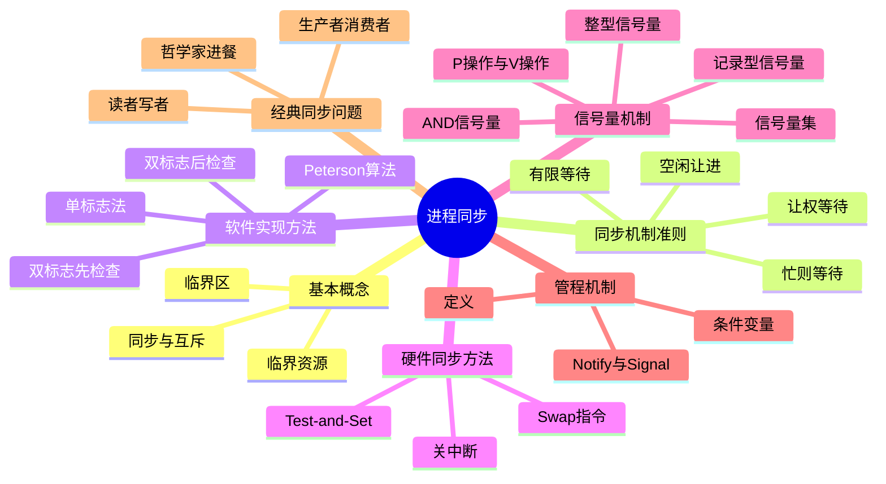

# 第4章 进程同步

> **本章题库**：[第04章 真题](真题分类/第04章_进程同步_真题.md) | [名校真题汇总](真题分类/名校真题汇总.md)



---

## 4.1 进程同步的基本概念

### 4.1.1 为什么需要进程同步

在多道程序环境下，多个进程并发执行，它们之间存在两种基本关系：
- **资源共享关系（互斥）**：多个进程需要共享某种资源（如打印机），必须互斥访问。
- **相互合作关系（同步）**：多个进程需要按照一定的先后顺序执行（如进程A的输出是进程B的输入）。

若没有正确的同步机制，可能导致**数据不一致**、**竞态条件（Race Condition）** 等问题。

### 4.1.2 临界资源与临界区

**临界资源（Critical Resource）：** 一次只能被一个进程使用的共享资源。

典型例子：
- 打印机、扫描仪等物理设备
- 共享变量、共享缓冲区
- 共享文件
- 数据库中的共享表

**临界区（Critical Section）：** 进程中**访问临界资源的代码段**。

每个进程的代码可以分为三部分：

```
do {
    进入区（Entry Section）   —— 检查是否可以进入临界区
    临界区（Critical Section）—— 访问临界资源的代码
    退出区（Exit Section）    —— 释放临界区的使用权
    剩余区（Remainder Section）—— 其余代码
} while (true);
```

**进入区**的功能：检查是否可以进入临界区，若可以则设置访问标志。
**退出区**的功能：释放临界区的使用权，恢复其他进程的访问资格。

---

## 4.2 同步机制的四个准则

为了解决进程同步问题，任何合法的同步机制必须满足以下四个基本准则：

| 准则 | 含义 | 重要性 |
|------|------|--------|
| **空闲让进**（Progress） | 临界区空闲时，若有进程请求进入，应允许其立即进入 | 保证资源不被浪费 |
| **忙则等待**（Mutual Exclusion） | 若有进程正在临界区内执行，其他进程必须等待 | 保证互斥访问 |
| **有限等待**（Bounded Waiting） | 对于等待进入临界区的进程，应在有限时间内获得进入机会 | 防止饥饿 |
| **让权等待**（No Busy Waiting） | 不能进入临界区的进程应立即释放CPU，进入等待状态 | 避免忙等消耗CPU |

**注意：** 并非所有同步机制都满足全部四个准则。例如Peterson算法不满足"让权等待"（存在忙等），而信号量机制满足全部四个准则。

---

## 4.3 软件实现方法

### 4.3.1 单标志法

**思想：** 设置一个整型变量 `turn`，表示当前允许进入临界区的进程编号。

```c
// 进程P0
while (turn != 0);   // 进入区：不为0则忙等
// 临界区
turn = 1;            // 退出区：将turn设为对方
// 剩余区

// 进程P1
while (turn != 1);   // 进入区：不为1则忙等
// 临界区
turn = 0;            // 退出区：将turn设为对方
// 剩余区
```

**分析：**
- 满足**忙则等待**和**让权等待**（不忙等，但会交替）。
- **不满足空闲让进**：若P0退出后turn=1，此时P0想再次进入临界区，即使临界区空闲，也必须等P1先执行。**强制交替使用**，造成资源浪费。

---

### 4.3.2 双标志先检查法

**思想：** 设置数组 `flag[2]`，`flag[i]=true` 表示进程i想进入临界区。

```c
// 进程Pi (i=0, j=1)
while (flag[j]);      // 先检查对方是否想进入
flag[i] = true;       // 再表明自己想进入
// 临界区
flag[i] = false;      // 退出区
// 剩余区
```

**分析：**
- **不满足忙则等待**：若P0和P1同时执行，可能都通过了 `while(flag[j])` 检查（此时对方都为false），然后都设置自己的flag为true，**同时进入临界区**，导致互斥被破坏。
- 原因：**检查和设置操作不是原子的**。

---

### 4.3.3 双标志后检查法

**思想：** 先设置自己的flag，再检查对方的flag。

```c
// 进程Pi (i=0, j=1)
flag[i] = true;       // 先表明自己想进入
while (flag[j]);      // 再检查对方
// 临界区
flag[i] = false;      // 退出区
// 剩余区
```

**分析：**
- 满足**忙则等待**。
- **不满足有限等待**：若双方同时设置自己的flag为true，然后同时检查对方的flag，发现对方也为true，**双方都在while循环中忙等**，产生死锁（饥饿）。

---

### 4.3.4 Peterson算法

**思想：** 结合"先检查后设置"和"turn变量"，解决前述问题。

```c
// 进程Pi (i=0, j=1)
flag[i] = true;       // 1. 表明自己想进入
turn = j;             // 2. 礼让对方（设置对方为优先）
while (flag[j] && turn == j);  // 3. 等待：对方想进入 且 轮到对方
// 临界区
flag[i] = false;      // 4. 退出区：撤回自己的请求
// 剩余区
```

**详细分析：**

**为什么能保证互斥？**
- 若P0和P1都想进入临界区，则 `flag[0]=true, flag[1]=true, turn=0或1`。
- `turn` 只能是0或1之一，所以 `turn == j` 只对一个进程为true。
- 满足条件的进程（`flag[j] && turn == j`）会被阻塞，不满足的进程进入临界区。

**为什么能满足空闲让进？**
- 若P0退出临界区，设置 `flag[0]=false`，则P1的while条件 `flag[0] && turn==0` 中 `flag[0]` 为false，P1可以立即进入。

**为什么能满足有限等待？**
- `turn` 变量确保了"礼让"机制：刚进入临界区的进程退出时会将turn设为对方，对方下次请求时一定能进入。

**缺点：** 不满足**让权等待**——等待进程在while循环中忙等（busy waiting），消耗CPU时间。

---

## 4.4 硬件同步方法

### 4.4.1 关中断

**思想：** 进程进入临界区时**关闭中断**，退出时**打开中断**，这样就不会发生进程切换。

```c
// 进入临界区
cli();    // 关中断（Clear Interrupt）
// 临界区
sti();    // 开中断（Set Interrupt）
```

**分析：**
- **优点：** 实现简单，效率高。
- **缺点：**
  - 仅适用于**单处理器**系统（多处理器系统中关闭一个CPU的中断不影响其他CPU）。
  - 过长的关中断时间会影响系统时钟和I/O响应。
  - 用户进程关中断可能导致系统不可控。
  - **不满足让权等待**。

---

### 4.4.2 Test-and-Set（TS）指令

**思想：** 利用硬件提供的**原子操作指令**来实现同步。

```c
// 硬件原子指令（不可被中断）
bool test_and_set(bool *lock) {
    bool old = *lock;
    *lock = true;
    return old;  // 返回旧值，整个操作是原子的
}

// 使用TS实现临界区
while (test_and_set(&lock));  // 若lock原来为true则忙等
// 临界区
lock = false;                  // 退出区
// 剩余区
```

**分析：**
- `test_and_set` 是**原子操作**（由硬件保证，CPU在一个时钟周期内完成），不会被中断。
- 若 `lock` 原来为false，则 `test_and_set` 返回false，退出while循环进入临界区，同时lock变为true。
- 若 `lock` 原来为true，则 `test_and_set` 返回true，继续循环等待。
- **满足互斥和有限等待，但不满足让权等待（忙等）。**

---

### 4.4.3 Swap指令

**思想：** 利用硬件的**交换指令**，在两个布尔变量之间进行原子交换。

```c
// 硬件原子指令
void swap(bool *a, bool *b) {
    bool temp = *a;
    *a = *b;
    *b = temp;
    // 整个操作是原子的
}

// 使用Swap实现临界区
bool key = true;
while (key == true)
    swap(&lock, &key);  // 原子交换lock和key
// 临界区
lock = false;            // 退出区
// 剩余区
```

**分析：**
- 若 `lock=false`，交换后 `key=false, lock=true`，退出while进入临界区。
- 若 `lock=true`（有其他进程在临界区），交换后 `key=true, lock=true`，继续循环。
- 同样**不满足让权等待**。

---

### 4.4.4 硬件同步方法对比

| 方法 | 互斥 | 空闲让进 | 有限等待 | 让权等待 | 适用场景 |
|------|------|---------|---------|---------|---------|
| 关中断 | 是 | 是 | 是 | 否 | 单处理器，内核代码 |
| Test-and-Set | 是 | 是 | 是 | 否 | 通用 |
| Swap | 是 | 是 | 是 | 否 | 通用 |

所有硬件同步方法的共同缺点：**忙等（不满足让权等待）**。在进程占用CPU时间较长或临界区较长时，忙等会浪费大量CPU时间。

---

## 4.5 信号量机制

信号量机制是Dijkstra于1965年提出的，是**最经典、最常用**的进程同步工具。信号量机制可以解决所有同步问题，且满足全部四个准则（包括让权等待）。

### 4.5.1 整型信号量

**定义：** 信号量 S 是一个整型变量，只能通过两个标准原子操作 `wait()` 和 `signal()` 来访问。

```c
// 整型信号量定义
int S = 1;  // 初始值为1（表示资源可用）

// P操作（wait操作，荷兰语Proberen=测试）
void wait(int S) {
    while (S <= 0);  // 忙等！
    S--;
}

// V操作（signal操作，荷兰语Verhogen=增加）
void signal(int S) {
    S++;
}
```

**使用方法：**
```c
// 进程Pi
wait(S);       // 进入区
// 临界区
signal(S);     // 退出区
// 剩余区
```

**缺点：** `wait` 操作中存在**忙等**，不满足"让权等待"准则。

---

### 4.5.2 记录型信号量（重点掌握）

**定义：** 将信号量扩展为一个记录结构，包含一个整型值和一个等待队列。

```c
// 记录型信号量定义
typedef struct {
    int value;          // 信号量值
    struct process *list;  // 等待队列
} semaphore;

// P操作（wait）
void wait(semaphore S) {
    S.value--;
    if (S.value < 0) {
        // 将当前进程加入等待队列
        add(S.list, running_process);
        block();  // 进程阻塞（让权等待！）
    }
}

// V操作（signal）
void signal(semaphore S) {
    S.value++;
    if (S.value <= 0) {
        // 从等待队列中取出一个进程
        process P = remove(S.list);
        wakeup(P);  // 唤醒该进程
    }
}
```

**value 的含义：**
- `value > 0`：表示当前可用资源数为 `value`。
- `value = 0`：表示无可用资源，等待队列为空。
- `value < 0`：其绝对值 `|value|` 表示等待队列中进程的数目。

**记录型信号量满足所有四个准则：**
- **空闲让进**：value>0时，进程可直接进入。
- **忙则等待**：value<0时，进程阻塞。
- **有限等待**：等待队列采用FIFO调度，进程最终会被唤醒。
- **让权等待**：进程阻塞时调用 `block()` 放弃CPU，不在临界区忙等。

---

### 4.5.3 AND型信号量

**定义：** 有时一个进程需要同时获得多个资源，若逐个请求可能导致死锁。AND型信号量**一次性请求所有需要的资源**。

```c
// AND型信号量的P操作（Swait）
void Swait(semaphore S1, semaphore S2, ..., semaphore Sn) {
    if (S1 >= 1 && S2 >= 1 && ... && Sn >= 1) {
        // 所有资源都可用，一次性全部分配
        S1--; S2--; ... Sn--;
    } else {
        // 资源不足，将所有进程放入等待队列（不会部分分配）
        // 将当前进程阻塞
    }
}

// AND型信号量的V操作（Ssignal）
void Ssignal(semaphore S1, semaphore S2, ..., semaphore Sn) {
    // 一次性释放所有信号量
    S1++; S2++; ... Sn++;
    // 唤醒等待的进程
}
```

**优势：** 避免了"部分分配"导致的死锁（如进程持有R1等R2，另一个持有R2等R1）。

---

### 4.5.4 信号量集

**定义：** 一次请求**多种资源**的**每种资源若干个**的信号量扩展机制。

```c
// 信号量集的Swait操作
void Swait(semaphore S1, int t1, semaphore S2, int t2, ...) {
    if (S1 >= t1 && S2 >= t2 && ...) {
        S1 -= t1; S2 -= t2; ...
    } else {
        // 将进程放入相应资源的等待队列
        // 设置等待条件为 Si >= ti
    }
}
```

**特殊形式：**
- `Swait(S, t, d)`：信号量S的下限为t，每次分配d个。
- `Swait(S, 1, 1)`：退化为普通记录型信号量。
- `Swait(S, 1, 0)`：当S>=1时总能通过，可用于实现**开关机制**。

---

### 4.5.5 信号量机制的经典应用模式

**互斥实现（信号量初值为1）：**
```c
semaphore mutex = 1;

// 进程Pi
wait(mutex);
// 临界区
signal(mutex);
```

**同步实现（信号量初值为0）：**
```c
semaphore sync = 0;  // 初始为0，保证执行顺序

// 进程A（先执行的进程）
// ...执行操作A...
signal(sync);        // 通知进程B

// 进程B（后执行的进程）
wait(sync);          // 等待进程A的通知
// ...执行操作B...
```

**注意：**
- 信号量初值为 **1**：用于**互斥**（一次一个进程进入临界区）。
- 信号量初值为 **0**：用于**同步**（确保执行顺序）。

---

## 4.6 管程机制

### 4.6.1 为什么引入管程

信号量机制虽然功能强大，但使用复杂，容易出错（如P/V操作配对错误、忘记V操作等）。管程（Monitor）提供了一种**更高层次的同步机制**，将共享数据和操作封装在一起，由编译器保证互斥。

### 4.6.2 管程的定义

**管程（Monitor）** 是由Hoare和Hansen提出的同步机制，其定义为：

> 一个管程由**一组共享数据**、**一组操作过程（函数）** 和**初始化代码**组成。管程将共享数据和对数据的操作封装在一起，提供了面向对象的同步抽象。

**管程的特性：**
1. 管程中的共享变量只能由管程内的过程访问，外部进程**不能直接访问**。
2. **任一时刻最多只有一个进程在管程内执行**（由编译器保证互斥，类似硬件互斥锁）。
3. 进程调用管程中的过程时，若管程已被占用，则调用者**阻塞等待**。

### 4.6.3 条件变量

管程中提供了**条件变量（Condition Variable）**，用于实现进程间的同步。

```c
// 管程的基本结构
monitor MonitorName {
    // 共享数据
    shared_variable_type variable;

    // 条件变量
    condition x, y;

    // 初始化代码
    initialization_code() { ... }

    // 管程过程
    procedure_1() { ... }
    procedure_2() { ... }
}
```

**条件变量的操作：**

| 操作 | 含义 |
|------|------|
| `x.wait()` | 调用进程在条件变量x上**挂起等待**（释放管程的互斥权） |
| `x.signal()` | 唤醒在条件变量x上等待的一个进程（若无等待进程则无效） |

### 4.6.4 Hoare管程 vs Hansen管程

| 特性 | Hoare管程 | Hansen管程 |
|------|-----------|------------|
| signal语义 | signal后，被唤醒进程立即执行，signal进程挂起 | signal后，signal进程继续执行，被唤醒进程在合适时机执行 |
| 实现复杂度 | 复杂（需两次模式切换） | 简单（只需一次模式切换） |
| 进程切换次数 | 多 | 少 |

### 4.6.5 管程示例：互斥进入

```c
monitor mutex_monitor {
    boolean occupied = false;
    condition free;

    enter() {
        if (occupied)
            free.wait();      // 若已被占用，在条件变量上等待
        occupied = true;      // 标记为已占用
    }

    leave() {
        occupied = false;     // 标记为可用
        free.signal();        // 唤醒等待的进程
    }
}
```

---

## 4.7 三大经典同步问题

### 4.7.1 生产者-消费者问题（Producer-Consumer Problem）

**问题描述：**
- 有一组生产者进程和一组消费者进程，共享一个大小为n的**有界缓冲区**。
- 生产者向缓冲区中放入产品，消费者从缓冲区中取出产品。
- 约束条件：
  - 缓冲区满时，生产者必须等待。
  - 缓冲区空时，消费者必须等待。
  - 同一时刻只能有一个进程访问缓冲区（互斥）。

**需要的信号量：**
- `mutex = 1`：互斥信号量，保护缓冲区的互斥访问。
- `empty = n`：同步信号量，表示空缓冲区数（初始为n）。
- `full = 0`：同步信号量，表示满缓冲区数（初始为0）。

**完整代码（使用记录型信号量）：**

```c
semaphore mutex = 1;   // 互斥访问缓冲区
semaphore empty = n;   // 空缓冲区数
semaphore full = 0;    // 满缓冲区数
item buffer[n];
int in = 0, out = 0;  // 缓冲区指针

// 生产者进程
void producer() {
    while (true) {
        item product = produce_item();    // 生产产品
        wait(empty);                      // 等待空缓冲区（P操作）
        wait(mutex);                      // 进入临界区
        buffer[in] = product;             // 放入产品
        in = (in + 1) % n;               // 循环缓冲区
        signal(mutex);                    // 离开临界区
        signal(full);                     // 增加满缓冲区计数（V操作）
    }
}

// 消费者进程
void consumer() {
    while (true) {
        wait(full);                       // 等待产品（P操作）
        wait(mutex);                      // 进入临界区
        item product = buffer[out];       // 取出产品
        out = (out + 1) % n;             // 循环缓冲区
        signal(mutex);                    // 离开临界区
        signal(empty);                    // 增加空缓冲区计数（V操作）
        consume_item(product);            // 消费产品
    }
}
```

**关键要点：**
1. `wait(empty)` 和 `wait(full)` 必须在 `wait(mutex)` **之前**，否则可能产生**死锁**（如缓冲区满时生产者先获取mutex锁，再wait(empty)阻塞，而消费者无法获取mutex锁来消费产品）。
2. `signal` 操作的顺序可以交换（先signal(mutex)或先signal(full/empty)均可）。
3. 缓冲区使用**循环队列**实现（通过取模运算 `in % n`）。

---

### 4.7.2 哲学家进餐问题（Dining Philosophers Problem）

**问题描述：**
- 5位哲学家围坐在圆桌旁，每人面前有一碗饭，桌上5把筷子（每两位哲学家之间一把）。
- 哲学家交替进行"思考"和"进餐"。
- 进餐时需要**同时拿起左右两把筷子**。
- 约束条件：每把筷子一次只能被一个哲学家使用。

**方法一：使用信号量（简单但可能死锁）**

```c
semaphore chopstick[5] = {1, 1, 1, 1, 1};  // 5把筷子

// 哲学家i（i = 0, 1, 2, 3, 4）
void philosopher(int i) {
    while (true) {
        think();                          // 思考
        wait(chopstick[i]);               // 拿起左边筷子
        wait(chopstick[(i + 1) % 5]);     // 拿起右边筷子
        eat();                            // 进餐
        signal(chopstick[i]);             // 放下左边筷子
        signal(chopstick[(i + 1) % 5]);   // 放下右边筷子
    }
}
```

**死锁分析：** 若5位哲学家同时拿起左边筷子，则所有筷子都被占用，每人等待右边筷子 → 死锁！

**方法二：限制同时进餐人数（避免死锁）**

```c
semaphore chopstick[5] = {1, 1, 1, 1, 1};
semaphore limit = 4;  // 最多4位哲学家同时尝试进餐

void philosopher(int i) {
    while (true) {
        think();
        wait(limit);                      // 限制人数
        wait(chopstick[i]);
        wait(chopstick[(i + 1) % 5]);
        eat();
        signal(chopstick[i]);
        signal(chopstick[(i + 1) % 5]);
        signal(limit);
    }
}
```

**原理：** 5把筷子最多供4位哲学家使用，限制人数为4则至少有一位哲学家能拿到两把筷子，不会死锁。

**方法三：同时拿起两把筷子（AND信号量）**

```c
semaphore chopstick[5] = {1, 1, 1, 1, 1};

void philosopher(int i) {
    while (true) {
        think();
        Swait(chopstick[i], chopstick[(i + 1) % 5]);  // 同时拿两把
        eat();
        Ssignal(chopstick[i], chopstick[(i + 1) % 5]);  // 同时放两把
    }
}
```

**方法四：奇偶编号差异化处理**

```c
void philosopher(int i) {
    while (true) {
        think();
        if (i % 2 == 0) {              // 偶数：先左后右
            wait(chopstick[i]);
            wait(chopstick[(i + 1) % 5]);
        } else {                         // 奇数：先右后左
            wait(chopstick[(i + 1) % 5]);
            wait(chopstick[i]);
        }
        eat();
        signal(chopstick[i]);
        signal(chopstick[(i + 1) % 5]);
    }
}
```

---

### 4.7.3 读者-写者问题（Readers-Writers Problem）

**问题描述：**
- 多个进程共享一个数据对象（如文件、数据库）。
- **读者**：只读取数据，不修改。多个读者可以同时读取。
- **写者**：修改数据。写者必须独占访问（与其他读者和写者都互斥）。

**约束条件：**
- 多个读者可以同时进入。
- 写者必须独占。
- 读者和写者之间互斥。

---

#### 读优先（Readers Preference）

**思想：** 只要有读者在读，后续的读者可以继续进入，写者必须等待所有读者完成后才能执行。

```c
semaphore mutex = 1;     // 保护 read_count 的互斥访问
semaphore rw_mutex = 1;  // 读者与写者之间的互斥
int read_count = 0;      // 当前正在读的进程数

// 读者进程
void reader() {
    while (true) {
        wait(mutex);                  // 进入区
        read_count++;
        if (read_count == 1)         // 第一个读者负责锁住写者
            wait(rw_mutex);
        signal(mutex);               // 其他读者可以继续增加read_count

        // ---- 读取数据 ----

        wait(mutex);                  // 退出区
        read_count--;
        if (read_count == 0)         // 最后一个读者负责释放写者
            signal(rw_mutex);
        signal(mutex);
    }
}

// 写者进程
void writer() {
    while (true) {
        wait(rw_mutex);               // 获得独占权

        // ---- 写入数据 ----

        signal(rw_mutex);             // 释放独占权
    }
}
```

**分析：**
- 第一个读者进入时锁住写者（`wait(rw_mutex)`），后续读者可以直接进入。
- 最后一个读者离开时释放写者（`signal(rw_mutex)`）。
- **问题：** 若一直有读者，写者会**饥饿**（不公平）。

---

#### 写优先（Writers Preference）

**思想：** 当有写者请求时，后续的读者不能进入，写者优先执行。

```c
semaphore rw_mutex = 1;   // 读者与写者之间的互斥
semaphore mutex = 1;       // 保护 read_count
semaphore write_mutex = 1; // 写者互斥 + 写优先控制
int read_count = 0;

// 读者进程
void reader() {
    while (true) {
        wait(write_mutex);             // 等待写者完成
        wait(mutex);
        read_count++;
        if (read_count == 1)
            wait(rw_mutex);
        signal(mutex);
        signal(write_mutex);           // 释放（允许写者竞争）

        // ---- 读取数据 ----

        wait(mutex);
        read_count--;
        if (read_count == 0)
            signal(rw_mutex);
        signal(mutex);
    }
}

// 写者进程
void writer() {
    while (true) {
        wait(write_mutex);             // 与读者竞争
        wait(rw_mutex);                // 获得独占权

        // ---- 写入数据 ----

        signal(rw_mutex);
        signal(write_mutex);           // 释放
    }
}
```

**分析：**
- 写者请求时先锁住 `write_mutex`，阻止新读者进入。
- 已经在读的读者不受影响，但新读者会被阻塞。
- **问题：** 写者持续到达时，读者可能**饥饿**。

---

#### 读写公平（Fair Solution）

```c
semaphore rw_mutex = 1;
semaphore mutex = 1;
semaphore queue = 1;       // 排队信号量，保证公平
int read_count = 0;

// 读者进程
void reader() {
    while (true) {
        wait(queue);                   // 排队
        wait(mutex);
        read_count++;
        if (read_count == 1)
            wait(rw_mutex);
        signal(mutex);
        signal(queue);                 // 允许下一个排队者

        // ---- 读取数据 ----

        wait(mutex);
        read_count--;
        if (read_count == 0)
            signal(rw_mutex);
        signal(mutex);
    }
}

// 写者进程
void writer() {
    while (true) {
        wait(queue);                   // 排队
        wait(rw_mutex);                // 获得独占权

        // ---- 写入数据 ----

        signal(rw_mutex);
        signal(queue);                 // 释放
    }
}
```

---

#### 读者-写者三种策略对比

| 策略 | 读者优先 | 写者优先 | 公平方案 |
|------|---------|---------|---------|
| **读者并发** | 是（只要有读者） | 受限（写者优先时阻塞） | 受限 |
| **写者独占** | 是 | 是 | 是 |
| **写者饥饿** | 可能（持续读者） | 无 | 无 |
| **读者饥饿** | 无 | 可能（持续写者） | 无 |
| **适用场景** | 读多写少 | 写操作重要/频繁 | 通用 |

---

## 4.8 信号量机制综合示例

### 4.8.1 前驱图（进程同步）示例

**问题：** S1 -> S2 -> S3 和 S1 -> S4 -> S3，要求S2和S4并行执行。

```c
semaphore a = 0, b = 0, c = 0, d = 0;

// S1
void S1() { ... signal(a); signal(b); }

// S2（依赖S1）
void S2() { wait(a); ... signal(c); }

// S3（依赖S2和S4）
void S3() { wait(c); wait(d); ... }

// S4（依赖S1）
void S4() { wait(b); ... signal(d); }
```

---

## 4.9 关键总结

1. **临界资源**的互斥访问是进程同步的基础问题，核心是"进入区-临界区-退出区"的结构。
2. **同步机制四准则**（空闲让进、忙则等待、有限等待、让权等待）是评价同步机制正确性的标准。
3. **软件方法**（Peterson算法）和**硬件方法**（TS/Swap）都存在忙等问题，实用性有限。
4. **信号量机制**是最常用的同步工具：
   - 初值为1 → 互斥
   - 初值为0 → 同步
   - P操作（wait）：先减后判，负值则阻塞
   - V操作（signal）：先加后判，非正则唤醒
5. **管程**是更高层次的抽象，通过编译器保证互斥，使用更安全方便。
6. **三大经典问题**的解决模式：
   - 生产者-消费者：缓冲区管理 + 互斥 + 同步
   - 哲学家进餐：资源分配 + 避免死锁
   - 读者-写者：读写策略 + 并发控制
7. 信号量的P/V操作**顺序至关重要**，错误的顺序可能导致死锁或同步失效。
