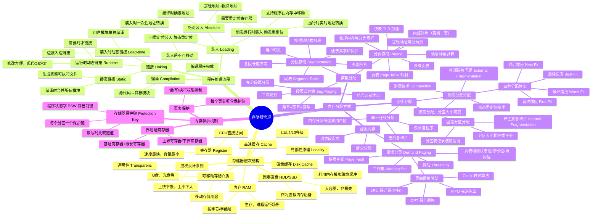
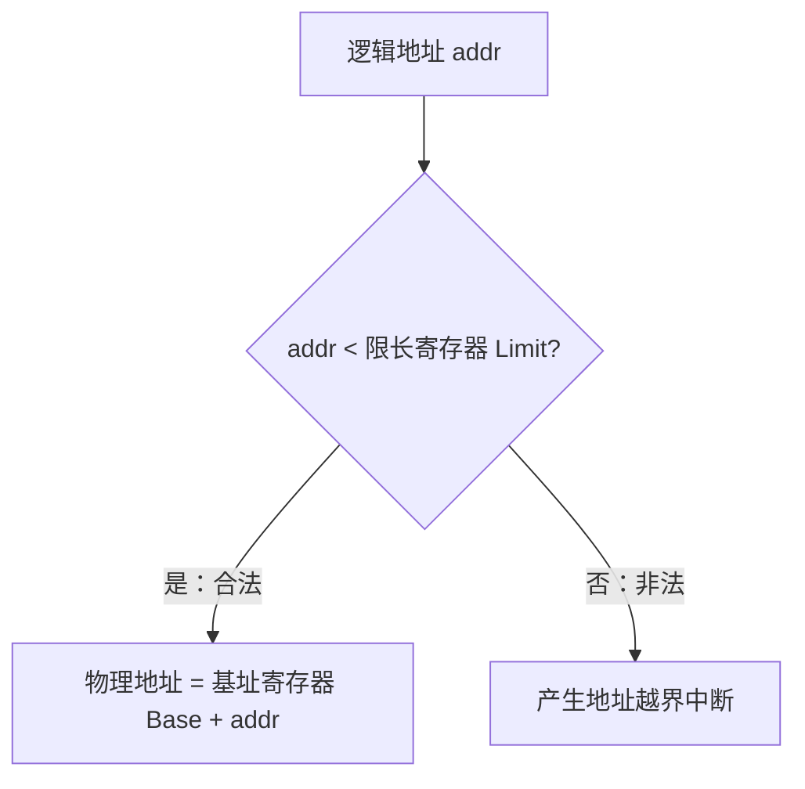
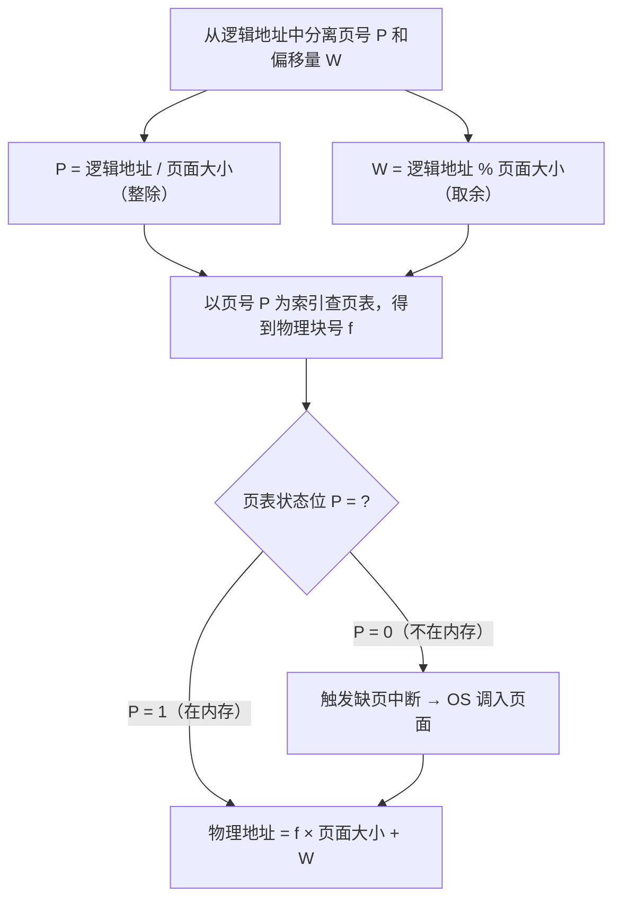
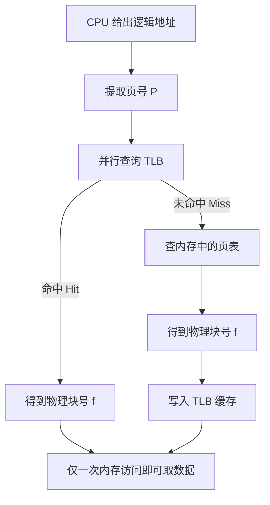
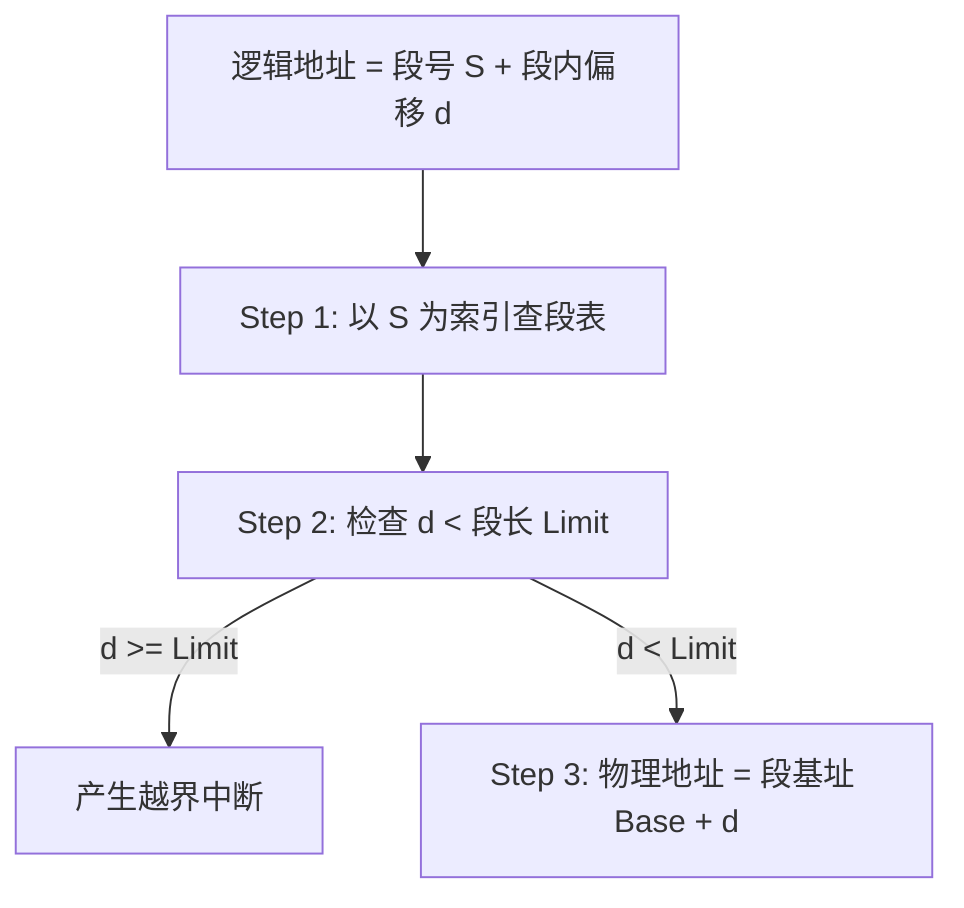
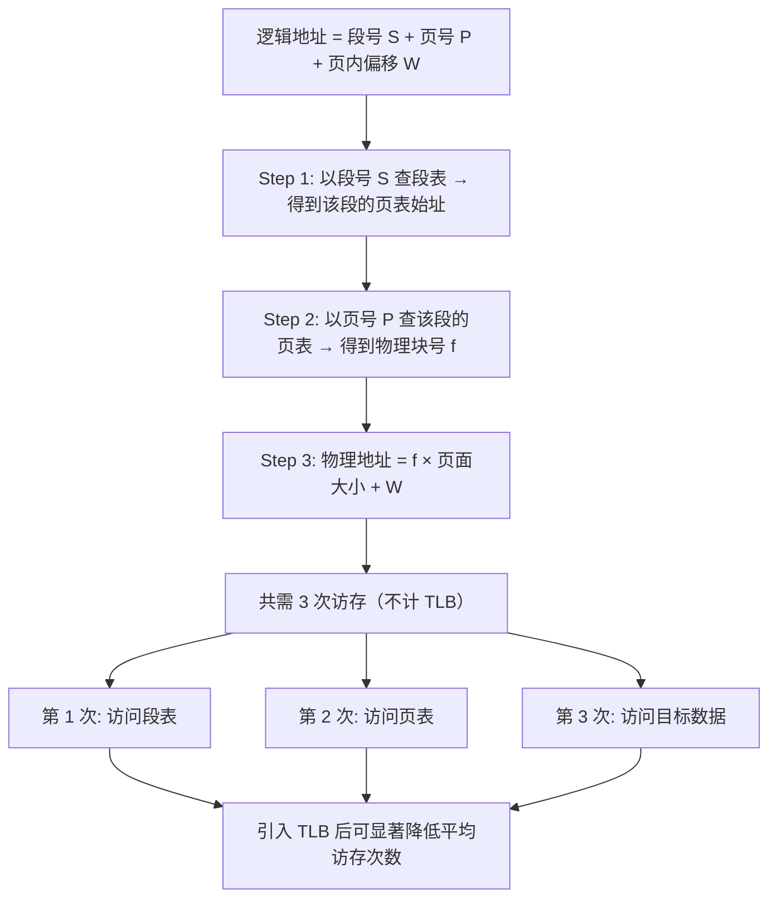
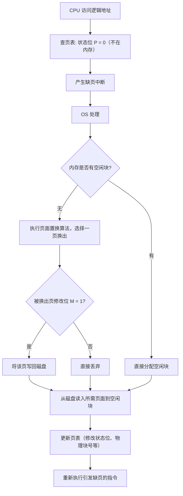
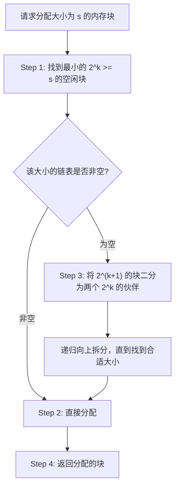
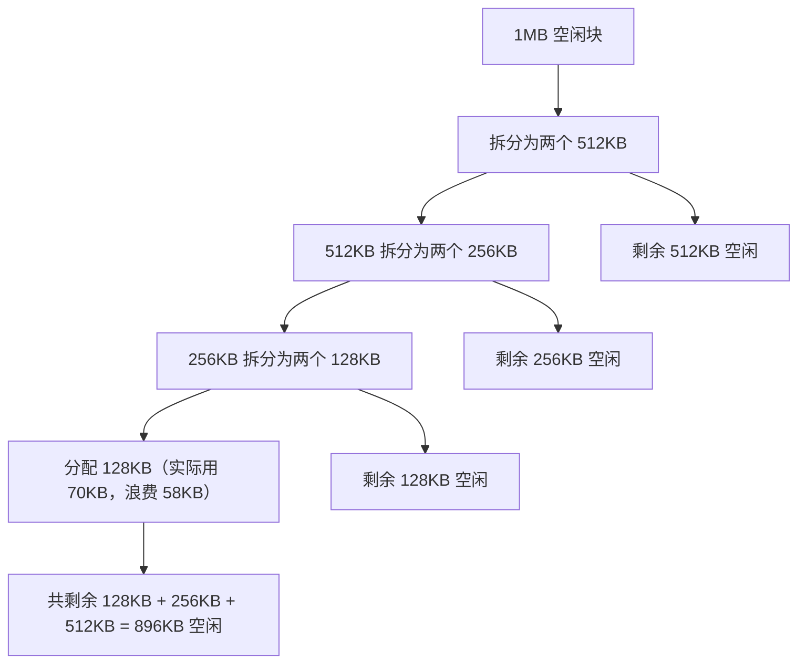
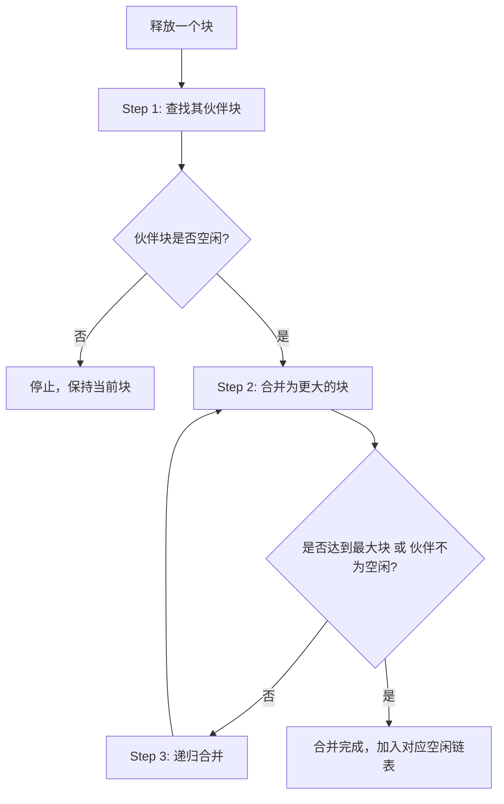

# 第5章 存储器管理

> **本章题库**：[第05章 真题](真题分类/第05章_存储器管理_真题.md) | [名校真题汇总](真题分类/名校真题汇总.md)

## 思维导图



---

## 5.1 存储器层次结构

### 5.1.1 多级存储体系

现代计算机采用**存储器层次结构（Memory Hierarchy）**，利用局部性原理（Principle of Locality），在速度、容量和成本之间取得平衡。

| 层次 | 存储介质 | 典型速度 | 典型容量 | 每位成本 | CPU可否直接访问 |
|------|---------|---------|---------|---------|---------------|
| 第1层 | 寄存器 Register | <1ns | 几百B~几KB | 最高 | 是 |
| 第2层 | 高速缓存 Cache (L1/L2/L3) | 1~10ns | 几十KB~几十MB | 很高 | 是（硬件透明） |
| 第3层 | 内存 RAM | 50~100ns | 几GB~几百GB | 中等 | 是 |
| 第4层 | 磁盘缓存 Disk Cache | 数ms | 利用内存模拟 | - | 否（OS管理） |
| 第5层 | 固定磁盘 HDD/SSD | HDD: 5~10ms; SSD: 0.1ms | 几百GB~几TB | 低 | 否 |
| 第6层 | 可移动存储介质 | 秒级 | 不定 | 最低 | 否 |

### 5.1.2 局部性原理

- **时间局部性（Temporal Locality）**：最近被访问的存储单元在不久的将来很可能再次被访问（如循环变量）。
- **空间局部性（Spatial Locality）**：如果某个存储单元被访问，则其相邻存储单元很可能很快被访问（如顺序执行的指令）。

局部性原理是 Cache、虚拟内存、磁盘缓存等技术的理论基础。

---

## 5.2 程序的装入和链接

### 5.2.1 编译（Compilation）

源程序（.c/.cpp）经过**编译程序**翻译为目标模块（.o/.obj），每个目标模块从 0 开始编址，形成各自的逻辑地址空间。

### 5.2.2 链接（Linking）

链接是将多个目标模块及库函数组合为一个完整的可执行程序（装入模块）。

| 链接方式 | 时间 | 原理 | 优点 | 缺点 |
|---------|------|------|------|------|
| **静态链接** | 编译时 | 将所有目标模块拼接为一个完整模块，所有地址一次性重定位 | 简单直接 | 可执行文件大；修改一个模块需重新链接全部 |
| **装入时动态链接** | 装入时 | 边装入边链接，用户目标模块单独编译后由链接器边装入边合并 | 方便修改（单个模块可独立编译） | 每次装入都需链接，效率较低 |
| **运行时动态链接** | 运行时 | 程序执行中需要某个模块时才将其调入并链接 | 运行中可动态加载（如DLL/SO），节省内存 | 实现复杂，链接开销在运行时产生 |

### 5.2.3 装入（Loading）

装入是将链接好的程序从磁盘加载到内存中。

#### (1) 绝对装入（Absolute Loading）

在编译或链接时，程序中的逻辑地址已经确定为其在内存中的物理地址。

```
编译时确定地址: 逻辑地址 = 物理地址
适用场景: 单道程序、固定内存位置
示例: 编译器被告知程序将从地址 0x1000 开始存放
```

**特点**：不需要地址变换，但程序只能放在内存的固定位置。

#### (2) 可重定位装入（静态重定位，Relocatable Loading）

装入时将程序中的所有逻辑地址一次性转换为物理地址。

```
装入前（逻辑地址）:    [指令: LOAD 10000]  → 访问逻辑地址 10000
装入后（物理地址）:    [指令: LOAD 30000]  → 装入起始地址20000，10000+20000=30000

特点:
  - 装入后程序在内存中不可移动
  - 不需要额外硬件支持
  - 早期OS常用
```

#### (3) 动态运行时装入（动态重定位，Dynamic Relocation）

程序装入内存后仍保持逻辑地址不变，每次执行指令时由硬件实时将逻辑地址转换为物理地址。

```
物理地址 = 逻辑地址 + 重定位寄存器值

示例:
  重定位寄存器 = 20000
  逻辑地址: LOAD 10000
  实际执行: LOAD (10000+20000) = LOAD 30000

特点:
  - 程序可在内存中移动（只需更新重定位寄存器）
  - 允许程序在运行时动态扩展
  - 需要硬件支持（重定位寄存器）
  - 现代OS广泛使用
```

---

## 5.3 连续分配方式

### 5.3.1 单一连续分配

最简单的存储管理方式，只适用于**单道程序**环境。

- 内存分为**系统区**（低地址，存放OS）和**用户区**（高地址，存放用户程序）。
- 用户区只有一道程序，独占整个用户区。
- **无外部碎片**，但**内部碎片严重**（用户区未被充分利用时浪费大量空间）。

### 5.3.2 固定分区分配

将用户内存区划分为若干**固定大小**的分区，每个分区可装入一道程序。

**两种划分方式**：

| 划分方式 | 特点 |
|---------|------|
| 分区大小相等 | 缺乏灵活性，适合控制多个相同对象的系统 |
| 分区大小不等 | 划分为多个大小不等的分区，灵活度提高 |

**数据结构**：分区分配表（记录分区号、起始地址、大小、状态）

**内部碎片**：程序大小 < 分区大小时，剩余空间浪费。

### 5.3.3 动态分区分配（可变分区分配）

分区的数目和大小在运行时根据进程需要**动态确定**。这是考试重点。

#### 四种分配算法详解

**前提条件**：系统内存总大小 640KB，当前已有以下占用情况：

初始内存布局（H = 已占用的进程）:

| 内存块 | OS | H(A, 100KB) | 空闲1 | H(B, 200KB) | 空闲2 | H(C, 50KB) | 空闲3 |
|--------|-----|-------------|-------|-------------|-------|------------|-------|
| 地址 | 0~64KB | 64~164KB | 164~364KB | 364~464KB | 464~514KB | 514~564KB | 564~640KB |
| 大小 | 64KB | 100KB | 200KB | 200KB | 50KB | 50KB | 76KB |

当前空闲分区链:
  空闲1: 起始164KB, 大小200KB
  空闲2: 起始464KB, 大小50KB
  空闲3: 起始564KB, 大小76KB

**新请求**: 进程 D 需要 **80KB**

---

**(1) 首次适应算法（First Fit, FF）**

**核心思想**：从空闲分区**链首**开始查找，找到**第一个**能满足大小要求的空闲分区就分配。

**要求**：空闲分区按**地址递增**排列。

```
查找过程（从头遍历空闲链）:
  空闲1 (164KB, 200KB) → 200KB >= 80KB ✓ 找到！
  分配给D: 起始164KB, 大小80KB
  剩余空闲: 起始244KB, 大小120KB

分配后内存:
| OS | A(100KB) | D(80KB) | 空闲(120KB) | B(200KB) | 空闲(50KB) | C(50KB) | 空闲(76KB) |
地址: 0  64       164       244            364        464          514       564        640
```

**特点**：
- 优点：实现简单，查找速度快；低地址部分的空闲区可以很快被利用；大块空闲区容易保留在链尾。
- 缺点：每次从头查找，低地址区会产生大量**小的外部碎片**；每次分配后需检查是否可以合并相邻空闲区。

---

**(2) 最佳适应算法（Best Fit, BF）**

**核心思想**：遍历所有空闲分区，找到能满足要求的**最小的**空闲分区进行分配。

**要求**：空闲分区按**容量递增**排列。

```
空闲分区按大小排序: 空闲2(50KB) < 空闲3(76KB) < 空闲1(200KB)

查找过程（从小到大遍历）:
  空闲2 (50KB)  → 50KB < 80KB ✗
  空闲3 (76KB)  → 76KB < 80KB ✗
  空闲1 (200KB) → 200KB >= 80KB ✓ 找到！
  分配给D: 起始164KB, 大小80KB
  剩余空闲: 起始244KB, 大小120KB

分配后内存（空闲按大小排序）:
  空闲: 50KB | 76KB | 120KB
```

**特点**：
- 优点：尽量保留大的空闲分区。
- 缺点：每次分配后都会留下一个**极小的空闲碎片**（难以利用），且需要遍历所有空闲分区。

---

**(3) 最坏适应算法（Worst Fit, WF）**

**核心思想**：遍历所有空闲分区，找到**最大的**空闲分区进行分配。

**要求**：空闲分区按**容量递减**排列。

```
空闲分区按大小排序: 空闲1(200KB) > 空闲3(76KB) > 空闲2(50KB)

查找过程（从大到小遍历）:
  空闲1 (200KB) → 200KB >= 80KB ✓ 找到！
  分配给D: 起始164KB, 大小80KB
  剩余空闲: 起始244KB, 大小120KB

分配后内存（空闲按大小排序）:
  空闲: 120KB | 76KB | 50KB
```

**特点**：
- 优点：碎片较大，便于后续利用；分配时总是取最大的，查找速度快。
- 缺点：会切割大空闲区，导致**大进程来时无法分配**；整体碎片利用率差。

---

**(4) 邻近适应算法（Next Fit, NF）**

**核心思想**：从**上次查找结束的位置**开始查找，找到第一个满足要求的空闲分区进行分配。

**数据结构**：通常使用**循环链表**。

```
假设上次分配后，指针停在空闲3(76KB)的位置。

查找过程（从指针位置开始循环查找）:
  空闲3 (76KB, 起始564KB) → 76KB < 80KB ✗
  （循环到链首）
  空闲1 (200KB, 起始164KB) → 200KB >= 80KB ✓ 找到！
  分配给D: 起始164KB, 大小80KB
  指针更新: 指向244KB位置
```

**特点**：
- 优点：分配开销最小，查找速度快（平均查找距离更短）。
- 缺点：每次分配都可能切割空闲区，**缺乏大的空闲分区**；尾部的空闲区往往被忽视。

---

#### 四种算法综合对比

| 对比维度 | 首次适应 (FF) | 最佳适应 (BF) | 最坏适应 (WF) | 邻近适应 (NF) |
|---------|-------------|-------------|-------------|-------------|
| **排序方式** | 按地址递增 | 按容量递增 | 按容量递减 | 无需排序（循环） |
| **查找起始点** | 链首 | 全部 | 全部（从大到小） | 上次结束位置 |
| **分配速度** | 较快 | 慢（需遍历） | 较快 | 最快 |
| **碎片特点** | 低地址区有小碎片 | 产生大量极小碎片 | 碎片较大 | 缺乏大空闲区 |
| **大空闲区保留** | 好（留在链尾） | 好 | 差 | 差 |
| **综合性能** | **最优**（通常） | 一般 | 较差 | 较好 |
| **实现复杂度** | 低 | 中（需排序） | 中（需排序） | 低（循环链表） |

> **考试重点**：首次适应算法在综合性能上通常最优，是最常用的策略。

### 5.3.4 动态重定位与紧凑

- **动态重定位**：在动态分区分配中，每次分配或回收后，内存中会出现不连续的空闲区。
- **紧凑（Compaction）**：通过移动已分配的分区，将所有空闲区合并为一个大的连续空闲区。紧凑需要**动态重定位**支持（移动进程时更新重定位寄存器）。
- **紧凑代价**：需要大量CPU时间，且移动过程中进程不能运行。

### 5.3.5 内存保护机制

#### (1) 界地址寄存器法

每个进程分配内存时，同时设置两个硬件寄存器：

| 寄存器 | 作用 |
|--------|------|
| **基址寄存器（Base Register）** | 存放进程在内存中的起始地址（下界） |
| **限长寄存器（Limit Register）** | 存放进程的大小（地址范围长度） |



#### (2) 存储器保护键法（Protection Key）

每个内存分区关联一个**保护键**（通常4位），存放在分区描述符中。CPU的**程序状态字（PSW）** 中保存当前执行进程的保护键。

- 访问内存时，比较 PSW 中的键与目标分区的键。
- 键匹配或目标分区为**共享读**模式时，允许访问；否则产生保护中断。

#### (3) 页表项保护

在分页系统中，每个页表项可以包含：
- **有效位（Valid/Invalid bit）**：指示该页是否在内存中。
- **读/写/执行保护位**：控制该页的访问权限。
- **修改位（Dirty bit）**：指示该页是否被修改过。

---

## 5.4 基本分页存储管理

### 5.4.1 基本概念

| 概念 | 定义 |
|------|------|
| **页（Page）** | 进程的逻辑地址空间被等分为的固定大小块 |
| **页框/页帧（Frame）** | 物理内存被等分为与页大小相同的块 |
| **页表（Page Table）** | 记录每个逻辑页号到物理页框号的映射 |
| **页内偏移量（Offset）** | 页内数据的相对位置，地址的低位部分 |

**关键规则**：
- 页面大小必须是 **2 的幂次方**（如 512B、1KB、4KB），便于用位运算提取页号和偏移量。
- 若页面大小为 $2^k$ 字节，则逻辑地址的低 $k$ 位为页内偏移量，高位为页号。

### 5.4.2 地址结构与地址转换

#### 逻辑地址结构

```
逻辑地址:
  ┌────────────────┬──────────────────┐
  │    页号 P       │  页内偏移量 W     │
  │  (高 m 位)      │  (低 k 位)       │
  └────────────────┴──────────────────┘

其中: 页面大小 = 2^k 字节，进程总页数 <= 2^m
```

#### 地址转换过程



#### 完整计算示例

**题目**：系统页面大小为 4KB（4096 字节），进程的页表如下：

| 页号 | 物理块号 | 状态位 |
|------|---------|-------|
| 0 | 5 | 1（在内存） |
| 1 | 2 | 1（在内存） |
| 2 | 8 | 1（在内存） |
| 3 | - | 0（不在内存） |

求逻辑地址 **12345** 对应的物理地址。

```
解题过程:
Step 1: 页号 P = 12345 / 4096 = 3（整除）
        偏移 W = 12345 % 4096 = 57（取余）
Step 2: 查页表，页号 3 的状态位 = 0（不在内存！）
        → 触发缺页中断 Page Fault
        → OS 需要将页号 3 对应的页面从磁盘调入内存
        → 调入后可能需要页面置换
        → 然后重新执行该指令

若假设页号 3 的物理块号为 11（调入后）:
Step 3: 物理地址 = 11 × 4096 + 57 = 45056 + 57 = 45113
```

### 5.4.3 快表 TLB（Translation Lookaside Buffer）

**问题**：纯页表存储在内存中，每次访存需**两次访问内存**（一次查页表，一次访问数据），效率低下。

**解决方案**：引入**快表（TLB）**——一个高速联想存储器（Associative Memory），存放最近使用的页表项。



**TLB特点**：
- 容量小（几十~几百个表项），采用**并行查找**（硬件实现）。
- TLB 命中率可达 98% 以上。
- 进程切换时 TLB 需刷新（或使用 ASID 标记进程身份，避免刷新）。

### 5.4.4 两级页表

**问题**：若逻辑地址空间很大，页表本身需要占用大量连续内存（如32位系统、4KB页，页表需 4MB 连续空间）。

**解决**：将页表本身也分页，形成**两级页表**。

```
逻辑地址结构（两级页表）:
  ┌──────────────┬──────────────┬──────────────────┐
  │  一级页号 P1  │  二级页号 P2  │   页内偏移 W     │
  └──────────────┴──────────────┴──────────────────┘

转换过程:
  1. 用 P1 查一级页表（外层页表），得到二级页表的物理块号
  2. 用 P2 查二级页表，得到目标页的物理块号 f
  3. 物理地址 = f × 页面大小 + W
  → 需要 3 次访存（加上 TLB 可降为 1 次）
```

### 5.4.5 内部碎片分析

分页系统中，最后一个页面通常不能恰好填满，产生的碎片称为**内部碎片**。

- **平均内部碎片** = 页面大小 / 2（假设页面随机使用）。
- 例如页面大小 4KB，平均内部碎片 2KB。

---

## 5.5 基本分段存储管理

### 5.5.1 基本概念

分段是按照程序的**逻辑结构**划分地址空间，每个段对应一个有意义的逻辑单元（如代码段、数据段、栈段、共享库段）。

| 概念 | 说明 |
|------|------|
| **段（Segment）** | 按逻辑结构划分的不等长内存区域 |
| **段表（Segment Table）** | 每个进程一个，记录段号→基址+段长的映射 |
| **段号（Segment Number）** | 逻辑地址高位，标识哪个段 |
| **段内偏移（Offset）** | 逻辑地址低位，段内的相对位置 |

### 5.5.2 段表结构

| 段号 | 基址（Base） | 段长（Limit） |
|------|------------|-------------|
| 0 | 40KB | 10KB |
| 1 | 80KB | 30KB |
| 2 | 120KB | 20KB |

### 5.5.3 地址转换



### 5.5.4 分段的共享与保护

分段天然适合实现**共享**和**保护**：
- **共享**：多个进程的段表中可以有相同的基址和段长，指向同一段（如共享代码库）。
- **保护**：每个段表项可以设置读/写/执行权限位。

---

## 5.6 分页 vs 分段 详细对比

| 比较维度 | 分页（Paging） | 分段（Segmentation） |
|---------|---------------|---------------------|
| **设计目的** | 提高内存利用率（**系统需要**） | 满足用户**逻辑需求** |
| **划分单位** | 固定大小的页 | 不等长的段（按逻辑结构） |
| **是否等分** | 是 | 否 |
| **逻辑地址** | 页号 + 偏移量 | 段号 + 偏移量 |
| **用户可见性** | 透明（用户无感知） | 可见（用户需知道段号） |
| **外部碎片** | **无** | **有**（段需连续存放） |
| **内部碎片** | 有（最后一页不满） | 无 |
| **共享与保护** | 不便（逻辑单元跨页） | 方便（按段共享/保护） |
| **动态增长** | 不方便 | 方便（段可独立扩展） |
| **信息传递单位** | 页 | 段 |
| **页表/段表** | 页号→页框号 | 段号→基址+段长 |
| **地址转换次数** | 1次访存（加TLB后） | 1次访存（加TLB后） |
| **典型应用场景** | 通用OS内存管理 | 面向逻辑模块的共享程序设计 |

---

## 5.7 段页式存储管理

### 5.7.1 基本思想

**先分段，再分页**，结合分段的逻辑性和分页的内存利用率。

### 5.7.2 逻辑地址结构

```
逻辑地址 = 段号 S + 页号 P + 页内偏移 W
```

### 5.7.3 地址转换过程



### 5.7.4 优缺点

| 优点 | 缺点 |
|------|------|
| 兼具分段的逻辑性和分页的内存利用率 | 地址转换复杂，需要三次访存 |
| 无外部碎片 | 硬件和系统开销较大 |
| 便于共享和保护（按段共享） | 需要 TLB 加速机制 |

---

## 5.8 虚拟内存管理

### 5.8.1 虚拟内存的基本概念

**虚拟内存（Virtual Memory）** 的核心思想：不必将进程的全部页面装入内存，只装入当前需要的部分，其余保存在磁盘上。当需要的页面不在内存时，通过**缺页中断**调入。

**实现基础**：
- **局部性原理**：程序运行在某段时间内只访问少量页面。
- **请求分页**：在基本分页基础上，增加页表状态位、修改位、访问位等。
- **页面置换算法**：内存满时，选择某页换出到磁盘。

### 5.8.2 请求分页的页表结构

| 字段 | 含义 |
|------|------|
| **页号** | 逻辑页号（可隐含） |
| **物理块号** | 该页在内存中的物理块号 |
| **状态位 P（Valid/Invalid）** | 1=在内存，0=不在内存（需从磁盘调入） |
| **访问字段 A** | 记录该页被访问的次数或最近访问时间（供置换算法使用） |
| **修改位 M（Dirty bit）** | 1=该页被修改过（换出时需写回磁盘），0=未修改（可直接丢弃） |
| **外存地址** | 该页在磁盘上的存放位置 |

### 5.8.3 缺页中断（Page Fault）处理流程



### 5.8.4 页面置换算法

#### (1) 最佳置换算法（OPT, Optimal）

- **原理**：选择**将来最长时间不会被访问**的页面淘汰。
- **性质**：理论最优，缺页率最低。
- **缺点**：无法实际实现（需预知未来访问序列），仅作为**性能评估基准**。

**示例**：页面引用序列 `7 0 1 2 0 3 0 4 2 3 0 3 2`，物理帧数 3：

```
访问序列:  7  0  1  2  0  3  0  4  2  3  0  3  2
帧状态:
  7→[7,-,-] 缺页
  0→[7,0,-] 缺页
  1→[7,0,1] 缺页
  2→[2,0,1] 缺页(淘汰7,因7将来最晚被访问)
  0→[2,0,1] 命中
  3→[2,0,3] 缺页(淘汰1,因1将来不再访问)
  0→[2,0,3] 命中
  4→[2,4,3] 缺页(淘汰0,因0将来在位置8访问)
  2→[2,4,3] 命中
  3→[2,4,3] 命中
  0→[0,4,3] 缺页(淘汰2)
  3→[0,4,3] 命中
  2→[0,2,3] 缺页(淘汰4)

缺页次数: 9
```

#### (2) 先进先出置换算法（FIFO）

- **原理**：选择**最早进入内存**的页面淘汰。
- **数据结构**：队列。
- **优点**：实现简单。
- **缺点**：性能差；可能产生 **Belady 异常**（增加物理帧反而增加缺页）。

**Belady 异常示例**：页面引用序列 `1 2 3 4 1 2 5 1 2 3 4 5`

| 物理帧数 | 缺页次数 |
|---------|---------|
| 3 | 9 |
| 4 | 10（反而增加！） |

#### (3) 最近最少使用算法（LRU, Least Recently Used）

- **原理**：选择**最长时间没有被访问**的页面淘汰（基于"最近使用过的很可能再次使用"的局部性假设）。
- **优点**：性能接近 OPT，**无 Belady 异常**。
- **缺点**：实现开销大（需记录每次访问的时间或顺序）。

**实现方法**：
- **计数器法**：为每个页表项增加一个计数器，每次访问时更新系统时钟到该计数器。淘汰时选计数器值最小的页。
- **栈法**：维护一个访问栈，每次访问某页时将其移到栈顶。栈底即为最久未访问的页。

**示例**：页面引用序列 `4 7 0 7 1 0 1 2 1 2 6`，物理帧数 3：

```
帧状态（右侧为栈顶方向，最近访问在右）:
  4→[4] 缺页
  7→[4,7] 缺页
  0→[4,7,0] 缺页
  7→[4,0,7] 命中，7移到栈顶
  1→[0,7,1] 缺页，淘汰4(栈底)
  0→[7,1,0] 命中
  1→[7,0,1] 命中
  2→[0,1,2] 缺页，淘汰7(栈底)
  1→[0,2,1] 命中
  2→[0,1,2] 命中
  6→[1,2,6] 缺页，淘汰0(栈底)

缺页次数: 6
```

#### (4) 时钟置换算法（Clock / 二次机会算法）

- **原理**：LRU 的近似实现，使用**引用位（Reference bit）** 和**循环链表**。
- **机制**：
  1. 所有页面组成循环链表，指针循环扫描。
  2. 淘汰时：若引用位=0，直接淘汰；若引用位=1，给"第二次机会"（置引用位为0，跳过）。
- **优点**：实现开销低，性能较好。

**改进型 Clock 算法**（综合考虑引用位和修改位）：

| 优先级 | 引用位 | 修改位 | 说明 |
|--------|--------|--------|------|
| 最优先淘汰 | 0 | 0 | 未访问且未修改，直接丢弃 |
| 次优先淘汰 | 0 | 1 | 未访问但已修改（需写回磁盘） |
| 再次淘汰 | 1 | 0 | 已访问但未修改 |
| 最后选择 | 1 | 1 | 已访问且已修改，给第二次机会 |

### 5.8.5 页面置换算法对比

| 算法 | 缺页率 | 实现复杂度 | Belady异常 | 实际可用性 |
|------|--------|-----------|-----------|-----------|
| **OPT** | 最低（最优） | 不可实现 | 无 | 仅理论基准 |
| **FIFO** | 较高 | 最低 | **有** | 教学用 |
| **LRU** | 较低 | 高（需硬件） | 无 | 需硬件支持 |
| **Clock** | 较低 | 低 | 可能 | **广泛使用** |

### 5.8.6 抖动（Thrashing）

**定义**：进程频繁发生缺页中断，CPU大部分时间用于页面置换而非执行进程，系统效率急剧下降。

**原因**：为每个进程分配的物理帧数太少，进程的**工作集（Working Set）** 无法全部驻留内存。

**工作集概念**：在时间窗口 $\Delta$ 内，进程访问的页面集合。

```
防止抖动的方法:
  1. 为每个进程分配足够多的物理帧（至少 >= 工作集大小）
  2. 采用工作集模型进行物理帧分配
  3. 利用缺页率（Page Fault Rate）控制:
     - 缺页率过高 → 增加分配帧数
     - 缺页率过低 → 减少分配帧数
  4. 限制进程并发数
```

### 5.8.7 请求分页的页面分配策略

| 策略 | 说明 |
|------|------|
| **固定分配** | 进程运行期间物理帧数固定不变 |
| **可变分配** | OS 根据缺页率动态调整分配的帧数 |
| **局部置换** | 缺页时只能从本进程的帧中选择淘汰 |
| **全局置换** | 缺页时可从所有进程的帧中选择淘汰 |

---

## 5.9 伙伴系统（Buddy System）

### 5.9.1 基本思想

伙伴系统是一种经典的**物理内存分配算法**，广泛应用于操作系统内核（如 Linux 的伙伴系统）。

- 将空闲内存块组织为大小为 $2^k$ 的链表（$k = 0, 1, 2, ..., n$）。
- 每个大小级别维护一个空闲链表。

### 5.9.2 分配过程



**示例**：内存总量 1MB，请求分配 70KB



### 5.9.3 释放与合并



**伙伴判定条件**：
- 大小相同
- 地址连续（相邻）
- 合并后地址对齐到合并后大小的整数倍

### 5.9.4 优缺点

| 优点 | 缺点 |
|------|------|
| 分配/释放速度快，O(log n) | **内部碎片**：最大浪费可达 50%（如请求 65KB 需分配 128KB） |
| 减少外部碎片 | 伙伴合并限制：只能与特定伙伴合并 |
| 易于实现和维护 | 对于非2的幂大小请求，浪费较大 |

---

## 5.10 常见考点汇总

| 考点 | 要点 |
|------|------|
| 动态分区分配算法 | FF/BF/WF/NF 的特点、适用场景、综合性能对比 |
| 地址转换计算 | 页号=地址/页面大小，偏移=地址%页面大小，物理地址=f×页面大小+W |
| 快表 TLB | 命中时一次访存，未命中时两次访存；命中率高 |
| 分页 vs 分段 | 目的不同、碎片不同、共享保护能力不同 |
| 段页式 | 先段后页、三次访存、结合两者优点 |
| 页面置换算法 | OPT/FIFO/LRU/Clock 的原理、特点、Belady异常 |
| 缺页中断处理 | 完整流程：检查空闲→置换→磁盘I/O→更新页表→重执行 |
| 抖动 Thrashing | 原因（帧数不足）、工作集模型、解决方案 |
| 动态重定位 | 基址寄存器+偏移、支持程序移动 |
| 内存保护 | 界地址寄存器、保护键、页表保护位 |
| 伙伴系统 | $2^k$ 拆分合并、内部碎片、Linux 页分配器 |
