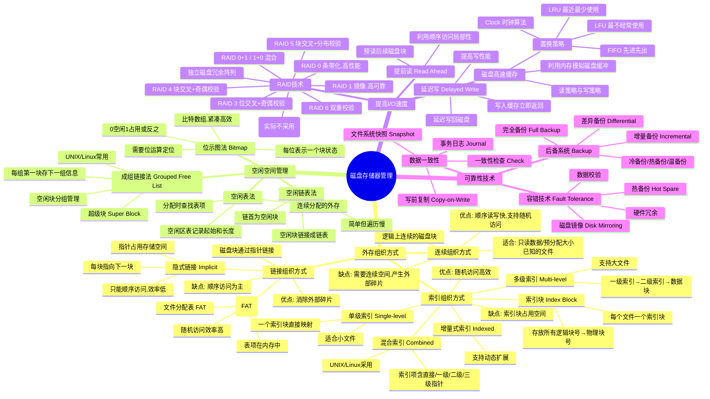

# 第6章 磁盘存储器管理

> **本章题库**：[第06章 真题](真题分类/第06章_磁盘存储器管理_真题.md) | [名校真题汇总](真题分类/名校真题汇总.md)

## 思维导图



---

## 6.1 磁盘基础

### 6.1.1 磁盘结构

| 组件 | 说明 |
|------|------|
| **磁道（Track）** | 磁盘表面上的同心圆 |
| **扇区（Sector）** | 磁道被等分为的弧段，是最小寻址单位（通常 512B 或 4KB） |
| **柱面（Cylinder）** | 所有盘面上同一半径的磁道集合 |
| **盘面（Platter）** | 磁盘的单个物理表面，每个盘面有一个磁头 |

### 6.1.2 磁盘访问时间

```
磁盘访问时间 = 寻道时间 + 旋转延迟 + 传输时间

寻道时间 T_s: 磁头移动到目标磁道所需时间
  T_s = m × n + s
  其中 m = 每跨越一个磁道的耗时, n = 跨越磁道数, s = 启动时间

旋转延迟 T_r: 目标扇区旋转到磁头下方的时间
  T_r = 1/(2r)   r = 磁盘转速（转/秒）
  平均旋转延迟为半圈（最坏情况为一整圈）

传输时间 T_t: 数据读写时间
  T_t = b/(r × N)
  b = 字节数, r = 转速, N = 每条磁道的字节数
```

### 6.1.3 磁盘主要性能指标

| 指标 | 说明 | 典型值 |
|------|------|--------|
| **存储容量** | 所有盘面可存储的总字节数 | 数百GB~数TB |
| **存储密度** | 单位面积存储的位数 | 沿磁道由内向外递减 |
| **数据传输率** | 单位时间传输的数据量 | HDD: 100~200MB/s; SSD: 500~3500MB/s |
| **转速** | 盘片每分钟转数 | HDD: 7200~15000 RPM |
| **平均访问时间** | 寻道+旋转延迟+传输 | HDD: 5~10ms; SSD: 0.1ms |

---

## 6.2 外存组织方式

### 6.2.1 连续组织方式（Contiguous Allocation）

每个文件占据磁盘上**一组连续的块**。

```
文件 A: 占据块 0~5
文件 B: 占据块 8~12
空闲: 块 6~7, 13~...

[ A ][ A ][ A ][ A ][ A ][ A ][free][free][ B ][ B ][ B ][ B ][ B ][free]...
  0    1    2    3    4    5    6     7     8    9   10   11   12   13
```

| 优点 | 缺点 |
|------|------|
| 实现简单，支持顺序和随机访问 | 需要连续空间，产生**外部碎片** |
| 读写速度最快（磁头移动少） | 文件创建时必须确定大小，**不方便动态扩展** |
| 支持直接访问（计算块号即可） | 空间紧缩（Compaction）代价大 |

### 6.2.2 链接组织方式（Linked Allocation）

每个文件的磁盘块通过**指针**链接成链表，不要求连续。

#### (1) 隐式链接（Implicit Linking）

```
文件目录项中记录起始块号和结束块号
每个块中包含指向下一块的指针

文件 A: 块2 → 块5 → 块1 → 块8 → 块3 → NULL

目录项: 起始块=2, 结束块=3, 长度=5块
```

| 优点 | 缺点 |
|------|------|
| 消除外部碎片，空间利用率高 | **只支持顺序访问**（要访问第i块，需从头遍历i次） |
| 文件可动态增长 | 每块中指针占用空间（如每块4KB，指针4B，浪费0.1%） |
| 实现简单 | 可靠性差（一个块的指针损坏，整个文件丢失） |

#### (2) 显式链接（Explicit Linking）—— FAT

**文件分配表（File Allocation Table, FAT）**：将所有块的链接信息集中存放在内存的一张表中。

```
FAT 表项（内存中）:
  索引:    0    1    2    3    4    5    6    7    8
  内容: [空闲] [5]  [5]  [EOF] [空闲] [1]  [空闲] [空闲] [3]

文件 A（起始块=2）: 2 → 5 → 1 → 5 ... 形成环? 
实际示例:
  文件A: 起始块=0, 链: 0→1→2→3(EOF)
  文件B: 起始块=5, 链: 5→6→8(EOF)
```

FAT 表项格式：
- **FAT12**：12位表项，最多4096个块（适合软盘、小硬盘）
- **FAT16**：16位表项，最多65536个块（单分区≤2GB）
- **FAT32**：28位表项（高4位保留），支持大容量分区

| 优点 | 缺点 |
|------|------|
| 支持顺序和随机访问（FAT在内存中，查找快） | FAT表占用内存空间（大磁盘时很大） |
| 无需遍历磁盘块即可找到任意块 | FAT损坏时文件全部丢失 |
| 空间利用率高 | 不适合非常大的磁盘 |

### 6.2.3 索引组织方式（Indexed Allocation）

为每个文件分配一个**索引块（Index Block）**，索引块中存放该文件所有逻辑块号到物理块号的映射。

```
索引块（放在磁盘上，访问时需先读入内存）:
  索引[0] = 块5
  索引[1] = 块2
  索引[2] = 块9
  索引[3] = 块1

文件 A 的逻辑块0→物理块5, 逻辑块1→物理块2, ...
```

| 优点 | 缺点 |
|------|------|
| 支持直接访问和随机访问 | 索引块本身占用磁盘空间 |
| 无外部碎片 | 小文件也需一个完整的索引块（浪费） |
| 灵活支持文件动态增长 | 大文件需要多级索引，增加访问开销 |

#### (1) 单级索引

每个文件一个索引块，直接记录所有块号。

- **限制**：若索引块可存放 N 个块号，则文件最大 N 个块。
- **示例**：索引块大小 4KB，块号 4B，可存 1024 个块号。若块大小 4KB，文件最大 4MB。

#### (2) 多级索引

将索引块本身也用索引管理，形成树状结构。

```
一级索引块 → 二级索引块 → 数据块

逻辑块号 i 的查找:
  i / (索引项数) → 一级索引中的索引
  i % (索引项数) → 二级索引中的位置

支持更大文件，但增加磁盘访问次数。
```

#### (3) 混合索引（Combined Index）

将直接指针、一级间接、二级间接、三级间接指针组合在一个索引块中。**UNIX/Linux 的 inode 采用此方式。**

```
inode 结构示例:
  直接指针（Direct）:       12个  → 直接指向数据块（共 12 × 4KB = 48KB）
  一级间接（Single Indirect）: 1个  → 指向一个索引块（共 1024 × 4KB = 4MB）
  二级间接（Double Indirect）: 1个  → 指向二级索引（共 1024² × 4KB = 4GB）
  三级间接（Triple Indirect）: 1个  → 指向三级索引（共 1024³ × 4KB = 4TB）

文件总大小上限 ≈ 48KB + 4MB + 4GB + 4TB ≈ 4TB+（4KB块）
```

#### (4) 增量式索引

索引块可以动态增长，支持文件大小的灵活扩展。在某些系统中，索引块本身也采用链表或树结构管理。

---

## 6.3 空闲空间管理

### 6.3.1 空闲表法（Free Space Table）

适用于**连续分配**方式的外存。维护一张空闲区表，记录所有空闲区的起始块号和长度。

| 空闲区号 | 起始块 | 块数 |
|---------|--------|------|
| 1 | 2 | 4 |
| 2 | 9 | 3 |
| 3 | 15 | 8 |

分配和回收类似于动态分区分配的算法（首次适应、最佳适应等）。

### 6.3.2 空闲链表法（Free Space List）

将所有空闲块通过**指针**链接成一个链表，链首指针存放在磁盘特定位置（或内存中缓存）。

```
空闲链表:
  首指针 → 块5 → 块12 → 块8 → 块3 → NULL

分配: 从链首取出n个连续或不连续的空闲块
回收: 将释放的块插入链表（链首或尾）
```

| 优点 | 缺点 |
|------|------|
| 实现简单 | 遍历链表开销大（每次分配需读多个块） |
| 不需额外空间存储表 | 分配连续块困难 |
| 回收简单 | 每个空闲块浪费一个指针空间 |

**变体**：**成组空闲链表法（Grouped Free List）**，将空闲块分组，每组的第一个块记录下一组的信息，减少磁盘访问次数（即成组链接法的核心思想）。

### 6.3.3 位示图法（Bitmap / Bit Vector）

用一个**比特数组**表示磁盘所有块的状态。每个比特对应一个磁盘块。

```
位示图（Bit 0表示空闲，1表示已占用）:

块号:  0  1  2  3  4  5  6  7  8  9 10 11 12 13 14 15
位:    0  0  1  1  0  1  0  0  0  1  1  0  0  1  0  0

空闲块: 0, 1, 4, 6, 7, 8, 11, 12, 14, 15
占用块: 2, 3, 5, 9, 10, 13
```

**位运算定位**：

```
假设字长为 w 位（如32位或64位）:
  字号 = 块号 / w
  位号 = 块号 % w

查找空闲块: 遍历位示图，找到值为0的位
分配: 将对应位置1
回收: 将对应位置0
```

| 优点 | 缺点 |
|------|------|
| 空间紧凑，容易找到连续空闲块 | 大磁盘时位示图本身较大（1TB磁盘、4KB块需32MB位示图） |
| 支持位运算快速定位 | 需要扫描位示图寻找空闲块 |

### 6.3.4 成组链接法（Grouped Free List）

**这是考试重点**，是 UNIX/Linux 系统广泛采用的空闲空间管理方法，结合了空闲链表法和分组管理的优点。

#### 基本原理

将所有空闲块**分组管理**，每组的**第一块**不仅属于空闲块，还作为"超级块"存储**下一组空闲块的信息**（下一组的块号列表和块数）。

```
组内结构:
  ┌──────────────────────────────────────────┐
  │  空闲块 N（超级块）                        │
  │  ┌─────────────────────────────────────┐  │
  │  │ 下一组信息:                          │  │
  │  │   [0] 本组空闲块数 (如 100)          │  │
  │  │   [1] 下一组首块号 (如 200)          │  │
  │  │   [2] 空闲块号列表:                  │  │
  │  │         块150, 块151, ..., 块248    │  │
  │  └─────────────────────────────────────┘  │
  │  空闲块 N+1                                │
  │  空闲块 N+2                                │
  │  ...                                      │
  └──────────────────────────────────────────┘
```

#### 超级块（Super Block）

超级块是成组链接法的核心，存放在内存中（或磁盘上需时读入内存）。

```
超级块内容:
  s_free:        空闲块数
  s_freeblks[]:  空闲块号列表（如最多100个）
```

#### 分配过程

```
请求分配一个空闲块:

Step 1: 检查超级块中的空闲块数 s_free
  → 若 s_free > 1:
      取 s_freeblks[s_free - 1]（最后一个空闲块号）分配
      s_free 减 1
  → 若 s_free == 1:
      说明当前超级块是最后一组的指示块
      将该块中的下一组信息读入超级块
      释放当前块（即分配出去）

示例:
  超级块: s_free=3, s_freeblks=[500, 400, 300]
  分配: 取出300号块, s_free变为2
  超级块: s_free=2, s_freeblks=[500, 400]

  当 s_free==1 时（只有1个空闲块指示块）:
  将1号块的内容（下一组信息）复制到超级块
  1号块被分配出去
```

#### 回收过程

```
回收块号 b:

Step 1: 将 b 放入超级块的 s_freeblks 末尾
        s_free 加 1

Step 2: 若 s_free > 容量上限（如100）:
        将超级块当前内容写入 b 块
        超级块更新为 b 块的内容（下一组信息）

示例:
  超级块: s_free=99, s_freeblks=[...]
  回收块500:
    s_free变为100
    将超级块内容写入500号块
    超级块更新为500号块的内容
```

| 优点 | 缺点 |
|------|------|
| 空闲块信息集中在少量块中，减少磁盘访问 | 实现较复杂 |
| 不需要额外的空闲表或位示图 | 超级块损坏可能影响所有空闲信息 |
| 分配和回收效率高 | 需要特殊的文件系统支持 |

---

## 6.4 提高磁盘 I/O 速度

### 6.4.1 磁盘高速缓存（Disk Cache）

利用内存中的一块区域模拟磁盘缓冲区，缓存最近访问过的磁盘数据。

#### 工作原理

```
CPU请求数据
  → 先检查磁盘高速缓存
  → 命中: 直接从内存返回数据（速度快）
  → 未命中: 从磁盘读入数据到缓存，同时返回给CPU
```

#### 置换策略

当磁盘高速缓存满时，需要选择替换哪些数据：

| 置换策略 | 原理 | 特点 |
|---------|------|------|
| **LRU（最近最少使用）** | 替换最长时间未被访问的数据 | 性能好，需记录访问时间 |
| **LFU（最不经常使用）** | 替换访问次数最少的数据 | 适合访问频率差异大的场景 |
| **FIFO（先进先出）** | 替换最早进入缓存的数据 | 简单但性能差 |
| **Clock（时钟算法）** | LRU近似，使用引用位+循环链表 | 开销低，广泛使用 |

#### 写策略

| 策略 | 原理 | 特点 |
|------|------|------|
| **写回法（Write-back）** | 数据先写入缓存，定时或缓存满时写回磁盘 | 写性能高，但数据可能丢失 |
| **写直达法（Write-through）** | 数据同时写入缓存和磁盘 | 数据安全，但写性能低 |

### 6.4.2 提前读（Read Ahead / Prefetching）

当顺序读取文件时，OS预测接下来会访问的磁盘块，提前将其读入磁盘缓存或内存。

- **原理**：利用**空间局部性**，顺序访问时预读后续块。
- **实现**：每次多读几个连续块到缓存中。
- **效果**：显著提高顺序读取性能，减少磁盘寻道和旋转等待。

### 6.4.3 延迟写（Delayed Write / Write-behind）

- **原理**：数据写入缓存后立即返回"写成功"给调用者，数据在后台延迟写回磁盘。
- **优点**：大幅减少写操作的等待时间；多次对同一块的写操作可在缓存中合并。
- **风险**：系统崩溃时未写回磁盘的数据可能丢失。通常配合**事务日志**保证数据安全。

---

## 6.5 RAID（独立磁盘冗余阵列）

### 6.5.1 RAID 基本概念

**RAID（Redundant Array of Independent Disks）** 通过将多个物理磁盘组合为一个逻辑存储单元，提高性能、可靠性或两者兼顾。

**核心思想**：数据分散（条带化）+ 冗余校验。

### 6.5.2 RAID 各级别详解

#### RAID 0（条带化，Striping）

```
数据块: [D1][D2][D3][D4][D5][D6]
分布:
  磁盘1: [D1] [D3] [D5]
  磁盘2: [D2] [D4] [D6]

并行读写: CPU可同时从多个磁盘读取数据
```

| 特性 | 说明 |
|------|------|
| 原理 | 数据按块交替分布到多个磁盘（条带化） |
| 冗余 | **无**（无校验，无镜像） |
| 性能 | 最高（并行I/O） |
| 可靠性 | **最差**（任一磁盘损坏，全部数据丢失） |
| 容量利用率 | 100%（N个磁盘的有效容量 = N × 单盘容量） |
| 最少磁盘数 | 2 |

#### RAID 1（镜像，Mirroring）

```
数据块: [D1][D2][D3][D4]
分布:
  磁盘1(主盘): [D1] [D2] [D3] [D4]
  磁盘2(镜像): [D1] [D2] [D3] [D4]  ← 完全副本

读取: 可从任一磁盘读
写入: 必须同时写两个磁盘
```

| 特性 | 说明 |
|------|------|
| 原理 | 数据完整复制到两个或多个磁盘 |
| 冗余 | **100%**（完全镜像） |
| 性能 | 读取性能高（可并行读），写性能一般 |
| 可靠性 | **最高**（一个磁盘损坏不影响） |
| 容量利用率 | 50%（一半容量用于镜像） |
| 最少磁盘数 | 2 |

#### RAID 2（位交叉+纠错码）

| 特性 | 说明 |
|------|------|
| 原理 | 数据按位交叉分布，使用汉明码（Hamming Code）进行纠错 |
| 冗余 | 使用多个校验盘（汉明码需要 $\lceil \log_2 D \rceil + 1$ 个校验盘） |
| 实际应用 | **几乎不采用**（代价过高，RAID 3/4/5更实用） |

#### RAID 3（位交叉+奇偶校验盘）

```
数据按位/字节交叉:
  磁盘1: [D1.0] [D4.0] [D7.0]
  磁盘2: [D1.1] [D4.1] [D7.1]
  磁盘3: [D1.2] [D4.2] [D7.2]
  磁盘P: [P1]   [P4]   [P7]    ← 奇偶校验盘（专用）

P = D1 ⊕ D2 ⊕ D3   （异或运算）
```

| 特性 | 说明 |
|------|------|
| 原理 | 数据按位交叉，设置**专用奇偶校验盘** |
| 冗余 | 1个校验盘（N+1个磁盘） |
| 性能 | 读性能好，写性能受校验盘瓶颈限制 |
| 可靠性 | 允许1个磁盘故障 |
| 容量利用率 | (N-1)/N |
| 校验盘瓶颈 | 所有校验计算都访问同一个磁盘，成为性能瓶颈 |

#### RAID 4（块交叉+奇偶校验盘）

```
数据按块交叉:
  磁盘1: [块1] [块4] [块7]
  磁盘2: [块2] [块5] [块8]
  磁盘3: [块3] [块6] [块9]
  磁盘P: [P1]  [P4]  [P7]    ← 专用校验盘

每次写入都要更新校验盘（至少2次磁盘访问）
```

| 特性 | 说明 |
|------|------|
| 原理 | 数据按块交叉，设置**专用奇偶校验盘** |
| 与RAID 3区别 | RAID 3按位交叉，RAID 4按块交叉 |
| 优点 | 可并行读取数据块，允许随机读 |
| 缺点 | 校验盘写入瓶颈（每次写入需更新校验盘） |
| 实际应用 | 较少（被 RAID 5 取代） |

#### RAID 5（块交叉+分布式校验）

```
数据和校验信息**分布到所有磁盘**:

  磁盘1: [D1]  [D6]  [P4]  [D11] [D16]
  磁盘2: [D2]  [P5]  [D7]  [D12] [P15]
  磁盘3: [P3]  [D3]  [D8]  [P11] [D17]  ← P不是固定在一块盘上
  磁盘4: [D4]  [D9]  [D13] [D18] [D22]
  磁盘5: [D5]  [D10] [D14] [D19] [D23]

校验信息P轮流分布在各磁盘上 → 消除了RAID 4的校验盘瓶颈
```

| 特性 | 说明 |
|------|------|
| 原理 | 块交叉 + **分布式奇偶校验** |
| 与RAID 4区别 | 校验信息均匀分布在所有磁盘上 |
| 性能 | 读性能高，写性能优于RAID 3/4 |
| 可靠性 | 允许1个磁盘故障 |
| 容量利用率 | (N-1)/N（1个磁盘容量用于校验） |
| **最常用** | 是目前**最流行的RAID级别** |

#### RAID 6（双重分布式校验）

```
引入两个独立的校验信息 P 和 Q:

  磁盘1: [D1]  [D8]  [P7]  [Q12]
  磁盘2: [D2]  [P6]  [D9]  [Q13]
  磁盘3: [Q5]  [D3]  [Q10] [P14]
  磁盘4: [D4]  [D11] [P15] [D20]

P 和 Q 使用不同的校验算法
```

| 特性 | 说明 |
|------|------|
| 原理 | 块交叉 + **双重分布式校验** |
| 可靠性 | 允许**2个磁盘同时故障** |
| 容量利用率 | (N-2)/N |
| 写性能 | 每次写入需更新P和Q，开销较大 |
| 应用场景 | 对可靠性要求极高的场景 |

### 6.5.3 RAID 各级别综合对比

| RAID | 别名 | 冗余方式 | 最少磁盘数 | 容量利用率 | 读性能 | 写性能 | 可靠性 | 典型应用 |
|------|------|---------|-----------|-----------|--------|--------|--------|---------|
| **0** | 条带化 | 无 | 2 | 100% | 最高 | 最高 | 最差 | 临时数据、高性能计算 |
| **1** | 镜像 | 完整副本 | 2 | 50% | 高 | 中等 | 最高 | 数据库日志、系统盘 |
| **2** | 汉明码 | 纠错码 | 4 | 50%~67% | - | - | 高 | 几乎不采用 |
| **3** | 位交叉 | 专用校验盘 | 4 | (N-1)/N | 高 | 中等 | 较高 | 大文件顺序读写 |
| **4** | 块交叉 | 专用校验盘 | 4 | (N-1)/N | 较高 | 中等 | 较高 | 较少采用 |
| **5** | 分布式校验 | 分布式校验 | 4 | (N-1)/N | 高 | 较高 | 较高 | **文件服务器、数据库** |
| **6** | 双重校验 | 双重分布式校验 | 5 | (N-2)/N | 高 | 中等 | 高 | 大容量、高可靠存储 |
| **0+1** | 条带+镜像 | 镜像+条带 | 4 | 50% | 最高 | 高 | 高 | 高性能高可靠 |
| **1+0** | 镜像+条带 | 条带+镜像 | 4 | 50% | 最高 | 高 | 高于0+1 | 数据库服务器 |

> **考试重点**：RAID 0/1/5 的原理、区别和适用场景；RAID 5 的校验信息分布方式。

### 6.5.4 RAID 级别选择指南

| 需求 | 推荐 RAID |
|------|-----------|
| 极致性能，可容忍数据丢失 | RAID 0 |
| 数据安全至上，容量不是问题 | RAID 1 |
| 综合性能、可靠性和成本 | **RAID 5** |
| 极高可靠性（如2块盘同时故障） | RAID 6 |
| 高性能+高可靠 | RAID 10 (1+0) |

---

## 6.6 磁盘调度算法

当多个进程同时请求磁盘 I/O 时，OS 需要决定服务顺序。磁盘调度的目标是**最小化总寻道时间**。

### 6.6.1 基本术语

```
磁头当前位置: 磁道 53
磁盘磁道范围: 0 ~ 199
请求队列: 98, 183, 37, 122, 14, 124, 65, 67
```

### 6.6.2 FCFS（先来先服务，First Come First Served）

**原理**：严格按照请求到达的顺序依次服务。

```
磁头移动路径: 53→98→183→37→122→14→124→65→67

寻道总距离:
  |98-53| + |183-98| + |37-183| + |122-37| + |14-122| + |124-14| + |65-124| + |67-65|
= 45 + 85 + 146 + 85 + 108 + 110 + 59 + 2
= 640

磁头移动图示:
  0                53          98   122 124   183  199
  |================|====...====|====|==|=====|===|
              53→98 →183 →37 →122→14→124→65→67
  (来回摆动严重)
```

| 优点 | 缺点 |
|------|------|
| 极其简单，公平 | 平均寻道时间长 |
| 不会产生饥饿 | 磁头频繁来回移动，效率极低 |

### 6.6.3 SSTF（最短寻道时间优先，Shortest Seek Time First）

**原理**：每次选择**离当前磁头位置最近**的请求进行服务。

```
当前位置: 53

Step 1: 距53最近的是 65 (距离12) → 服务65
Step 2: 距65最近的是 67 (距离2)  → 服务67
Step 3: 距67最近的是 37 (距离30) → 服务37
Step 4: 距37最近的是 14 (距离23) → 服务14
Step 5: 距14最近的是 98 (距离84) → 服务98
Step 6: 距98最近的是 122(距离24) → 服务122
Step 7: 距122最近的是 124(距离2) → 服务124
Step 8: 距124最近的是 183(距离59) → 服务183

寻道总距离:
  12 + 2 + 30 + 23 + 84 + 24 + 2 + 59 = 236

磁头移动图示:
  0    14   37     53  65 67          98    122 124     183  199
  |====|====|======|===|==|============|=====|===|=======|====|
       ←←←←←←  53→65→67→  ←←←←←  →→→→→→→→→→→→→→→
```

| 优点 | 缺点 |
|------|------|
| 寻道性能明显优于FCFS | **可能产生饥饿**（远处请求长期得不到服务） |
| 实现简单 | 不提供公平性保证 |

### 6.6.4 SCAN（扫描算法 / 电梯算法）

**原理**：磁头沿一个方向移动并服务沿途请求，到达磁盘末端后反向扫描。

```
假设磁头初始向磁道号增大的方向移动:
当前位置: 53, 方向: →

移动: 53→65→67→98→122→124→183 (到达末端) →→→
然后反向: 183→37→14

服务顺序: 65, 67, 98, 122, 124, 183, 37, 14

寻道总距离:
  (183-53) + (183-14) = 130 + 169 = 299

磁头移动图示:
  0   14  37          53  65 67      98   122 124     183  199
  |===|===|===========|===|==|========|====|===|=======|====|→
                                                  ←←←←←←|←←←←|
```

| 优点 | 缺点 |
|------|------|
| 不会产生饥饿 | 两端等待时间不均匀（中间磁道服务频率高） |
| 寻道性能好 | 磁头到达末端需反向，等待时间较长 |
| 类似电梯运行，易于理解 | 对刚离开磁头方向的请求不公平 |

### 6.6.5 C-SCAN（循环扫描，Circular SCAN）

**原理**：磁头单向扫描（只在一个方向上服务），到达末端后**快速跳回起点**，重新开始扫描。

```
假设磁头向磁道号增大方向移动:
当前位置: 53, 方向: →

移动: 53→65→67→98→122→124→183 (到达末端)
跳回起点: →→→ 0 (不服务任何请求)
重新扫描: 0→14→37 (从起点开始服务)

服务顺序: 65, 67, 98, 122, 124, 183, 14, 37

寻道总距离:
  (183-53) + (183-0) + (37-0) = 130 + 183 + 37 = 350
```

| 优点 | 缺点 |
|------|------|
| 等待时间更均匀（所有方向同等对待） | 需要跳回起点，有额外开销 |
| 不产生饥饿 | 跳回过程浪费时间 |

### 6.6.6 N-Step-SCAN

**原理**：解决 SCAN 中的**磁臂粘着（Arm Sticking）** 问题。将请求队列分为若干子队列，每次只处理一个子队列（最多 N 个请求）。

**磁臂粘着问题**：在 SCAN 过程中，若有新请求不断到达并恰好在磁头前方，磁头会一直停留在某个区域反复服务，远处的请求长期得不到服务。

```
N-Step-SCAN 工作方式:
  当前子队列: [98, 183, 37, 122] (N=4)
  新到达请求放入另一个子队列: [14, 124, 65, 67]

  处理当前子队列: 按SCAN算法处理 98, 183, 37, 122
  当前子队列处理完毕后，将新队列作为当前子队列
  继续按SCAN处理: 14, 124, 65, 67
```

| 优点 | 缺点 |
|------|------|
| 解决磁臂粘着问题 | 实现复杂 |
| 保证每个请求都能得到服务 | N值需要合理选择 |
| 公平性好 | N太大退化为SCAN，N太小增加调度开销 |

### 6.6.7 FSCAN（双队列扫描）

**原理**：N-Step-SCAN 的简化版本，只使用**两个子队列**：
- **当前队列**：正在使用 SCAN 算法处理的请求。
- **新到达队列**：SCAN 处理期间新到达的请求。

当当前队列处理完毕后，交换两个队列。

| 优点 | 缺点 |
|------|------|
| 简单有效 | 不如N-Step-SCAN灵活 |
| 同样解决磁臂粘着 | - |
| 实现成本低 | - |

### 6.6.8 磁盘调度算法综合对比

| 算法 | 寻道性能 | 公平性 | 饥饿问题 | 磁臂粘着 | 实现复杂度 | 适用场景 |
|------|---------|--------|---------|---------|-----------|---------|
| **FCFS** | 差 | 最好 | 无 | 无 | 最低 | 负载轻时 |
| **SSTF** | 较好 | 差 | **有** | 无 | 低 | 通用 |
| **SCAN** | 好 | 较好 | 无 | **有** | 中 | 通用 |
| **C-SCAN** | 好 | **最好** | 无 | **有** | 中 | 均匀服务需求 |
| **N-Step-SCAN** | 好 | 好 | 无 | **无** | 高 | 高负载场景 |
| **FSCAN** | 好 | 好 | 无 | **无** | 中 | 高负载场景 |

---

## 6.7 可靠性技术

### 6.7.1 容错技术（Fault Tolerance）

容错是指系统在部分组件发生故障时仍能继续正常运行的能力。

| 技术 | 说明 |
|------|------|
| **磁盘镜像** | 数据同时写入两个磁盘，一个损坏时使用镜像 |
| **RAID** | 利用冗余校验信息恢复损坏数据 |
| **热备份（Hot Spare）** | 预留空闲磁盘，自动替换故障磁盘 |
| **双机热备** | 两台服务器同时运行，故障时切换 |
| **ECC 内存** | 纠错码检测和修正内存中的位错误 |

### 6.7.2 后备系统

| 备份类型 | 原理 | 特点 |
|---------|------|------|
| **完全备份（Full Backup）** | 备份所有数据 | 完整但耗时、占用空间大 |
| **增量备份（Incremental）** | 只备份自上次备份以来修改的文件 | 快速、节省空间，恢复时需所有增量 |
| **差异备份（Differential）** | 只备份自上次完全备份以来修改的文件 | 介于两者之间，恢复较快 |

**备份时间策略**：
- **冷备份**：系统停机时备份，数据一致性最好
- **温备份**：只读状态下备份
- **热备份**：系统运行时备份，不影响服务但需额外机制保证一致性

### 6.7.3 数据一致性

数据一致性是指文件系统中数据的逻辑完整性，确保数据在并发访问、系统崩溃等异常情况下保持一致。

| 技术 | 说明 |
|------|------|
| **一致性检查（fsck）** | 系统启动时检查并修复文件系统不一致（如位示图与实际使用状态不匹配） |
| **事务日志（Journaling）** | 将修改操作先记录到日志区，再执行实际修改；崩溃后可通过日志恢复（如 ext3/ext4、NTFS） |
| **写前复制（Copy-on-Write, COW）** | 修改数据时不直接覆盖，而是写到新位置，更新指针；崩溃时旧数据仍完好（如 ZFS、Btrfs） |
| **文件系统快照（Snapshot）** | 在某一时刻冻结文件系统状态的只读视图，用于备份和恢复 |

---

## 6.8 常见考点汇总

| 考点 | 要点 |
|------|------|
| 磁盘访问时间 | 寻道时间+旋转延迟+传输时间的计算公式 |
| 外存组织方式对比 | 连续/链接（隐式/显式）/索引（单级/多级/混合）的特点和适用场景 |
| FAT 文件分配表 | 显式链接的实现，FAT12/16/32的区别 |
| 混合索引（inode） | 直接+一级+二级+三级间接指针结构 |
| 空间管理方法 | 空闲表法/空闲链表法/位示图法/成组链接法的原理对比 |
| **成组链接法** | 分组管理、超级块机制、分配回收过程（**高频考点**） |
| **磁盘调度算法** | FCFS/SSTF/SCAN/C-SCAN 的寻道路径和距离计算 |
| 磁臂粘着 | SCAN的问题，N-Step-SCAN/FSCAN的解决方案 |
| **RAID 各级别** | 0/1/5 的原理、容量利用率、可靠性、适用场景 |
| RAID 5 校验分布 | 校验信息分布在所有磁盘，消除专用校验盘瓶颈 |
| 磁盘高速缓存 | 置换策略（LRU/LFU/Clock/FIFO）、写策略（写回/写直达） |
| 提前读与延迟写 | 利用局部性原理提高I/O性能 |
| 数据一致性 | 事务日志、写前复制、一致性检查的原理 |
| 可靠性技术 | 容错机制、备份策略（完全/增量/差异） |
