# 第7章 文件管理

> **本章题库**：[第07章 真题](真题分类/第07章_文件管理_真题.md) | [名校真题汇总](真题分类/名校真题汇总.md)

## 思维导图

```mermaid
mindmap
  root((文件管理))
    文件的基本概念
      文件定义
        拥有文件名的一组相关信息的集合
        存储在非易失性介质上
        是OS中信息存储的基本单位
      文件分类
        按用途分类
          系统文件 System File
            OS核心程序和系统数据
            用户一般不能修改
          用户文件 User File
            用户创建的文档、数据、程序
            由用户拥有和管理
          库文件 Library File
            标准函数库和用户自定义库
            只允许读不允许修改
        按存取控制属性分类
          只执行文件 Execute-Only
            只允许被CPU执行
            不能读取和复制
          只读文件 Read-Only
            只允许读取
            不允许修改
          读写文件 Read-Write
            允许读和写操作
          无保护文件 No Protection
            无访问限制
        按组织形式和处理方式分类
          普通文件 Regular File
            ASCII文件 便于显示和编辑
            二进制文件 二进制编码效率高
          目录文件 Directory File
            由文件控制块组成
            实现文件目录的组织
          特殊文件 Special File
            设备文件
            管道文件
        按数据形式分类
          源文件 Source File
            由机器语言编写
            需经编译处理
          目标文件 Object File
            编译后的二进制代码
            经链接后成为可执行文件
          可执行文件 Executable File
            可直接由OS装入执行
            已经链接完毕
    文件系统及其层次结构
      定义与功能
        管理文件的存储检索共享
        提供统一的逻辑接口
        透明地组织和管理存储设备
      层次结构
        最高层 文件系统接口
          系统调用接口
          库函数接口
          为用户程序提供服务
        中间层 对对象进行操纵和管理的软件集合
          管理和分配磁盘空间
          管理文件目录和索引节点
          管理存储空间分配与回收
          提供文件共享和保护功能
          包含文件系统核心逻辑
        最底层 对象及其属性
          文件 File 管理的基本对象
          目录 Directory 文件组织结构
          磁盘存储空间 物理存储载体
    文件的逻辑结构
      无结构文件 流式文件 Stream File
        文件内容为无结构字节序列
        由一系列字节流组成
        如ASCII文本和二进制文件
        管理简单 存取灵活
        操作系统难以理解和处理
      有结构文件 记录文件 Record File
        顺序文件 Sequential File
          记录按关键字顺序排列
          顺序存取速度快
          插入删除记录困难
          不便于动态扩展
        索引文件 Indexed File
          建立索引表加速查找
          按关键字查找效率高
          插入删除操作方便
          索引表本身需要存储空间
        索引顺序文件 Indexed Sequential File
          结合顺序和索引的优点
          将记录分组建立索引
          顺序存取速度快
          随机访问较为方便
          增删记录比较方便
    文件目录
      FCB 文件控制块 File Control Block
        文件名 标识文件的字符串
        文件类型 系统/用户/库文件等
        文件大小 字节数或块数
        物理位置 起始块号 磁盘地址
        创建时间 文件创建的时间戳
        修改时间 最后修改时间
        访问时间 最后访问时间
        所有者信息 UID创建者
        访问权限 读/写/执行权限位
        链接计数 指向该文件的目录项数
      索引节点 inode
        文件类型和权限 i_mode
        所有者和组 i_uid i_gid
        文件大小 i_size 字节数
        时间戳 i_atime i_mtime i_ctime
        数据块指针 i_block数组
          12个直接指针
          1个一次间接指针
          1个二次间接指针
          1个三次间接指针
        硬链接计数 i_links_count
        inode不存储文件名
      目录结构
        单级目录结构
          所有文件在一个目录下
          文件名不能重复
          实现最简单
          查找效率低 不适合多用户
        两级目录结构
          主目录MFD和用户目录UFD
          不同用户可用相同文件名
          实现了用户间的隔离
          检索速度提高
        树形目录结构
          层次化的目录组织
          支持路径名访问文件
          可方便地实现文件分类
          是当前主流OS采用的结构
        无环图目录结构 ACYCLIC GRAPH
          允许共享子目录和文件
          用有向无环图DAG表示
          需要计数或垃圾回收机制
          增加了目录管理复杂度
      目录查询技术
        线性检索法 顺序检索
          从目录起始逐项查找
          实现简单 但效率低
          适合小目录
        Hash法 哈希检索
          对文件名计算Hash值
          直接定位目录项
          查找速度快 O(1)
          可能存在Hash冲突
    文件共享
      索引节点共享 硬链接 Hard Link
        多个目录项指向同一inode
        共享相同的文件内容
        inode中链接计数递增
        删除文件时链接计数递减
        链接计数为0时才真正释放
      符号链接共享 软链接 Soft Link
        创建新的特殊文件
        文件内容为目标文件的路径名
        类似Windows快捷方式
        可跨文件系统共享
        多一层查找开销
        原文件删除后符号链接失效
    文件保护
      访问权限控制
        访问类型 读 写 执行 删 拷贝
        访问控制列表 ACL
        UNIX权限模型 用户/组/其他 rwx
      访问矩阵 Access Matrix
        行为主体 对象 操作 三维结构
        行对应用户或进程
        列对应文件或资源
        矩阵元素为允许的操作集合
        存储优化 按列或按行存储
        关联保护环和安全级别
```



---

## 7.1 文件的基本概念

### 7.1.1 文件的定义

**文件（File）** 是具有文件名的一组相关信息的集合。文件是操作系统中信息存储的基本单位，通常存储在非易失性存储介质（如硬盘、SSD）上，以便长期保存。

文件的属性包括：

| 属性 | 说明 |
|------|------|
| **文件名（Name）** | 用户可见的标识符，是文件的唯一引用 |
| **文件标识符（Identifier）** | OS内部使用的唯一编号，对用户不可见 |
| **文件类型（Type）** | 系统文件、用户文件、库文件等 |
| **文件位置（Location）** | 文件在存储设备上的物理位置（起始块号/磁盘地址） |
| **文件大小（Size）** | 文件占用的字节数或块数 |
| **文件所有者（Owner）** | 创建者信息（如 UID） |
| **文件权限（Protection）** | 读/写/执行权限，控制用户对文件的访问 |
| **时间戳（Timestamps）** | 创建时间、最后修改时间、最后访问时间 |
| **链接计数（Link Count）** | 指向该文件的目录项数 |

### 7.1.2 文件的分类

#### (1) 按用途分类

| 类型 | 说明 | 示例 |
|------|------|------|
| **系统文件（System File）** | OS核心程序和系统数据，用户一般不能直接读写或修改 | 内核代码、配置文件 |
| **用户文件（User File）** | 由用户创建和管理的文件 | 文档、照片、程序 |
| **库文件（Library File）** | 标准函数库和用户自定义的可复用模块 | C标准库（libc）、DLL、SO文件 |

#### (2) 按存取控制属性分类

| 类型 | 说明 |
|------|------|
| **只执行文件（Execute-Only）** | 只允许被CPU执行，不能被读取或复制（如早期某些系统密码文件） |
| **只读文件（Read-Only）** | 允许读取但不允许修改（如配置文件、文档） |
| **读写文件（Read-Write）** | 允许读和写操作（最常见类型） |

#### (3) 按组织形式和处理方式分类

| 类型 | 说明 |
|------|------|
| **普通文件（Regular File）** | 存放用户数据，包括 ASCII 文本文件和二进制文件 |
| **目录文件（Directory File）** | 由文件控制块（FCB）组成的特殊文件，用于组织和管理其他文件 |
| **特殊文件（Special File）** | 将 I/O 设备和磁盘文件统一表示，如 UNIX 中的 `/dev/null`、管道文件等 |

#### (4) 按数据形式分类

| 类型 | 说明 |
|------|------|
| **源文件（Source File）** | 由程序设计语言编写的代码文件，需经编译处理 |
| **目标文件（Object File）** | 编译后的二进制代码文件（如 `.o` 或 `.obj`），经链接后成为可执行文件 |
| **可执行文件（Executable File）** | 已经完成链接，可直接由 OS 装入内存执行的文件 |

---

## 7.2 文件系统及其层次结构

### 7.2.1 文件系统的定义

**文件系统（File System）** 是操作系统中负责管理文件的存储、检索、共享和保护的软件机制。它为用户提供统一的逻辑接口，使用户无需关心文件在物理存储设备上的具体组织方式。

### 7.2.2 文件系统的层次结构

```
┌─────────────────────────────────────────────┐
│     最高层：文件系统接口（User Interface）     │
│   系统调用接口  库函数接口  为用户程序提供服务    │
├─────────────────────────────────────────────┤
│  中间层：对对象进行操纵和管理的软件集合           │
│  管理磁盘空间  管理目录和inode  管理文件共享     │
│  分配与回收存储空间  实现文件保护机制             │
├─────────────────────────────────────────────┤
│     最底层：对象及其属性（Objects）             │
│        文件 File  目录 Directory              │
│           磁盘存储空间 Disk Storage            │
└─────────────────────────────────────────────┘
```

**各层功能详解**：

| 层次 | 名称 | 功能描述 |
|------|------|---------|
| **最高层** | 文件系统接口 | 为用户程序提供 `open()`、`read()`、`write()`、`close()` 等系统调用接口和库函数接口 |
| **中间层** | 软件集合层 | 文件系统的核心逻辑，负责：存储空间管理（分配/回收）、文件目录管理（维护目录结构）、文件读写管理（I/O调度）、文件共享与保护 |
| **最底层** | 对象及其属性层 | 实际管理的对象：文件（数据载体）、目录（组织结构）、磁盘/存储设备（物理存储介质） |

---

## 7.3 文件的逻辑结构

文件的逻辑结构是从用户角度看到的文件组织形式，分为两大类。

### 7.3.1 无结构文件（流式文件，Stream File）

文件内容是一串无结构的**字节流（Byte Stream）**，操作系统不对文件内容的结构做任何解释。

```
文件A: [H][e][l][l][o][ ][W][o][r][l][d][\n][!][!][!]
          ← 一系列字节，无内部结构 →

用户程序自行决定如何解释这些字节:
  - 文本编辑器: 按行和字符解释
  - 图像处理程序: 按像素和颜色值解释
  - 编译器: 按语法规则解释
```

**特点**：
- 管理简单，存取灵活
- 操作系统只提供字节级存取服务
- **UNIX/Linux、Windows 等现代 OS 的主流文件形式**

### 7.3.2 有结构文件（记录文件，Record File）

文件由一组**逻辑记录（Record）** 组成，每条记录包含一个或多个**关键字（Key）** 和相关数据。

#### (1) 顺序文件（Sequential File）

```
顺序文件存储示意:
┌──────┬──────────────────┐
│ Key  │      Data         │
├──────┼──────────────────┤
│ A001 │  张三  90分       │
│ A002 │  李四  85分       │
│ A003 │  王五  78分       │
│ A004 │  赵六  92分       │
└──────┴──────────────────┘
记录按关键字(A001, A002, A003...)顺序排列
```

**特点**：

| 优点 | 缺点 |
|------|------|
| 顺序存取速度极快 | 不适合动态修改（插入/删除需移动大量记录） |
| 存储空间利用率高 | 不能直接随机访问（需从头顺序查找） |
| 实现简单 | 不便于文件动态扩展 |
| 适合批量处理 | 检索特定记录效率低 |

#### (2) 索引文件（Indexed File）

```
索引文件存储示意:
┌──────────┐
│ 索引表    │    ┌──────────────────┐
│ A001 → ─────→ │ 张三  90分  记录5  │
│ A002 → ─────→ │ 李四  85分  记录2  │  数据区(可不连续)
│ A003 → ─────→ │ 王五  78分  记录8  │
│ A004 → ─────→ │ 赵六  92分  记录1  │
└──────────┘    └──────────────────┘
```

**特点**：

| 优点 | 缺点 |
|------|------|
| 按关键字查找效率高（通过索引直接定位） | 索引表本身占用额外存储空间 |
| 插入和删除操作方便（不影响其他记录） | 索引表需随记录变化而维护 |
| 数据记录可不连续存放 | 记录不能太大（否则索引表太大） |

#### (3) 索引顺序文件（Indexed Sequential File）

```
索引顺序文件存储示意:
将记录分组，每组建立一个索引项:
┌──────────┐
│ 组索引表  │    ┌───────────────────────────────┐
│ A → 记录1 │    │ A001  张三  90 │ A002  李四  85 │  ← 第1组(顺序)
│ C → 记录5 │    ├───────────────────────────────┤
│ E → 记录9 │    │ C001  孙七  88 │ C002  周八  76 │  ← 第3组(顺序)
│ ...       │    ├───────────────────────────────┤
└──────────┘    │ E001  吴九  91 │ E002  郑十  80 │  ← 第5组(顺序)
                └───────────────────────────────┘
先通过索引定位到所在组，再在组内顺序查找
```

**特点**：
- 结合了顺序文件和索引文件的优点
- 顺序存取速度快（组内顺序排列）
- 随机访问较方便（通过索引快速定位组）
- 是实际文件系统中非常实用的结构

---

## 7.4 文件目录

### 7.4.1 FCB（文件控制块，File Control Block）

FCB 是操作系统为每个文件维护的一组元数据，存放在目录文件中。

| 字段 | 说明 |
|------|------|
| **文件名（File Name）** | 用户用来标识文件的字符串，同一目录下不能重名 |
| **文件标识符（File ID）** | 系统内部使用的唯一编号，如 inode 号 |
| **文件类型（File Type）** | 系统文件、用户文件、普通/目录/特殊文件等 |
| **文件大小（File Size）** | 文件占用的字节数或磁盘块数 |
| **物理位置/起始块号** | 文件在磁盘上的起始块地址 |
| **创建时间（Creation Time）** | 文件创建的时间戳 |
| **修改时间（Modification Time）** | 文件最后被修改的时间 |
| **访问时间（Access Time）** | 文件最后被访问的时间 |
| **所有者（Owner/UID）** | 文件创建者的用户标识 |
| **访问权限（Protection）** | 读/写/执行权限，控制不同用户的访问 |
| **链接计数（Link Count）** | 指向该文件的目录项数量（硬链接数） |

**FCB 的关键特性**：
- 目录文件本质上是**FCB 的集合**
- 目录的结构决定了文件的查找效率
- FCB 的数量和大小直接影响目录文件的大小

### 7.4.2 索引节点（inode，Index Node）

在 UNIX/Linux 系统中，为了提高目录检索效率，将 FCB 中除了文件名以外的所有信息集中存放在一个称为**索引节点（inode）** 的数据结构中，目录项只包含文件名和 inode 号。

**inode 结构详解**：

```
┌──────────────────────────────────────┐
│              inode 结构               │
├──────────────────────────────────────┤
│ i_mode          │ 文件类型和权限       │
│                 │ (rwxrwxrwx + 类型)  │
├─────────────────┼────────────────────┤
│ i_nlinks        │ 硬链接计数          │
├─────────────────┼────────────────────┤
│ i_uid           │ 所有者用户ID        │
├─────────────────┼────────────────────┤
│ i_gid           │ 所属组ID           │
├─────────────────┼────────────────────┤
│ i_size          │ 文件大小(字节)      │
├─────────────────┼────────────────────┤
│ i_atime         │ 最后访问时间        │
├─────────────────┼────────────────────┤
│ i_mtime         │ 最后修改时间        │
├─────────────────┼────────────────────┤
│ i_ctime         │ inode变更时间       │
├─────────────────┼────────────────────┤
│ i_block[0..11]  │ 12个直接块指针      │
├─────────────────┼────────────────────┤
│ i_block[12]     │ 一次间接块指针      │
├─────────────────┼────────────────────┤
│ i_block[13]     │ 二次间接块指针      │
├─────────────────┼────────────────────┤
│ i_block[14]     │ 三次间接块指针      │
└──────────────────────────────────────┘
  注: inode 不存储文件名！
  文件名存放在目录项中（目录项 = 文件名 + inode号）
```

**inode 中数据块指针的寻址能力**（假设块大小 = 4KB，每个指针 4 字节，每块可容纳 1024 个指针）：

| 指针类型 | 指向 | 寻址能力 |
|---------|------|---------|
| **直接指针** i_block[0..11] | 12 个数据块 | 12 × 4KB = **48KB** |
| **一次间接指针** i_block[12] | 1 个间接块 → 1024 个数据块 | 1024 × 4KB = **4MB** |
| **二次间接指针** i_block[13] | 1 个间接块 → 1024 个一级间接块 → 各 1024 个数据块 | 1024 × 1024 × 4KB = **4GB** |
| **三次间接指针** i_block[14] | 1 个间接块 → 1024 个二级间接块 → ... | 1024^3 × 4KB = **4TB** |

**最大文件大小** = 48KB + 4MB + 4GB + 4TB ≈ **4TB**

**inode 的优势**：
- 目录项仅包含**文件名 + inode号**，目录文件体积大大缩小
- 查找文件时只需匹配文件名，减少 I/O 次数
- 文件名和文件属性分离管理，便于实现硬链接

### 7.4.3 文件分配方式（磁盘块分配策略）

文件在磁盘上的物理存储方式是文件管理的核心问题之一。

#### (1) 连续分配（Contiguous Allocation）

```
连续分配示意:
文件A(占3块): [A0][A1][A2][  ][B0][B1][C0][C1][C2][C3][  ][  ]
              ↑ 起始块=0, 长度=3块

FCB记录: {文件名=A, 起始块=0, 长度=3}
```

- 文件的所有数据块在磁盘上**连续排列**
- FCB 中只需记录起始块号和长度
- **支持直接访问**：第 n 块的物理地址 = 起始块 + n

#### (2) 链接分配（Linked Allocation）

```
链接分配示意:
文件A(占3块):
[A0|→] → [A1|→] → [A2|NULL]
 每个块末尾存放指向下一块的指针

FCB记录: {文件名=A, 首块号=0}
```

- 每个文件的数据块可以**分散在磁盘任意位置**
- 每个块的末尾存放指向**下一块的指针**
- **不支持直接访问**，只能顺序访问

**链接分配的改进——FAT（File Allocation Table）**：

```
FAT表（所有文件的链接指针集中存放在一个表中）:
┌───────┬──────────┐
│ 块号   │ 下一块号   │
├───────┼──────────┤
│   0   │    5     │   → A: 0→5→2
│   1   │   NULL   │
│   2   │   NULL   │
│   3   │    7     │   → B: 3→7→4
│   4   │   NULL   │
│   5   │    2     │
│   7   │    4     │
│  ...  │   ...    │
└───────┴──────────┘

优势: 支持随机访问(FAT可常驻内存), 指针不占数据块空间
代表: MS-DOS, Windows FAT16/FAT32
```

#### (3) 索引分配（Indexed Allocation）

```
索引分配示意:
文件A的索引块:
┌──────────────┐
│ 索引块        │
│ [0] → 块12   │
│ [1] → 块7    │    每个文件有一个索引块,
│ [2] → 块3    │    存放该文件所有数据块的地址
└──────────────┘

数据块:  [块3:A2] [块7:A1] [块12:A0]
```

- 为每个文件分配一个**索引块（Index Block）**
- 索引块中存放该文件所有数据块的磁盘块号
- FCB 中只需记录索引块的地址
- **支持直接访问**：通过索引块中的第 n 个条目可直接定位第 n 块

#### 三种分配方式综合对比

| 对比维度 | 连续分配 (Contiguous) | 链接分配 (Linked) | 索引分配 (Indexed) |
|----------|----------------------|-------------------|-------------------|
| **基本原理** | 文件占据连续的磁盘块 | 每块末尾存指向下一块的指针 | 为文件分配索引块，存放所有块号 |
| **FCB 记录** | 起始块号 + 长度 | 首块号 | 索引块地址 |
| **顺序访问速度** | 最快（连续寻道） | 尚可（可能跨区寻道） | 良好 |
| **直接/随机访问** | 支持，O(1) | **不支持**，需遍历链 O(n) | 支持，O(1) |
| **外部碎片** | **严重**（连续空间不足时产生） | 无 | 无 |
| **空间开销** | 最小 | 每块浪费一个指针空间 | 每文件一个索引块 |
| **文件扩展** | 困难（需移动数据或找更大连续空间） | 容易（只需追加新块） | 容易 |
| **可靠性** | 较高 | **低**（链断裂则后续数据丢失） | 中等 |
| **典型实现** | 早期系统、CD-ROM、某些日志文件系统 | FAT 文件系统（FAT16/FAT32） | UNIX/Linux inode、NTFS MFT |

**大文件的索引分配——多级索引**：

对于非常大的文件，单个索引块无法容纳所有块号，因此采用多级索引（如 Linux inode 的直接/间接指针方案）。也可以采用**混合索引**方式，即在索引块中同时包含直接指针和间接指针。

### 7.4.4 目录结构

#### (1) 单级目录结构

```
┌──────────────────┐
│ / (根目录)         │
│ ├── file1.txt     │  所有文件在同一层
│ ├── program1.exe  │  文件名必须唯一
│ ├── data.csv      │  不能有重名文件
│ └── image.png     │
└──────────────────┘
```

- 所有文件位于**同一目录**中
- **文件名不能重复**
- 实现最简单，但查找效率低（线性扫描）
- **仅适用于单用户、小规模系统**

#### (2) 两级目录结构

```
┌──────────────────────────────┐
│          主目录 MFD            │
│  ┌──────┬──────┬──────┐     │
│  │User1 │User2 │User3 │     │
│  └──┬───┴──┬───┴──┬───┘     │
│     │      │      │          │
│     ↓      ↓      ↓          │
│  UFD1    UFD2    UFD3        │
│  file1   file1   file1  ← 不同用户可用相同文件名！
│  prog.c  prog.c  prog.c
└──────────────────────────────┘
```

- 主目录（MFD）记录每个用户及其**用户目录（UFD）** 的位置
- 每个 UFD 包含该用户的所有文件
- **不同用户可以用相同的文件名**（实现了基本的用户隔离）
- 检索效率优于单级目录

#### (3) 树形目录结构（Tree-Structured Directory）

```
              / (根)
           /     \
        home      etc
       /    \      \
    user1   user2   nginx
    / \      |      /   \
  doc  code  photo conf  html
```

- 支持**层次化的路径名**：`/home/user1/doc/file.txt`
- **绝对路径**：从根目录 `/` 开始的完整路径
- **相对路径**：从当前工作目录开始的路径
- 可以方便地实现文件分类和组织
- **当前主流 OS（UNIX/Linux/Windows）采用的目录结构**

#### (4) 无环图目录结构（Acyclic Graph Directory）

```
              / (根)
           /     \
        home      lib
       /    \       \
    user1   shared   libc.so.6
    / \      ↑
  doc  code ─┘  ← 用户1的code目录中创建了指向shared的链接

允许文件/目录被多个父目录共享（用有向无环图DAG表示）
```

- 允许**共享子目录和文件**（多个目录项指向同一文件）
- 使用**有向无环图（DAG）** 表示目录关系
- 需要**链接计数**或**垃圾回收**机制来管理共享资源的释放
- **不允许形成环路**（否则可能导致循环引用和死循环）

### 7.4.5 目录查询技术

#### (1) 线性检索法（顺序检索）

```
查找过程:
从目录起始位置逐项扫描，比较文件名:
  目录项1: "file1.txt" != "target.txt" → 继续
  目录项2: "prog.c"    != "target.txt" → 继续
  目录项3: "target.txt"== "target.txt" → 找到！

时间复杂度: O(n), n为目录项总数
```

- 从目录的起始位置开始，**逐项线性扫描**，比较文件名
- 实现简单，但**效率低**（时间复杂度 O(n)）
- 适合目录项较少的情况
- 支持通配符匹配（如 `*.txt`）

#### (2) Hash 法（哈希检索）

```
Hash查找过程:
对文件名"target.txt"计算Hash值:
  Hash("target.txt") = 7 (假设)
  → 直接访问目录项数组[7]
  → 比较文件名是否匹配
  → 若Hash冲突，沿链表/开放寻址继续查找

时间复杂度: 平均O(1) (无冲突时)
```

- 对文件名进行**Hash函数运算**，得到一个位置值
- 直接定位到对应的目录项（或目录项链表的首地址）
- 查找速度极快，平均时间复杂度 **O(1)**
- **可能产生Hash冲突**，需用链地址法或开放寻址法解决
- **现代文件系统广泛采用此方法**

---

## 7.5 文件共享

### 7.5.1 索引节点共享（硬链接，Hard Link）

```
目录项A: ["file1.txt" → inode 123]
目录项B: ["link.txt"  → inode 123]    ← 两个目录项指向同一inode

inode 123:
  nlinks = 2  (链接计数)
  i_block[...] → 数据块

删除操作:
  rm file1.txt → inode 123 的 nlinks 变为 1 (不释放数据)
  rm link.txt  → inode 123 的 nlinks 变为 0 (此时才释放inode和数据块)
```

**原理**：多个目录项包含**相同的 inode 号**，指向同一个 inode，因此共享相同的文件内容和属性。

**特点**：
- 硬链接不能跨文件系统（inode 号在不同文件系统中可能重复）
- 不能为目录创建硬链接（防止形成环路）
- 删除原文件后，只要硬链接计数不为零，文件数据仍然存在
- 原始文件名和硬链接名地位平等，无主次之分

### 7.5.2 符号链接共享（软链接，Soft Link）

```
原始文件: /home/user1/data.txt  (inode 456)

创建符号链接:
  ln -s /home/user1/data.txt /tmp/link.txt

/tmp/link.txt 的内容:
  [特殊文件类型] → 仅存储路径名 "/home/user1/data.txt"

访问过程:
  访问 /tmp/link.txt → OS读取文件内容(路径名)
  → 自动重定向到 /home/user1/data.txt
  → 通过路径访问原始文件
```

**特点**：
- 本质是一个**特殊的文件**，文件内容为**目标文件的路径名**
- 类似 Windows 的快捷方式（Shortcut）
- **可以跨文件系统**共享
- 多一层查找开销（需先读取链接文件再访问目标）
- 如果原始文件被删除，符号链接**失效**（成为悬空链接，Dangling Link）

### 7.5.3 硬链接 vs 软链接 对比

| 对比维度 | 硬链接（Hard Link） | 软链接（Soft Link） |
|---------|-------------------|-------------------|
| **本质** | 多个目录项指向同一 inode | 新建的特殊文件，存储路径名 |
| **inode** | 共享同一 inode | 有自己独立的 inode |
| **跨文件系统** | 不可以 | **可以** |
| **对目录链接** | 不允许 | 允许 |
| **原文件删除后** | 数据仍然存在（直到链接计数为0） | **链接失效**（悬空链接） |
| **文件大小** | 不增加（仅增加目录项） | 增加（存储路径名字符串的大小） |
| **访问开销** | 无额外开销 | 需多一次路径解析 |
| **典型命令** | `ln file1 file2` | `ln -s /path/to/file1 file2` |

---

## 7.6 文件保护

### 7.6.1 访问权限控制

操作系统通过控制用户对文件的**访问类型**来实现文件保护。

**基本访问类型**：

| 访问类型 | 说明 |
|---------|------|
| **读（Read）** | 从文件中读取数据 |
| **写（Write）** | 向文件中写入数据（修改或追加） |
| **执行（Execute）** | 将文件作为程序执行 |
| **删除（Delete）** | 删除文件 |
| **复制（Append）** | 向文件末尾追加数据 |

#### UNIX 权限模型

```
权限位表示: rwxrwxrwx
            ↑↑↑ ↑↑↑ ↑↑↑
            所有者 组  其他用户

r = 读(4)  w = 写(2)  x = 执行(1)

示例: chmod 754 file.txt
  所有者: rwx = 7 (读+写+执行)
  组:     r-x = 5 (读+执行)
  其他:   r-- = 4 (只读)
```

**访问控制列表（ACL，Access Control List）**：为每个文件维护一个列表，明确记录每个用户或用户组对该文件的访问权限，提供比简单 rwx 更细粒度的控制。

### 7.6.2 访问矩阵（Access Matrix）

**访问矩阵**是实现访问控制的抽象模型，是一个二维矩阵：

```
            对象(Object)
           文件A  文件B  打印机  磁盘
主体    ┌───────┬───────┬──────┬──────┐
(Subject)│       │       │      │      │
进程P1  │ r,w   │  r    │      │  -   │
        ├───────┼───────┼──────┼──────┤
进程P2  │  r    │  r,w  │  w   │  r   │
        ├───────┼───────┼──────┼──────┤
用户U3  │ r,x   │  -    │  -   │  r,w │
        └───────┴───────┴──────┴──────┘

行 = 主体(用户/进程)
列 = 对象(文件/设备)
元素 = 允许的操作集合
```

**访问矩阵的存储实现**：

直接存储整个矩阵会造成大量空间浪费（矩阵通常是稀疏的），因此采用以下优化策略：

| 实现方式 | 原理 | 优点 | 缺点 |
|---------|------|------|------|
| **按列存储**（权限表/ACL） | 每个对象维护一个（主体→权限）的列表 | 对象保护容易实现 | 对象多时列表可能很长 |
| **按行存储**（能力表/Capability List） | 每个主体维护一个（对象→权限）的列表 | 主体能力查询快 | 能力令牌可能被伪造 |
| **关联存储** | 将矩阵中的非空项存储在（主体，对象，权限）三元组中 | 空间效率高 | 查找可能较慢 |

**访问矩阵的扩展**：
- 可以添加**保护域（Protection Domain）** 的概念，将进程执行环境分为不同保护级别（如用户态、内核态）
- **域切换**：进程在不同保护域之间切换（如通过系统调用从用户域切换到内核域）

---

## 7.7 文件系统实例

### 7.7.1 UNIX 文件系统 vs NTFS vs FAT32 对比

| 对比维度 | UNIX/Linux (ext4) | NTFS | FAT32 |
|---------|------------------|------|-------|
| **分配方式** | 索引分配（inode 多级指针） | 索引分配（MFT 主文件表） | 链接分配（FAT 表） |
| **最大文件大小** | 理论 16TB（ext4） | 16 EB（理论） | 4 GB |
| **最大卷大小** | 1 EB（ext4） | 256 TB | 2 TB（Windows 限制 32GB） |
| **文件名长度** | 255 字节 | 255 字符（Unicode） | 8.3 格式或 LFN（最长 255） |
| **文件权限** | 详细的 rwx + ACL | NTFS ACL（细粒度权限） | 仅共享权限（只读/隐藏/系统） |
| **日志功能** | ext4 有 Journaling | 支持 Journaling | 不支持 |
| **文件系统检查** | e2fsck | chkdsk | chkdsk |
| **跨平台兼容** | Linux/macOS（需驱动） | Windows（Linux需驱动） | 所有主流 OS |
| **加密/压缩** | 支持（eCryptfs, LUKS） | 原生支持 EFS 和压缩 | 不支持 |
| **典型应用** | Linux 系统盘、服务器 | Windows 系统盘 | U盘、SD卡等可移动介质 |

### 7.7.2 文件系统的挂载机制（Mounting）

**挂载（Mounting）** 是将一个文件系统的根目录关联到操作系统目录树中某个**挂载点（Mount Point）** 的过程。

```
挂载前:
/
├── home
├── etc
└── var

挂载操作:
  mount /dev/sdb1 /mnt/usb

挂载后:
/
├── home
├── etc
├── var
└── mnt/
    └── usb/          ← 挂载点
        ├── photo.jpg  ← 这些文件实际在 /dev/sdb1 上
        └── data.txt
```

**挂载过程**：
1. OS 读取目标设备的**文件系统超级块（Superblock）**，获取文件系统类型和参数
2. 在系统目录树的指定**挂载点**处创建关联
3. 之后对该挂载点路径的访问，都由对应的文件系统驱动处理
4. 卸载（`umount`）时，撤销关联并确保所有缓存数据写回

---

## 7.8 常见考点汇总

| 考点 | 要点 |
|------|------|
| **FCB 各字段** | 文件名、文件大小、物理位置、创建/修改时间、所有者、权限、链接计数等 |
| **inode 结构** | 不存储文件名；12直接 + 1一次间接 + 1二次间接 + 1三次间接指针 |
| **三种分配方式** | 连续（外部碎片，支持直接访问）；链接（无碎片，不支持直接访问，FAT改进）；索引（无碎片，支持直接访问，需额外索引块） |
| **目录结构对比** | 单级（简单，不能重名）→ 两级（用户隔离）→ 树形（主流，支持路径）→ 无环图（支持共享） |
| **硬链接 vs 软链接** | 硬链接共用 inode，不能跨文件系统；软链接存路径名，可跨文件系统，原文件删除后失效 |
| **目录查询** | 线性检索 O(n) vs Hash法 O(1) |
| **文件系统挂载** | 将设备关联到目录树的挂载点；需读取超级块确定文件系统类型 |
| **UNIX/NTFS/FAT32** | 分配方式、最大文件大小、权限模型、日志支持的差异 |
| **访问矩阵** | 行=主体，列=对象，元素=权限；存储优化：按行/按列/关联存储 |
