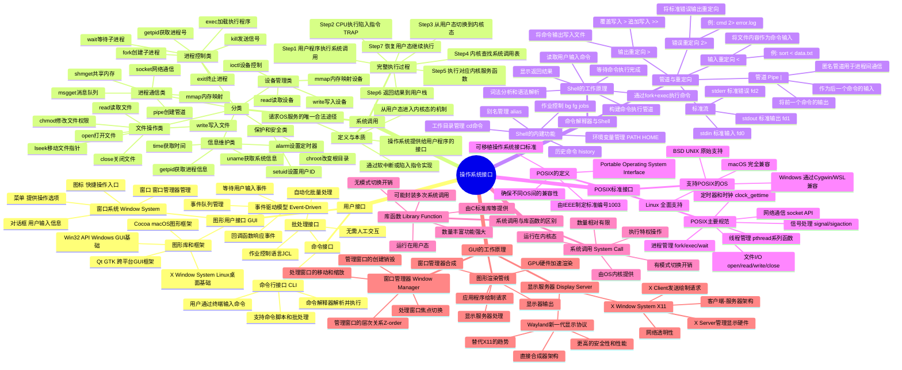

# 第8章 操作系统接口

> **本章题库**：[第08章 真题](真题分类/第08章_操作系统接口_真题.md) | [名校真题汇总](真题分类/名校真题汇总.md)

## 思维导图



---

## 8.1 操作系统接口概述

**操作系统接口（Operating System Interface）** 是操作系统为用户和应用程序提供的交互界面。用户通过操作系统接口使用计算机系统的硬件资源和软件服务。

操作系统接口主要分为以下几类：

```
┌────────────────────────────────────────────────┐
│                  操作系统接口                     │
├──────────────┬──────────────┬──────────────────┤
│   命令接口    │   程序接口    │    图形接口       │
│  (CLI/Shell) │ (系统调用)    │     (GUI)       │
│              │              │                  │
│ 用户输入命令  │ 程序请求服务   │  鼠标键盘图形化   │
│ Shell解析执行 │ 软中断进入内核 │  窗口菜单图标     │
└──────────────┴──────────────┴──────────────────┘
```

| 接口类型 | 使用者 | 交互方式 | 典型例子 |
|---------|-------|---------|---------|
| **命令接口** | 用户（管理员） | 键盘输入文本命令 | Linux Shell、Windows CMD/PowerShell |
| **程序接口（系统调用）** | 程序员 | 程序中调用API函数 | `fork()`、`open()`、`read()` |
| **图形接口** | 普通用户 | 鼠标点击、拖拽等图形化操作 | Windows Desktop、GNOME、KDE |

---

## 8.2 用户接口详解

### 8.2.1 命令接口（Command Interface）

#### (1) 命令行接口（CLI，Command Line Interface）

用户通过终端（Terminal）输入文本命令，由**命令解释器（Command Interpreter/Shell）** 解析并执行。

```
用户输入: $ ls -la /home/user

Shell工作流程:
  1. 读取用户输入字符串
  2. 词法分析: ["ls", "-la", "/home/user"]
  3. 路径查找: 在 PATH 环境变量指定的目录中查找可执行文件 "ls"
  4. 创建子进程: fork()
  5. 加载执行: execve("/bin/ls", ["ls", "-la", "/home/user"], env)
  6. 等待完成: waitpid()
  7. 将结果输出到终端
```

**常见 Shell 类型**：

| Shell 名称 | 说明 | 默认 Shell |
|-----------|------|-----------|
| **Bash** (Bourne Again Shell) | 最流行的 UNIX Shell | Linux/macOS 默认 |
| **Zsh** (Z Shell) | 功能增强版，支持更多特性 | macOS Catalina+ 默认 |
| **Fish** (Friendly Interactive Shell) | 用户友好，自动补全强大 | 需手动安装 |
| **PowerShell** | Windows 跨平台 Shell | Windows 默认 |
| **CMD** | Windows 传统命令解释器 | Windows 传统默认 |
| **sh** (Bourne Shell) | 最早的 UNIX Shell | 部分 UNIX 系统 |

#### (2) 批处理接口（Batch Interface）

用于自动化批量处理，无需人工交互，通过**作业控制语言（JCL，Job Control Language）** 编写脚本。

```
# UNIX Shell 批处理脚本示例 (backup.sh)
#!/bin/bash
echo "Starting backup..."
for file in /home/user/data/*.txt; do
    cp "$file" /backup/
done
echo "Backup complete."
```

### 8.2.2 图形用户接口（GUI，Graphical User Interface）

GUI 以图形化方式呈现信息和操作，用户通过鼠标、键盘等输入设备与系统交互。

**GUI 的基本组成元素**：

| 元素 | 说明 |
|------|------|
| **窗口（Window）** | 独立的矩形区域，显示一个应用程序或文档的内容 |
| **菜单（Menu）** | 提供可选操作的下拉列表或上下文菜单 |
| **图标（Icon）** | 小型图形标识，代表文件、程序或功能的快捷入口 |
| **对话框（Dialog Box）** | 弹出的交互窗口，用于输入信息或确认操作 |
| **按钮（Button）** | 可点击的图形控件，触发特定操作 |
| **光标（Cursor）** | 指示鼠标当前位置和可执行操作的图形符号 |

**GUI 的事件驱动模型**：

```
GUI事件驱动工作流程:

┌──────────┐     ┌──────────┐     ┌──────────────┐
│ 用户操作   │───→│ 事件队列   │───→│ 事件循环       │
│(点击/键盘) │    │ Event     │    │ Event Loop   │
└──────────┘    │ Queue     │    └──────┬───────┘
                └──────────┘           │
                                       ↓
                              ┌──────────────────┐
                              │ 事件分发 Dispatcher│
                              │ 根据事件类型分发    │
                              └──────┬───────────┘
                                     │
                    ┌────────────────┼────────────────┐
                    ↓                ↓                 ↓
             ┌──────────┐    ┌──────────┐    ┌──────────┐
             │ 鼠标点击   │    │ 键盘输入  │    │ 窗口事件   │
             │ Handler   │    │ Handler  │    │ Handler  │
             └──────────┘    └──────────┘    └──────────┘
```

---

## 8.3 系统调用（System Call）

### 8.3.1 系统调用的定义

**系统调用（System Call）** 是操作系统内核为用户程序提供的服务接口，是用户程序请求操作系统服务的**唯一合法途径**。

系统调用是用户态程序进入内核态的**入口点**，通过执行特殊的**陷入指令（Trap Instruction）** 从用户态切换到内核态，在内核态下完成所需服务后返回用户态。

```
用户程序与操作系统的关系:

┌─────────────────────────────────────────┐
│              用户态 (User Mode)           │
│                                         │
│   用户程序 (A.out)                       │
│     │                                   │
│     │ 调用 printf("Hello")              │
│     ↓                                   │
│   C标准库 (libc)                         │
│     │                                   │
│     │ 内部调用 write() 系统调用           │
│     ↓                                   │
│   ═══════════════════════════════════   │ ← 系统调用边界
│   (陷入指令 TRAP, 切换到内核态)           │
│   ═══════════════════════════════════   │
│                                         │
│              内核态 (Kernel Mode)         │
│                                         │
│   内核 sys_write() 函数                  │
│     │                                   │
│     │ 驱动硬件将数据写入显示设备           │
│     ↓                                   │
│   返回用户态                              │
└─────────────────────────────────────────┘
```

### 8.3.2 系统调用的完整执行过程

系统调用从发起至完成，经历以下完整步骤：

```
系统调用完整执行过程:

Step 1: 用户程序发起系统调用
        例如: fd = open("/home/file.txt", O_RDONLY)
        → 编译器将 open() 转换为库函数调用

Step 2: C库函数 (如 glibc) 执行准备工作
        → 将系统调用号放入指定寄存器 (如 EAX)
        → 将参数放入其他寄存器 (如 EBX, ECX, EDX)
        → 执行陷入指令 (如 x86 的 "int 0x80" 或 "syscall")

Step 3: CPU 执行陷入指令，触发模式切换
        → CPU 从用户态 (Ring 3) 切换到内核态 (Ring 0)
        → 保存用户态上下文 (寄存器、程序计数器、栈指针等) 到内核栈
        → 跳转到内核的系统调用入口点 (中断向量表中的地址)

Step 4: 内核的系统调用分发程序
        → 根据系统调用号查系统调用表 (System Call Table)
        → 找到对应的内核处理函数指针
        → 调用该内核函数

Step 5: 内核函数执行实际操作
        → 执行具体的服务逻辑 (如文件读写、进程创建等)
        → 可能涉及硬件操作 (I/O、中断控制等)

Step 6: 执行完毕，返回结果
        → 将返回值放入指定寄存器 (如 EAX)
        → 恢复用户态上下文
        → CPU 从内核态切换回用户态

Step 7: C库函数获取返回值
        → 从寄存器中读取内核返回的结果
        → 若返回值表示错误 (负值)，设置全局变量 errno
        → 将结果返回给用户程序

时间线:
  用户态           │  内核态                    │  用户态
  ────────────────┤───────────────────────────┤──────────
  准备参数          │  保存上下文                  │  读取返回值
  执行 TRAP 指令    │  查系统调用表                │  恢复执行
                   │  执行内核函数                │
                   │  设置返回值                  │
                   │  恢复上下文                  │
```

**系统调用过程中关键的数据结构**：

| 结构 | 说明 |
|------|------|
| **系统调用号（System Call Number）** | 每个系统调用的唯一编号，用于在系统调用表中索引 |
| **系统调用表（System Call Table）** | 一个数组，存储所有系统调用处理函数的指针 |
| **陷入指令（Trap Instruction）** | 特权指令，触发 CPU 模式切换（如 x86 的 `int 0x80`、`syscall`） |
| **用户态上下文** | 所有 CPU 寄存器的值、程序计数器、栈指针等 |
| **内核栈** | 内核态执行时使用的栈空间 |

### 8.3.3 Linux 系统调用分类

#### (1) 进程控制类

| 系统调用 | 功能说明 |
|---------|---------|
| `fork()` | 创建子进程（子进程复制父进程的地址空间） |
| `exec()` / `execve()` | 加载并执行新程序（替换当前进程的地址空间） |
| `exit()` | 终止当前进程 |
| `wait()` / `waitpid()` | 父进程等待子进程结束 |
| `kill()` | 向进程发送信号（可用于终止进程） |
| `getpid()` / `getppid()` | 获取当前进程ID / 父进程ID |
| `nice()` / `setpriority()` | 调整进程优先级 |
| `clone()` | 创建子进程（可精细控制共享资源） |

**fork() + exec() 模式详解**：

```
Shell执行命令 "ls -la" 的过程:

┌─────────────────────────────────────────────┐
│ Shell 进程 (父进程)                            │
│  1. 解析命令: "ls", "-la"                     │
│  2. fork() → 创建子进程                       │
│     ┌──────────────────────────────────────┐ │
│     │ 子进程 (复制了父进程的全部状态)          │ │
│     │  3. execve("/bin/ls", args, env)     │ │
│     │     → 替换为 ls 程序的代码和数据        │ │
│     │  4. 执行 ls -la                      │ │
│     │  5. exit(0) → 返回退出码              │ │
│     └──────────────────────────────────────┘ │
│  6. waitpid() → 等待子进程结束               │
│  7. 获取退出状态，继续Shell的交互循环           │
└─────────────────────────────────────────────┘

为什么需要 fork+exec 而不直接 exec?
  - fork 允许子进程在 exec 前做准备工作
  - 如: 重定向 I/O、设置环境变量、创建管道等
  - Shell 的 I/O 重定向功能依赖于 fork 后、exec 前的操作窗口
```

#### (2) 文件操作类

| 系统调用 | 功能说明 |
|---------|---------|
| `open()` | 打开或创建文件，返回文件描述符（File Descriptor） |
| `close()` | 关闭文件描述符，释放相关资源 |
| `read()` | 从文件描述符读取数据 |
| `write()` | 向文件描述符写入数据 |
| `lseek()` | 移动文件读写指针到指定位置 |
| `chmod()` / `fchmod()` | 修改文件权限 |
| `chown()` | 修改文件所有者 |
| `stat()` / `fstat()` | 获取文件状态信息 |
| `unlink()` | 删除文件（减少链接计数） |
| `dup()` / `dup2()` | 复制文件描述符（用于 I/O 重定向） |
| `mmap()` | 将文件映射到进程地址空间（内存映射文件） |

**文件描述符表**：

```
进程的文件描述符表:
┌───────┬──────────────────┐
│  fd   │  指向的打开文件    │
├───────┼──────────────────┤
│   0   │ stdin  (标准输入)  │  ← 默认: 终端输入
│   1   │ stdout (标准输出)  │  ← 默认: 终端输出
│   2   │ stderr (标准错误)  │  ← 默认: 终端输出
│   3   │ file.txt (打开的文件) │
│   4   │ socket_fd (网络套接字) │
│  ...  │  ...             │
└───────┴──────────────────┘

每个进程独立拥有文件描述符表,
fd 0/1/2 是系统默认打开的标准流
```

#### (3) 设备管理类

| 系统调用 | 功能说明 |
|---------|---------|
| `ioctl()` | 控制设备的特殊操作（如设置波特率、屏幕分辨率） |
| `read()` / `write()` | 对设备文件的读写（与文件操作共用接口） |
| `mmap()` | 将设备内存映射到进程地址空间 |
| `select()` / `poll()` / `epoll()` | I/O 多路复用，同时监控多个文件描述符 |
| `mount()` / `umount()` | 挂载/卸载文件系统设备 |

**设备文件的概念（UNIX"一切皆文件"）**：

```
Linux 中设备作为文件处理:
  /dev/sda     → 硬盘设备文件
  /dev/tty     → 终端设备文件
  /dev/null    → 空设备（丢弃所有写入）
  /dev/random  → 随机数设备
  /dev/urandom → 非阻塞随机数设备

对设备的读写 → 调用 read()/write() 系统调用
→ 内核将请求转发给对应的设备驱动程序
→ 驱动程序控制硬件完成操作
```

#### (4) 信息维护类

| 系统调用 | 功能说明 |
|---------|---------|
| `time()` / `gettimeofday()` | 获取系统时间 |
| `clock_gettime()` | 获取高精度时钟值 |
| `uname()` | 获取操作系统信息（名称、版本等） |
| `getpid()` / `getuid()` | 获取进程/用户标识信息 |
| `alarm()` | 设置定时信号（闹钟） |
| `setitimer()` | 设置更精确的间隔定时器 |
| `sysinfo()` | 获取系统内存、交换区等信息 |

#### (5) 进程通信类

| 系统调用 | 功能说明 |
|---------|---------|
| `pipe()` | 创建匿名管道（单向通信，父子进程间） |
| `mkfifo()` | 创建命名管道（FIFO，无亲缘关系进程间） |
| `shmget()` / `shmat()` | 共享内存的创建与附加 |
| `msgget()` / `msgsnd()` / `msgrcv()` | 消息队列的创建和收发 |
| `semget()` / `semop()` | 信号量的创建和操作（进程同步） |
| `socket()` | 创建网络套接字（网络通信的基础） |
| `bind()` / `listen()` / `accept()` | 服务器端套接字绑定、监听和接受连接 |
| `connect()` / `send()` / `recv()` | 客户端连接和数据收发 |
| `signal()` / `sigaction()` | 信号处理机制 |

#### (6) 保护和安全类

| 系统调用 | 功能说明 |
|---------|---------|
| `setuid()` / `setgid()` | 设置进程的有效用户ID/组ID |
| `chroot()` | 改变进程的根目录（chroot jail 沙箱） |
| `chmod()` / `chown()` | 修改文件权限和所有者 |
| `seccomp()` | 限制进程可使用的系统调用（安全沙箱） |

### 8.3.4 系统调用的开销分析

| 开销类型 | 说明 |
|---------|------|
| **模式切换** | 从用户态到内核态，再返回，需要保存和恢复 CPU 上下文 |
| **参数拷贝** | 需要将用户空间的参数复制到内核空间 |
| **内核验证** | 内核需要验证所有参数的合法性（防止恶意参数） |
| **中断处理** | 陷入指令触发中断处理流程，有额外的硬件开销 |
| **缓存失效** | 模式切换可能导致 TLB、缓存失效 |

**一次系统调用的典型开销**：几十到几百微秒（μs），比普通函数调用（纳秒级）慢约 100-1000 倍。

---

## 8.4 命令解释器与 Shell

### 8.4.1 Shell 的工作原理

**Shell** 是一个特殊的用户程序，既是命令解释器，也是一种编程语言。

```
Shell主循环 (Read-Eval-Print Loop):

while (true) {
    1. 显示提示符 (如 $ 或 # )
    2. 读取用户输入行 (命令字符串)
    3. 解析命令:
       a. 词法分析 → 分离出命令名和参数
       b. 检查内建命令 (如 cd, export, exit)
          → 若是内建命令，Shell直接执行
       c. 检查外部命令:
          → 在 PATH 环境变量指定的目录中搜索可执行文件
       d. 处理 I/O 重定向符号 (<, >, >>, 2>)
       e. 处理管道符 (|)
    4. 创建子进程 (fork)
    5. 在子进程中执行命令 (exec)
    6. Shell 父进程等待子进程完成 (wait)
    7. 回到步骤 1 继续循环
}
```

### 8.4.2 Shell 的内建功能

有些功能必须由 Shell 直接实现（不能通过外部命令完成），因为它们需要修改 Shell 自身的状态：

| 功能 | 命令 | 说明 |
|------|------|------|
| **工作目录** | `cd /path` | 修改 Shell 进程的当前目录（fork 后子进程的修改不影响父进程） |
| **环境变量** | `export PATH=...` | 设置环境变量供子进程继承 |
| **Shell 变量** | `VAR=value` | 设置仅 Shell 内部可见的变量 |
| **别名** | `alias ll='ls -la'` | 为命令创建别名 |
| **历史命令** | `history` | 查看和复用之前的命令 |
| **退出** | `exit` | 终止 Shell 进程 |
| **作业控制** | `bg`、`fg`、`jobs` | 前后台作业管理 |
| **输入源** | `source file.sh` | 在当前 Shell 中执行脚本（而非 fork 子进程） |

**为什么 `cd` 必须是内建命令？**

```
如果 cd 是外部命令:
  Shell fork → 子进程执行 cd → 子进程的当前目录改变了
  → 但父进程(Shell)的当前目录没有改变！
  → 回到 Shell 后，提示符中的路径没有变化

所以 cd 必须由 Shell 直接执行（内建），
才能真正改变 Shell 进程自身的当前目录。
```

### 8.4.3 管道与 I/O 重定向

#### (1) 标准流（Standard Streams）

每个进程默认打开三个文件描述符：

| 文件描述符 | 名称 | 缩写 | 默认连接 |
|-----------|------|------|---------|
| fd 0 | 标准输入（Standard Input） | stdin | 键盘 |
| fd 1 | 标准输出（Standard Output） | stdout | 终端屏幕 |
| fd 2 | 标准错误（Standard Error） | stderr | 终端屏幕 |

#### (2) 管道（Pipe）

**管道**是 UNIX 中最重要的 IPC（进程间通信）机制之一，将一个进程的输出连接到另一个进程的输入。

```
管道工作原理:
  命令: cat file.txt | sort | head -5

  ┌──────────┐    pipe1    ┌──────────┐    pipe2    ┌──────────┐
  │ cat       │──→ fd1 ──→ │ sort     │──→ fd1 ──→ │ head -5  │ → 终端
  │ file.txt  │    fd0 ←──  │          │    fd0 ←──  │          │
  └──────────┘             └──────────┘             └──────────┘

实现细节 (以 cat | sort 为例):
  1. Shell 调用 pipe() 创建管道，得到两个文件描述符 pipe_fd[0](读) 和 pipe_fd[1](写)
  2. Shell fork 创建 cat 进程
     → 子进程: close(stdout), dup(pipe_fd[1])  // stdout → 管道写端
     → 子进程: exec("cat", "file.txt")
  3. Shell fork 创建 sort 进程
     → 子进程: close(stdin), dup(pipe_fd[0])   // stdin → 管道读端
     → 子进程: exec("sort")
  4. 管道提供自动缓冲: cat 写入的数据被内核缓冲, sort 从中读取
  5. 当 cat 写完关闭管道写端后, sort 读到 EOF, 处理完毕退出
```

**管道的类型**：

| 类型 | 说明 | 特点 |
|------|------|------|
| **匿名管道（Anonymous Pipe）** | `pipe()` 创建 | 只能用于有亲缘关系的进程（父子/兄弟） |
| **命名管道（FIFO）** | `mkfifo()` 创建 | 以文件形式存在于文件系统中，无亲缘关系进程也可使用 |

#### (3) I/O 重定向

```
I/O重定向示例:

# 输出重定向 (覆盖写)
$ ls -la > output.txt
  → Shell 在 fork 前: close(1), open("output.txt", O_WRONLY|O_CREAT)
  → ls 的 stdout 就指向了 output.txt

# 输出追加重定向
$ echo "new line" >> log.txt
  → 类似上面，但 open 时使用 O_APPEND 标志

# 输入重定向
$ sort < data.txt
  → Shell: close(0), open("data.txt", O_RDONLY)
  → sort 的 stdin 指向了 data.txt

# 错误重定向
$ gcc main.c 2> compile_error.log
  → Shell: close(2), open("compile_error.log", O_WRONLY|O_CREAT)
  → 编译错误信息写入日志文件

# 标准输出和错误同时重定向
$ cmd > all.log 2>&1
  → 先重定向 stdout 到 all.log
  → 再将 stderr(2) 重定向到 stdout(1) 的目标

# 丢弃输出
$ noisy_command > /dev/null
  → stdout 指向空设备，所有输出被丢弃
```

---

## 8.5 POSIX 标准接口

### 8.5.1 POSIX 的定义

**POSIX（Portable Operating System Interface，可移植操作系统接口）** 是由 IEEE 制定的一系列标准（编号 IEEE 1003），旨在确保不同操作系统之间的**应用程序可移植性**。

POSIX 定义了操作系统应该提供的**系统调用接口、库函数、Shell 命令和工具**的标准规范。

### 8.5.2 POSIX 主要规范

| 规范领域 | POSIX 标准接口（函数） | 功能说明 |
|---------|---------------------|---------|
| **进程管理** | `fork()`, `exec*()`, `_exit()`, `wait*()`, `getpid()`, `getppid()` | 创建、执行、终止和等待进程 |
| **文件 I/O** | `open()`, `close()`, `read()`, `write()`, `lseek()`, `stat()`, `fcntl()` | 文件的打开、关闭、读写、属性操作 |
| **信号处理** | `signal()`, `sigaction()`, `kill()`, `raise()`, `sigprocmask()` | 进程间信号的发送和处理 |
| **线程管理** | `pthread_create()`, `pthread_join()`, `pthread_exit()`, `pthread_mutex_*()`, `pthread_cond_*()` | POSIX 线程（pthread）的创建、同步和销毁 |
| **网络通信** | `socket()`, `bind()`, `listen()`, `accept()`, `connect()`, `send()`, `recv()` | 套接字网络编程接口 |
| **定时器** | `clock_gettime()`, `nanosleep()`, `timer_create()`, `gettimeofday()` | 高精度时间获取和定时操作 |
| **内存管理** | `mmap()`, `munmap()`, `brk()`, `sbrk()` | 内存映射和堆管理 |
| **进程间通信** | `shmget()`, `semget()`, `msgget()`, `mq_open()` | 共享内存、信号量、消息队列 |
| **目录操作** | `opendir()`, `readdir()`, `closedir()`, `mkdir()`, `rmdir()` | 目录的读取、创建和删除 |
| **环境和配置** | `getenv()`, `setenv()`, `sysconf()`, `pathconf()` | 环境变量和系统配置查询 |

### 8.5.3 支持 POSIX 的操作系统

| 操作系统 | POSIX 兼容性 |
|---------|-------------|
| **Linux** | 全面支持 POSIX（glibc 实现） |
| **macOS** | 完全兼容 POSIX |
| **FreeBSD / OpenBSD** | 完全兼容 POSIX |
| **Solaris** | 完全兼容 POSIX |
| **Windows** | 部分兼容（通过 Cygwin、WSL 或原生 UCRT 实现） |

**POSIX 的重要性**：
- 为程序员提供了**统一的 API**，源代码只需少量修改即可在不同 OS 上编译运行
- Linux 和 macOS 上的 C 语言系统编程几乎完全一致
- Windows 通过 WSL（Windows Subsystem for Linux）大幅提高了 POSIX 兼容性

---

## 8.6 系统调用与库函数的区别

这是一个常见的考试考点。理解二者的区别对于正确使用操作系统接口至关重要。

```
应用程序中系统调用与库函数的关系:

┌──────────────────────────────────────────────────┐
│                    用户程序                         │
│    printf("Hello, World!\n")                       │
│         │                                         │
│         ↓                                         │
│    ┌────────────────┐                             │
│    │ C标准库 (glibc) │  ← 库函数 (用户态)           │
│    │ printf()       │                             │
│    │ (格式化字符串,   │                             │
│    │  缓冲区管理)    │                             │
│    └───────┬────────┘                             │
│            │ 内部调用                               │
│            ↓                                      │
│    ┌────────────────┐                             │
│    │ write()        │  ← 系统调用包装函数           │
│    │ (将用户缓冲区   │    (用户态)                  │
│    │  数据传给内核)   │                             │
│    └───────┬────────┘                             │
│ ═══════════╪═════════════════════════════════════ │
│            │ TRAP 指令                             │
│            ↓                                      │
│    ┌────────────────┐                             │
│    │ sys_write()    │  ← 系统调用内核处理函数       │
│    │ (内核态执行)    │    (内核态)                   │
│    │ 调用设备驱动    │                             │
│    └────────────────┘                             │
└──────────────────────────────────────────────────┘
```

| 对比维度 | 系统调用（System Call） | 库函数（Library Function） |
|---------|----------------------|-------------------------|
| **提供者** | OS 内核（kernel） | C 标准库（glibc）、第三方库 |
| **执行模式** | **内核态**（需要模式切换） | **用户态**（无需模式切换） |
| **开销** | 较大（几十~几百μs，涉及陷入、上下文保存/恢复） | 较小（普通函数调用，纳秒级） |
| **数量** | 有限（Linux 约 300+ 个） | 丰富（C 标准库有数千个函数） |
| **功能范围** | 底层硬件操作、OS 核心服务 | 高层封装、格式化、数据处理 |
| **可移植性** | 依赖具体 OS（需遵循 POSIX） | 依赖库本身（跨平台库如 glibc 移植性好） |
| **是否可被绕过** | 不可以（是用户接触硬件的唯一途径） | 可以（直接使用系统调用） |
| **封装层次** | 直接进入内核 | 可能封装了多个系统调用 |
| **错误处理** | 返回 -1 并设置 errno | 返回 NULL 或错误码 |
| **典型例子** | `open()`, `read()`, `fork()`, `write()` | `printf()`, `malloc()`, `fopen()`, `fread()` |

**关键关系**：

- 库函数**可能封装**一个或多个系统调用（如 `malloc()` 内部调用 `brk()` 或 `mmap()`）
- 库函数**可能不涉及**系统调用（如 `strcpy()` 纯粹在用户态操作内存）
- 一个系统调用可以被多个库函数使用
- **所有系统调用最终都通过陷入指令进入内核**，库函数则不一定

---

## 8.7 GUI 的工作原理

### 8.7.1 窗口管理器（Window Manager）

**窗口管理器**是负责管理所有窗口的显示、布局和交互的系统组件。

| 功能 | 说明 |
|------|------|
| **窗口创建与销毁** | 分配和释放窗口资源 |
| **窗口移动与缩放** | 响应用户的拖拽操作 |
| **窗口层次管理（Z-order）** | 决定窗口的前后遮挡顺序 |
| **焦点管理** | 确定哪个窗口接收键盘输入 |
| **窗口装饰** | 绘制标题栏、边框、最小化/最大化按钮 |
| **虚拟桌面** | 管理多个工作区 |

**常见窗口管理器**：

| 桌面环境 | 窗口管理器 | 平台 |
|---------|----------|------|
| GNOME | Mutter | Linux |
| KDE Plasma | KWin | Linux |
| Windows Desktop | DWM (Desktop Window Manager) | Windows |
| macOS Aqua | Quartz Compositor | macOS |

### 8.7.2 显示服务器（Display Server）

**显示服务器**是图形系统的核心，负责将所有应用程序的图形输出合成并发送到显示器。

#### X Window System（X11）

```
X Window System 架构:

┌──────────────────────────────────────────────┐
│                X Server                       │
│           (管理显示硬件和输入设备)               │
│    ┌────────────┬────────────┬────────────┐  │
│    │ 显卡驱动    │  输入设备   │  帧缓冲区   │  │
│    │            │  处理       │  Framebuffer│  │
│    └────────────┴────────────┴────────────┘  │
│                    ↑                          │
│              X 协议 (X Protocol)              │
│              (基于TCP/Unix Socket)            │
│         ↗        ↑        ↖                   │
│     ┌─────┐  ┌─────┐  ┌─────┐               │
│     │X App│  │X App│  │ WM  │               │
│     │客户端│  │客户端│  │窗口  │               │
│     └─────┘  └─────┘  │管理器│               │
│                        └─────┘               │
│     X Client (应用程序)                        │
└──────────────────────────────────────────────┘

X11 特点:
  - 客户端-服务器架构
  - X Server 运行在本地，管理硬件
  - X Client 可以运行在远程机器（网络透明性）
  - 窗口管理器只是一个特殊的 X Client
  - 策略与机制分离（Mechanism- policy separation）
```

#### Wayland（新一代显示协议）

```
Wayland 架构:

┌──────────────────────────────────────┐
│        Wayland Compositor             │
│     (合成器 = X Server + WM 合并)      │
│  ┌──────────┐  ┌──────────────────┐  │
│  │ EGL/GPU  │  │  输入设备管理     │  │
│  │ 直接渲染  │  │                  │  │
│  └──────────┘  └──────────────────┘  │
│         ↗     ↑     ↖                 │
│     ┌─────┐ ┌─────┐ ┌─────┐         │
│     │ App │ │ App │ │ App │         │
│     └─────┘ └─────┘ └─────┘         │
│     Wayland Client (应用程序)          │
└──────────────────────────────────────┘

Wayland 特点:
  - 合成器直接管理所有窗口渲染
  - 更高的安全性（应用无法读取其他窗口内容）
  - 更低的延迟（直接与GPU合成）
  - 更简洁的架构
  - 逐步替代 X11（Ubuntu 21.04+ 默认）
```

### 8.7.3 GUI 的渲染流程

```
从用户操作到屏幕显示的完整流程:

1. 用户操作 → 鼠标点击/键盘输入
        ↓
2. 输入设备 → 触发中断 → 内核读取输入事件
        ↓
3. 输入事件 → 传递给显示服务器/合成器
        ↓
4. 合成器 → 判断事件属于哪个窗口
        ↓
5. 事件传递 → 发送给对应的应用程序
        ↓
6. 应用程序 → 处理事件 → 调用绘图API
        ↓
7. 绘图命令 → 发送给显示服务器
        ↓
8. 合成器 → 收集所有窗口的绘图结果
        ↓
9. GPU合成 → 将所有窗口合成为一帧画面
        ↓
10. 显示输出 → 通过显示接口(HDMI/DP)送到显示器
        ↓
11. 显示器 → 刷新显示（通常60Hz/144Hz）
```

---

## 8.8 常见考点汇总

| 考点 | 要点 |
|------|------|
| **系统调用执行过程** | 用户态准备参数 → TRAP陷入 → 切换内核态 → 查系统调用表 → 执行内核函数 → 返回结果 → 恢复用户态 |
| **系统调用 vs 库函数** | 系统调用运行在内核态、有模式切换开销；库函数运行在用户态、可能封装多个系统调用 |
| **fork()+exec() 模式** | fork 复制进程，exec 替换程序映像；Shell 用此模式执行外部命令 |
| **Shell 的内建命令** | cd、export、exit 等必须内建（因为需要修改 Shell 自身状态） |
| **I/O 重定向** | 通过 close()+dup()/open() 改变 fd0/1/2 的指向；在 fork 后、exec 前完成 |
| **管道 Pipe** | 匿名管道用于父子进程间通信；`|` 操作符的底层实现是 pipe()+fork()+dup() |
| **POSIX 标准** | IEEE 1003 标准，确保 OS 间可移植性；Linux/macOS 完全支持，Windows 部分支持 |
| **文件描述符** | 每个进程独立维护；fd 0=stdin, 1=stdout, 2=stderr |
| **GUI 工作原理** | X11 客户端-服务器架构；Wayland 合成器直接渲染；事件驱动模型 |
| **系统调用开销** | 模式切换 + 参数拷贝 + 上下文保存/恢复，远大于普通函数调用 |
| **Linux 系统调用分类** | 进程控制、文件操作、设备管理、信息维护、进程通信、保护安全六大类 |
| **"一切皆文件"** | UNIX 哲学：设备、管道、socket 等都抽象为文件描述符，统一使用 read/write 接口 |
