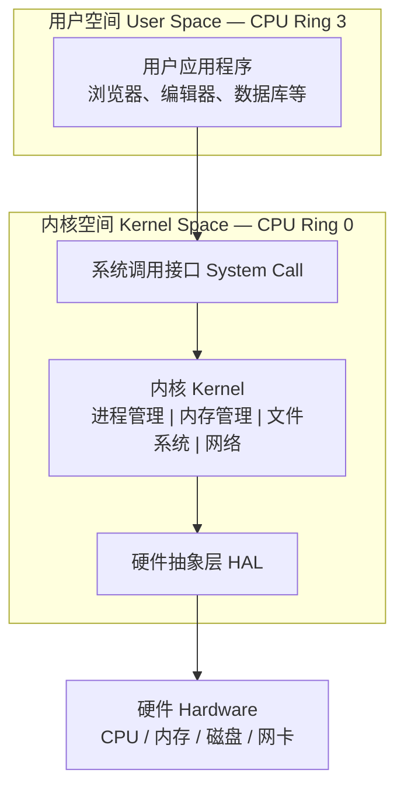
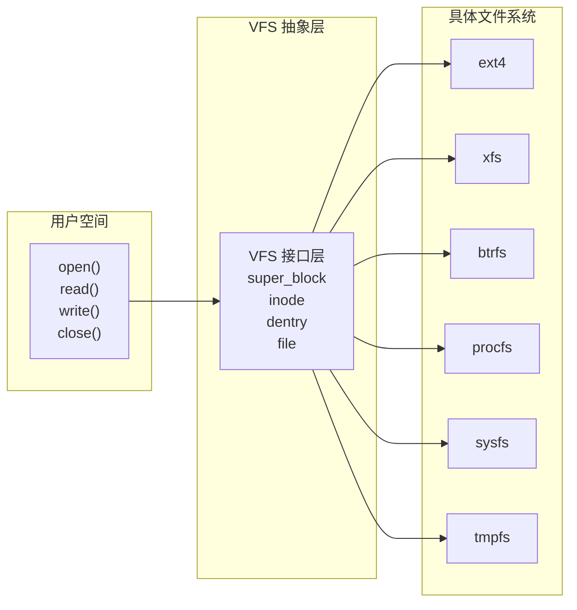
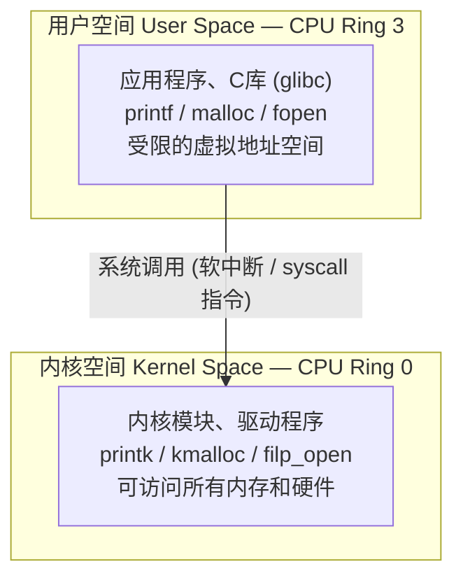

# 第10章 内核模块

> **本章题库**：[第10章 真题](真题分类/第10章_内核模块_真题.md) | [名校真题汇总](真题分类/名校真题汇总.md)

## 思维导图

```mermaid
mindmap
  root((内核模块 Kernel Module))
    内核基础
      内核的定义
        操作系统的核心程序
        常驻内存，运行在最高特权级
        管理硬件资源和提供系统服务
      内核的主要功能
        进程管理 Process Management
          进程创建/调度/通信/同步/销毁
          调度器 Scheduler
          上下文切换 Context Switch
        内存管理 Memory Management
          虚拟内存管理
          物理内存分配
          页表管理与地址转换
        文件系统 File System
          VFS虚拟文件系统接口
          具体FS ext4/xfs/btrfs
          inode/dentry/super_block
        网络接口 Network Interface
          TCP/IP协议栈
          Socket接口
          网络设备驱动
        设备驱动 Device Drivers
          字符设备 Character Device
          块设备 Block Device
          网络设备 Network Device
      内核的两种设计哲学
        宏内核 Monolithic Kernel
          所有功能运行在同一地址空间
          性能高，但一个模块出错可能导致整个系统崩溃
          代表：Linux
        微内核 Microkernel
          仅保留最基本功能在内核态
          其他服务运行在用户态
          安全稳定，但性能开销较大
          代表：Minix, QNX, GNU Hurd
        混合内核 Hybrid Kernel
          结合宏内核和微内核的特点
          代表：Windows NT, macOS XNU

    Linux内核整体架构
      五大子系统
        进程管理子系统 PM
          task_struct 进程描述符（PCB）
          CFS完全公平调度器
          进程间通信 IPC
            管道 Pipe/Named Pipe
            信号 Signal
            共享内存 Shared Memory
            消息队列 Message Queue
            信号量 Semaphore
            Socket
          进程创建 fork/clone
          内核线程 kthread_create
        内存管理子系统 MM
          虚拟地址空间
            32位系统 4GB
            64位系统 256TB
          多级页表机制
          伙伴系统 Buddy System
            以页为单位分配/释放
            解决外部碎片
          Slab分配器
            小对象内存分配
            kmalloc底层实现
            对象缓存复用
          OOM Killer
            内存耗尽时终止进程
            按oom_score评分选择牺牲者
          页缓存 Page Cache
            缓存磁盘数据在内存中
            加速文件读写
        文件系统子系统 VFS
          虚拟文件系统抽象层
            统一的文件操作接口
            open/read/write/close
          核心数据结构
            super_block 超级块
            inode 索引节点
            dentry 目录项
            file 打开的文件
          支持的具体文件系统
            ext4 Linux默认
            xfs 高性能
            btrfs 快照/压缩
            tmpfs 内存文件系统
            procfs /proc 虚拟文件系统
            sysfs /sys 设备信息
        网络接口子系统 Net
          Socket层
            用户空间网络编程接口
          协议层
            TCP/IP协议栈
            ARP/IP/TCP/UDP/ICMP
          Netfilter框架
            iptables/nftables底层
            数据包过滤/NAT
          核心数据结构
            sk_buff 网络数据包
            net_device 网络设备
          网络设备管理
            网卡驱动注册
            收包/发包路径
        硬件抽象层 HAL/设备驱动
          字符设备
            按字节流访问
            如串口、键盘、鼠标
            file_operations接口
          块设备
            按固定大小块访问
            如硬盘、SSD、U盘
            支持随机访问
          网络设备
            网卡等网络接口
            sk_buff收发
          设备模型
            kobject/kset设备树
            sysfs文件系统暴露设备信息
          中断处理
            硬中断→上半部 Top Half
            软中断→下半部 Bottom Half
            tasklet / workqueue

    内核模块机制 LKM
      可加载内核模块 LKM
        Loadable Kernel Module
        运行时动态加载到内核
        无需重新编译整个内核
        模块文件扩展名 .ko
        Kernel Object
      模块的生命周期
        编译 Compile
          源码.c → 目标文件.o → 模块.ko
          依赖内核头文件和构建系统
        加载 Load
          insmod 手动加载指定.ko文件
          modprobe 自动处理依赖加载
          加载时执行module_init注册的函数
        运行 Run
          模块代码在内核态执行
          可注册设备/中断/文件系统等
        卸载 Unload
          rmmod 卸载指定模块
          卸载时执行module_exit注册的函数
          必须释放所有资源避免内核泄漏
      module_init 与 module_exit
        module_init(func)
          声明模块加载时调用的初始化函数
          返回0表示成功，非0表示失败
        module_exit(func)
          声明模块卸载时调用的清理函数
        __init 标记
          初始化函数仅在加载时使用
          加载完成后释放其占用的内存
        __exit 标记
          清理函数仅在模块编译为模块时使用
          编译进内核时该函数会被丢弃
      模块信息宏
        MODULE_LICENSE()
          声明许可证（GPL/GPL v2/MIT等）
          影响内核符号的导出
          非GPL模块无法使用EXPORT_SYMBOL_GPL导出的符号
        MODULE_AUTHOR()
          声明模块作者
        MODULE_DESCRIPTION()
          模块功能描述
        MODULE_VERSION()
          模块版本号
      模块参数
        module_param(name,type,perm)
          为模块添加可配置参数
          加载时可通过参数传递值
          type: bool/int/charp等
          perm: 参数在/sys中的权限
        MODULE_PARAM_DESC()
          参数的描述信息
      模块依赖
        符号导出 Symbol Export
          EXPORT_SYMBOL() 导出全局函数/变量
          EXPORT_SYMBOL_GPL() 仅对GPL模块导出
        依赖解析
          modprobe自动处理模块间依赖关系
          insmod不处理依赖，需手动按序加载
          depmod命令生成模块依赖信息
      模块常见操作命令
        lsmod 查看已加载模块列表
        modinfo 查看模块详细信息
        modprobe -r 卸载模块（自动处理依赖）
        insmod / rmmod 手动加载/卸载
        dmesg 查看内核日志（printk输出）
      Kbuild构建系统
        obj-m 编译为可加载模块
        obj-y 编译进内核镜像
        Makefile写法
          单文件模块
          多文件模块的obj-m和xxx-objs
        编译命令
          make -C /lib/modules/$(uname -r)/build M=$(pwd) modules

    内核编程 Kernel Programming
      内核空间 vs 用户空间
        地址空间隔离
          用户空间 CPU Ring 3
          内核空间 CPU Ring 0
        访问权限
          用户态不能直接访问内核地址
          内核态可以访问所有地址空间
        系统调用 System Call
          用户态→内核态的唯一合法入口
          通过软中断/ syscall 指令触发
          如 open/read/write/fork/mmap
        地址空间布局（32位Linux）
          用户空间 0~3GB
            代码段/数据段/堆/栈/mmap区
          内核空间 3~4GB
            内核代码/数据/页表/内核栈
      编程特殊性与限制
        不能使用标准库
          没有glibc/musl等用户空间库
          没有printf/malloc/fopen等函数
          必须使用内核提供的API
        不能使用printf
          内核用printk替代
          输出到内核日志缓冲区
          通过dmesg命令查看
        内存分配差异
          kmalloc 小内存分配（<128KB）
            物理连续内存
            GFP_KERNEL等标志
            kfree释放
          vmalloc 大内存分配
            虚拟连续但物理不一定连续
            适合大块内存
            vfree释放
          kzalloc 分配并清零
          kmem_cache_create 创建对象缓存
        不能使用浮点运算
          内核不支持FPU上下文保存
          使用浮点会导致内核异常
          必须用整数运算替代
        不能随意睡眠
          中断上下文不能睡眠
          进程上下文可以睡眠
          spin_lock持有期间不能睡眠
        栈空间有限
          内核线程栈通常只有8KB/16KB
          不应在栈上分配大数组
          避免深层递归
        错误处理
          返回指针用ERR_PTR/IS_ERR
          返回值一般用负数表示错误码
          goto用于统一错误清理
      常用内核API
        输出与日志
          printk 带日志级别的内核打印
            KERN_EMERG(0) 到 KERN_DEBUG(7)
            共8个日志级别
          pr_info/pr_err/pr_debug 便捷宏
        内存管理
          kmalloc/kfree 物理连续小内存
          vmalloc/vfree 大块虚拟连续内存
          kzalloc 分配并清零
          kmem_cache_create 分配slab对象缓存
        链表操作
          内核自定义双向链表 list_head
          list_add/list_del/list_for_each
          不依赖标准库的链表实现
        字符设备操作
          alloc_chrdev_region 动态分配设备号
          cdev_init/cdev_add 注册字符设备
          file_operations 定义文件操作回调
          register_chrdev_region 静态分配设备号
        同步机制
          spin_lock/spin_unlock 自旋锁
          mutex_lock/mutex_unlock 互斥锁
          semaphore 信号量
          completion 完成变量
        内核线程
          kthread_create 创建线程
          kthread_stop 停止线程
          msleep 睡眠指定毫秒数
      /proc文件系统
        进程信息目录 /proc/PID/
          cmdline 命令行参数
          status 进程状态信息
          maps 内存映射信息
          fd 打开的文件描述符
        系统信息
          /proc/cpuinfo CPU信息
          /proc/meminfo 内存信息
          /proc/version 内核版本
          /proc/modules 已加载模块
        内核模块利用/proc
          创建/proc/xxx文件
          通过read/write回调与用户空间交互
          实现内核态信息的用户态读取
        创建示例
          proc_create 创建文件
          file_operations 定义读写操作
          适用于调试和状态输出

    Linux内核版本演进
      版本号格式
        主版本号.次版本号.修订号
        如 6.1.0
      重要版本里程碑
        2.0 1996 多处理器SMP支持
        2.2 1999 模块支持改进
        2.4 2001 USB/ACPI支持
        2.6 2003 O(1)调度器/CFS前身
          模块版本化ABI
          内核抢占支持
        3.x 2011 延续2.6编号
        4.x 2015 增强虚拟化/容器
        5.x 2018 RUST语言初步支持
          实时性PREEMPT_RT
          eBPF扩展
        6.x 2022 更多硬件支持
          RUST正式进入内核
      模块兼容性
        不同版本内核模块ABI可能不兼容
        需针对特定内核版本编译
        模块版本验证 vermagic
```

---

## 10.1 内核基础

### 10.1.1 内核的定义

**内核（Kernel）** 是操作系统的核心程序，常驻内存，运行在CPU的最高特权级（Ring 0），负责管理硬件资源和为上层应用程序提供系统服务。

内核是连接硬件与用户应用程序之间的桥梁：



### 10.1.2 内核的主要功能

| 功能模块 | 职责 | 关键机制 |
|---------|------|---------|
| **进程管理** | 进程的创建、调度、通信、同步和销毁 | 调度器、上下文切换、IPC |
| **内存管理** | 虚拟内存、物理内存分配、页表管理 | 伙伴系统、Slab分配器、页表 |
| **文件系统** | 文件的存储、检索和访问 | VFS抽象层、ext4/xfs等 |
| **网络接口** | 网络协议栈和网络设备管理 | TCP/IP、Socket、Netfilter |
| **设备驱动** | 屏蔽硬件差异，提供统一接口 | 字符设备、块设备、网络设备 |

### 10.1.3 两种内核设计哲学

| 类型 | 特点 | 优点 | 缺点 | 代表OS |
|------|------|------|------|--------|
| **宏内核 Monolithic Kernel** | 所有内核功能运行在同一地址空间 | 性能高，模块间通信快 | 一个模块出错可能整个系统崩溃 | Linux |
| **微内核 Microkernel** | 仅保留最基本功能在内核态（调度、IPC、内存管理），其他服务运行在用户态 | 安全稳定，模块隔离 | 性能开销大，IPC频繁 | Minix, QNX |
| **混合内核 Hybrid Kernel** | 宏内核与微内核的折中 | 兼顾性能与稳定性 | 设计复杂 | Windows NT, macOS XNU |

---

## 10.2 Linux内核五大子系统

### 10.2.1 进程管理子系统（Process Management）

**核心职责**：进程的创建、调度、通信、同步和销毁。

| 概念 | 说明 |
|------|------|
| **task_struct** | 描述进程/线程的核心数据结构（PCB），包含PID、状态、调度信息、内存映射等 |
| **CFS** | Completely Fair Scheduler，Linux默认调度器，基于虚拟运行时间（vruntime）的红黑树实现 |
| **进程创建** | `fork()` → `clone()` → `do_fork()`，写时复制（COW）优化 |
| **进程间通信 IPC** | 管道、信号、共享内存、消息队列、信号量、Socket |
| **内核线程** | `kthread_create()` 创建运行在内核态的线程，无用户地址空间 |

**CFS调度器核心思想**：
- 为每个进程维护一个**vruntime**（虚拟运行时间）
- 总是选择vruntime最小的进程运行
- 使用**红黑树**组织可运行进程，查找最小vruntime为O(log n)
- nice值影响vruntime的增长速率（优先级高的进程vruntime增长慢）

### 10.2.2 内存管理子系统（Memory Management）

**核心职责**：虚拟内存管理、物理内存分配与回收、页表管理、内存保护。

| 概念 | 说明 |
|------|------|
| **虚拟地址空间** | 每个进程拥有独立的虚拟地址空间（32位: 4GB, 64位: 256TB+） |
| **多级页表** | Linux使用4级页表（PGD→PUD→PMD→PTE），减少页表占用的内存 |
| **伙伴系统 Buddy System** | 以页（4KB）为单位的物理内存分配器，解决外部碎片 |
| **Slab分配器** | 基于伙伴系统之上，为内核小对象（如task_struct、inode）提供高效分配 |
| **OOM Killer** | Out Of Memory Killer，内存耗尽时按oom_score评分终止进程 |
| **Page Cache** | 页缓存，将磁盘数据缓存在内存中，加速文件读写 |

**内存分配函数对比**：

| 函数 | 适用场景 | 内存特点 | 释放函数 |
|------|---------|---------|---------|
| `kmalloc()` | 小内存（通常 < 128KB） | 物理连续 | `kfree()` |
| `vmalloc()` | 大块内存 | 虚拟连续，物理不一定连续 | `vfree()` |
| `kzalloc()` | 小内存 + 清零 | 物理连续，初始化为0 | `kfree()` |
| `kmem_cache_create()` | 固定大小对象缓存 | Slab机制，高效复用 | `kmem_cache_destroy()` |

### 10.2.3 文件系统子系统（VFS）

**核心职责**：通过虚拟文件系统（VFS）抽象层，为上层提供统一的文件操作接口，支持多种具体文件系统。



**VFS四大核心数据结构**：

| 数据结构 | 作用 | 说明 |
|---------|------|------|
| **super_block** | 描述文件系统整体信息 | 块大小、魔数、挂载点 |
| **inode** | 描述文件元信息 | 权限、大小、时间戳、数据块位置 |
| **dentry** | 目录项，缓存路径到inode的映射 | 加速路径查找 |
| **file** | 描述一个打开的文件实例 | 当前偏移、访问模式、操作函数表 |

### 10.2.4 网络接口子系统（Network）

**核心职责**：网络协议栈的实现和网络设备驱动管理。

| 概念 | 说明 |
|------|------|
| **Socket层** | 用户空间网络编程接口（socket/bind/listen/accept/connect） |
| **协议层** | TCP/IP协议栈：ARP→IP→TCP/UDP→应用层 |
| **Netfilter** | 数据包过滤框架，iptables/nftables的底层实现 |
| **sk_buff** | Socket Buffer，网络数据包的核心数据结构，管理数据的添加/删除/克隆 |
| **net_device** | 网络设备描述符，表示一个网络接口（如eth0） |

### 10.2.5 硬件抽象层/设备驱动（HAL / Device Drivers）

**核心职责**：屏蔽硬件差异，向上层提供统一的设备访问接口。

| 设备类型 | 访问方式 | 典型设备 | 内核接口 |
|---------|---------|---------|---------|
| **字符设备 Character Device** | 按字节流访问，顺序读写 | 串口、键盘、鼠标、终端 | `file_operations` |
| **块设备 Block Device** | 按固定大小块访问，支持随机读写 | 硬盘、SSD、U盘 | `block_device_operations` |
| **网络设备 Network Device** | 数据包收发 | 网卡、虚拟网卡 | `net_device` |

**中断处理模型**：

| 部分 | 执行上下文 | 特点 |
|------|-----------|------|
| **上半部 Top Half** | 硬中断上下文 | 快速响应，只做紧急工作（如拷贝数据），不能睡眠 |
| **下半部 Bottom Half** | 软中断/进程上下文 | 延迟处理耗时工作（如协议处理），可用tasklet/workqueue |

---

## 10.3 内核模块机制（LKM）

### 10.3.1 什么是LKM

**LKM（Loadable Kernel Module）** 即**可加载内核模块**，是一种在操作系统运行时动态加载到内核中的代码模块，无需重新编译整个内核。

| 特性 | 说明 |
|------|------|
| **动态加载** | 运行时通过 `insmod` 或 `modprobe` 加载 |
| **动态卸载** | 通过 `rmmod` 卸载模块 |
| **文件格式** | `.ko`（Kernel Object）文件 |
| **独立编译** | 可脱离内核源码树独立编译 |

### 10.3.2 模块的基本结构

```c
#include <linux/init.h>
#include <linux/module.h>
#include <linux/kernel.h>

// 模块加载时调用的初始化函数
static int __init hello_init(void)
{
    printk(KERN_INFO "Hello, Kernel!\n");
    return 0;  // 返回0表示成功，非0表示失败
}

// 模块卸载时调用的清理函数
static void __exit hello_exit(void)
{
    printk(KERN_INFO "Goodbye, Kernel!\n");
}

// 注册初始化和清理函数
module_init(hello_init);   // insmod 时调用
module_exit(hello_exit);   // rmmod 时调用

// 模块信息（可选）
MODULE_LICENSE("GPL");
MODULE_AUTHOR("Author");
MODULE_DESCRIPTION("A simple kernel module");
MODULE_VERSION("1.0");
```

### 10.3.3 关键宏说明

| 宏/函数 | 作用 |
|---------|------|
| `module_init(func)` | 声明模块加载时调用的初始化函数 |
| `module_exit(func)` | 声明模块卸载时调用的清理函数 |
| `__init` | 标记初始化函数，加载完成后释放其占用的内存 |
| `__exit` | 标记清理函数，编译进内核时该函数会被丢弃 |
| `MODULE_LICENSE()` | 声明许可证，影响内核符号的导出（非GPL模块无法使用GPL-only符号） |

### 10.3.4 模块参数

```c
#include <linux/moduleparam.h>

static int count = 1;
module_param(count, int, 0644);  // 名称、类型、权限
MODULE_PARM_DESC(count, "Number of iterations");
```

加载时通过参数传递值：
```bash
sudo insmod hello.ko count=5
```

| 参数类型 | 说明 |
|---------|------|
| `bool` | 布尔值 |
| `int` | 整数 |
| `charp` | 字符串指针 |
| `uint` | 无符号整数 |

### 10.3.5 模块依赖与符号导出

**符号导出**：

| 宏 | 说明 |
|----|------|
| `EXPORT_SYMBOL(func)` | 导出全局函数，所有模块均可使用 |
| `EXPORT_SYMBOL_GPL(func)` | 仅对声明为GPL许可证的模块导出 |

**依赖管理**：
- `modprobe`：自动处理模块间依赖关系（根据`/lib/modules/$(uname -r)/modules.dep`）
- `insmod`：不处理依赖，需手动按正确顺序加载
- `depmod`：扫描模块目录，生成依赖信息

### 10.3.6 模块常用操作命令

| 命令 | 功能 | 示例 |
|------|------|------|
| `insmod` | 加载指定模块（不处理依赖） | `sudo insmod hello.ko` |
| `rmmod` | 卸载指定模块 | `sudo rmmod hello` |
| `modprobe` | 加载模块（自动处理依赖） | `sudo modprobe hello` |
| `modprobe -r` | 卸载模块（自动处理依赖） | `sudo modprobe -r hello` |
| `lsmod` | 列出所有已加载模块 | `lsmod \| grep hello` |
| `modinfo` | 查看模块详细信息 | `modinfo hello.ko` |
| `dmesg` | 查看内核日志（含printk输出） | `dmesg \| tail` |

### 10.3.7 Kbuild构建系统

#### 单文件模块的Makefile

```makefile
obj-m += hello.o
```

#### 多文件模块的Makefile

```makefile
obj-m += mymodule.o
mymodule-objs := foo.o bar.o
```

#### 编译命令

```bash
make -C /lib/modules/$(uname -r)/build M=$(pwd) modules
```

| 参数 | 含义 |
|------|------|
| `-C` | 进入内核源码树目录 |
| `/lib/modules/$(uname -r)/build` | 当前内核的编译目录（通常是符号链接） |
| `M=$(pwd)` | 指定外部模块源码所在的当前目录 |
| `modules` | Kbuild目标，编译所有 `obj-m` 指定的模块 |

#### Kbuild核心变量

| 变量 | 含义 |
|------|------|
| `obj-m` | 编译为可加载模块（`.ko`） |
| `obj-y` | 编译进内核镜像（built-in） |
| `ccflags-y` | 额外的C编译器标志 |
| `EXTRA_CFLAGS` | 额外编译选项（旧写法，推荐用ccflags-y） |

#### 编译输出文件

| 文件 | 说明 |
|------|------|
| `hello.ko` | 编译好的内核模块文件 |
| `hello.o` | 编译后的目标文件 |
| `hello.mod.c` | 模块元信息自动生成文件 |
| `Module.symvers` | 模块符号版本信息 |

---

## 10.4 内核编程

### 10.4.1 内核空间 vs 用户空间



**地址空间布局（32位Linux）**：

| 区域 | 地址范围 | 大小 | 内容 |
|------|---------|------|------|
| 用户空间 | 0x00000000 ~ 0xBFFFFFFF | 3GB | 代码段、数据段、堆、栈、mmap区 |
| 内核空间 | 0xC0000000 ~ 0xFFFFFFFF | 1GB | 内核代码、内核数据、页表、内核栈 |

**关键区别**：

| 特性 | 用户空间进程 | 内核模块 |
|------|------------|---------|
| **运行级别** | Ring 3（最低特权） | Ring 0（最高特权） |
| **地址空间** | 独立的虚拟地址空间 | 直接访问所有物理内存 |
| **错误后果** | 进程崩溃，不影响其他进程 | **整个系统崩溃（Kernel Panic）** |
| **内存分配** | `malloc()` | `kmalloc()` / `vmalloc()` |
| **输出函数** | `printf()` → stdout | `printk()` → 内核日志缓冲区 |
| **调试工具** | `gdb` | `printk` / `ftrace` / KGDB |

### 10.4.2 内核编程的特殊性与限制

#### (1) 不能使用标准库

内核模块运行在内核态，**无法链接用户空间的C标准库（glibc/musl）**，因此所有标准库函数都不可用。

#### (2) 不能使用printf

`printf` 是C标准库函数，属于用户空间。内核中使用 **`printk`** 替代：

```c
#include <linux/kernel.h>

printk(KERN_INFO "Informational message\n");
printk(KERN_ERR "Error: something went wrong\n");
printk(KERN_DEBUG "Debug: value = %d\n", val);
```

**printk日志级别**：

| 宏 | 级别值 | 说明 |
|----|--------|------|
| `KERN_EMERG` | 0 | 系统崩溃 |
| `KERN_ALERT` | 1 | 需要立即处理 |
| `KERN_CRIT` | 2 | 严重条件 |
| `KERN_ERR` | 3 | 错误 |
| `KERN_WARNING` | 4 | 警告 |
| `KERN_NOTICE` | 5 | 正常但重要 |
| `KERN_INFO` | 6 | 信息性 |
| `KERN_DEBUG` | 7 | 调试信息 |

**便捷宏**：`pr_info()`、`pr_err()`、`pr_warn()`、`pr_debug()` 等。

#### (3) 内存分配差异

| 用户空间 | 内核空间 | 说明 |
|---------|---------|------|
| `malloc()` | `kmalloc()` | 分配物理连续的小块内存（< 128KB） |
| `malloc()` (大块) | `vmalloc()` | 分配虚拟连续的大块内存 |
| `calloc()` | `kzalloc()` | 分配并清零 |
| `free()` | `kfree()` | 释放kmalloc分配的内存 |
| `free()` | `vfree()` | 释放vmalloc分配的内存 |

#### (4) 不能使用浮点运算

内核**不支持FPU（浮点运算单元）上下文的保存和恢复**。在内核态使用浮点运算会导致异常。所有计算必须使用**整数运算**。

#### (5) 栈空间非常有限

| 类型 | 栈大小 |
|------|--------|
| 内核线程栈 | 8KB（32位）或 16KB（64位） |
| 用户空间线程栈 | 通常 8MB |

因此：
- 不应在栈上分配大数组
- 避免深层递归
- 函数调用层次不宜过深

#### (6) 错误处理模式

内核编程使用特殊的错误处理模式：

```c
void *ptr = kmalloc(size, GFP_KERNEL);
if (IS_ERR(ptr)) {
    return PTR_ERR(ptr);  // 将错误指针转为负数错误码
}

// 统一的错误清理模式：使用goto
int my_function(void)
{
    int ret;

    ret = do_step1();
    if (ret)
        goto err_step1;

    ret = do_step2();
    if (ret)
        goto err_step2;

    return 0;  // 成功

err_step2:
    undo_step1();
err_step1:
    return ret;
}
```

### 10.4.3 常用内核API速查

| 类别 | 用户空间 | 内核空间 | 说明 |
|------|---------|---------|------|
| 输出 | `printf()` | `printk()` | 打印信息 |
| 内存 | `malloc()`/`free()` | `kmalloc()`/`kfree()` | 物理连续小内存 |
| 内存 | `mmap()` | `vmalloc()`/`vfree()` | 虚拟连续大内存 |
| 文件 | `fopen()`/`fread()` | `filp_open()`/`kernel_read()` | 文件操作 |
| 线程 | `pthread_create()` | `kthread_create()` | 线程创建 |
| 字符串 | `strlen()`/`strcpy()` | `strlen()`/`strcpy()` | 内核可用基本字符串函数 |
| 链表 | 手动实现或用`<list.h>` | `list_head` 内核链表 | 内核自实现的侵入式双向链表 |

**内核链表（list_head）**：

```c
#include <linux/list.h>

struct my_item {
    int data;
    struct list_head list;  // 侵入式链表节点
};

// 初始化链表头
LIST_HEAD(my_list);

// 添加节点
list_add(&item->list, &my_list);

// 遍历链表
struct my_item *pos;
list_for_each_entry(pos, &my_list, list) {
    printk(KERN_INFO "data = %d\n", pos->data);
}
```

### 10.4.4 字符设备驱动框架

```c
#include <linux/cdev.h>
#include <linux/fs.h>

static int my_open(struct inode *inode, struct file *file) {
    printk(KERN_INFO "Device opened\n");
    return 0;
}

static ssize_t my_read(struct file *f, char __user *buf, size_t len, loff_t *off) {
    printk(KERN_INFO "Device read\n");
    return 0;
}

static ssize_t my_write(struct file *f, const char __user *buf, size_t len, loff_t *off) {
    printk(KERN_INFO "Device write\n");
    return len;
}

static int my_release(struct inode *inode, struct file *file) {
    printk(KERN_INFO "Device closed\n");
    return 0;
}

// 文件操作函数表
static const struct file_operations my_fops = {
    .owner  = THIS_MODULE,
    .open   = my_open,
    .read   = my_read,
    .write  = my_write,
    .release = my_release,
};

static struct cdev my_cdev;
static dev_t devno;

static int __init my_init(void)
{
    alloc_chrdev_region(&devno, 0, 1, "mydevice");
    cdev_init(&my_cdev, &my_fops);
    cdev_add(&my_cdev, devno, 1);
    return 0;
}

static void __exit my_exit(void)
{
    cdev_del(&my_cdev);
    unregister_chrdev_region(devno, 1);
}

module_init(my_init);
module_exit(my_exit);
MODULE_LICENSE("GPL");
```

---

## 10.5 /proc文件系统

### 10.5.1 概述

`/proc` 是一个**虚拟文件系统（procfs）**，不占用磁盘空间，由内核在内存中动态生成。它提供了访问内核数据结构和进程信息的用户友好接口。

### 10.5.2 常见的/proc文件

| 文件/目录 | 说明 |
|----------|------|
| `/proc/cpuinfo` | CPU信息（型号、频率、核心数等） |
| `/proc/meminfo` | 内存使用详情 |
| `/proc/version` | 内核版本信息 |
| `/proc/modules` | 已加载的内核模块列表 |
| `/proc/PID/` | 进程PID的相关信息 |
| `/proc/PID/cmdline` | 进程的命令行参数 |
| `/proc/PID/status` | 进程状态信息 |
| `/proc/PID/maps` | 进程的内存映射 |
| `/proc/PID/fd/` | 进程打开的文件描述符 |

### 10.5.3 内核模块利用/proc

内核模块可以创建 `/proc` 下的文件，实现与用户空间的数据交互：

```c
#include <linux/proc_fs.h>
#include <linux/seq_file.h>

static int my_proc_show(struct seq_file *m, void *v)
{
    seq_printf(m, "Hello from kernel module!\n");
    return 0;
}

static int my_proc_open(struct inode *inode, struct file *file)
{
    return single_open(file, my_proc_show, NULL);
}

static const struct proc_ops my_proc_ops = {
    .proc_open    = my_proc_open,
    .proc_read    = seq_read,
    .proc_lseek   = seq_lseek,
    .proc_release = single_release,
};

// 在模块初始化时创建 /proc/my_module
proc_create("my_module", 0644, NULL, &my_proc_ops);
```

用户空间通过 `cat /proc/my_module` 即可读取内核模块输出的信息。

---

## 10.6 Linux内核版本演进

### 10.6.1 版本号格式

Linux内核版本号格式为：**主版本号.次版本号.修订号**（如 `6.1.0`）

- 次版本号为**奇数**表示开发版（如2.5、2.7、3.11）
- 次版本号为**偶数**表示稳定版（如2.6、4.19、5.15）
- 2015年起（4.0开始）取消奇偶区分，统一发布

### 10.6.2 重要版本里程碑

| 版本 | 年份 | 主要特性 |
|------|------|---------|
| **2.0** | 1996 | 多处理器SMP支持 |
| **2.2** | 1999 | 模块支持改进，防火墙功能 |
| **2.4** | 2001 | USB、ACPI、日志文件系统支持 |
| **2.6** | 2003 | O(1)调度器、内核抢占、模块版本化ABI |
| **3.x** | 2011 | 延续2.6版本号，持续改进 |
| **4.x** | 2015 | 增强虚拟化（Docker底层）、容器支持 |
| **5.x** | 2018 | Rust语言初步支持、eBPF扩展、PREEMPT_RT实时性 |
| **6.x** | 2022 | RUST正式进入内核、更多硬件架构支持 |

### 10.6.3 模块兼容性

**重要**：不同版本的内核，其模块二进制接口（ABI）**可能不兼容**。
- 模块必须针对**当前运行的内核版本**编译
- 每个 `.ko` 文件包含 **vermagic**（版本魔数），加载时内核会验证
- 使用 `modinfo hello.ko` 可查看 vermagic 信息
- 不匹配时 `insmod` 会报错：`insmod: ERROR: could not insert module hello.ko: Required key not available`

---

## 10.7 常见考点

| 考点 | 内容 |
|------|------|
| **内核空间vs用户空间** | Ring级别、地址范围、错误后果、可调用的函数差异 |
| **内核编程限制** | 不能用printf/malloc/浮点运算、栈空间有限、错误处理用goto |
| **LKM生命周期** | 编译→加载→运行→卸载，module_init/module_exit的作用 |
| **模块参数** | module_param的用法，加载时传参 |
| **符号导出** | EXPORT_SYMBOL vs EXPORT_SYMBOL_GPL |
| **五大子系统** | 进程管理/内存管理/文件系统/网络/设备驱动的职责和关键数据结构 |
| **Kbuild系统** | obj-m vs obj-y，Makefile写法，编译命令 |
| **printk日志级别** | 8个级别的含义和数值 |
| **kmalloc vs vmalloc** | 物理连续vs虚拟连续，适用场景 |
| **/proc文件系统** | 作用、常见文件、模块如何利用/proc与用户空间交互 |
| **字符设备驱动框架** | file_operations、cdev_init/cdev_add的使用 |
