# 第11章 文件系统

> **本章题库**：[第11章 真题](真题分类/第11章_文件系统_真题.md) | [名校真题汇总](真题分类/名校真题汇总.md)

## 思维导图

```mermaid
mindmap
  root((文件系统))
    文件系统概念
      文件的组织与管理
        文件的定义
          文件是具有文件名的一组相关信息的集合
          文件包含数据文件和程序文件
        文件的属性
          文件名 类型符 创建者 所有者
          保护信息 时间戳 大小
        文件的操作
          创建 删除 读 写
          截断 重定位(Seek)
          打开与关闭
        文件的逻辑结构
          无结构文件(流式文件)
          有结构文件(记录式文件)
          定长记录 vs 变长记录
        文件的物理结构
          连续分配 链接分配(FAT)
          索引分配(inode)
          混合索引
      目录结构
        单级目录结构
        两级目录结构
        树形目录结构
          最通用的目录组织方式
          支持路径名 绝对路径与相对路径
        图形目录结构
          允许目录共享(符号链接)
          解决目录环问题
        目录查询技术
          线性检索法
          Hash法
      文件存取方法
        顺序存取
          按文件逻辑顺序依次读写
          磁带 顺序文件
        随机存取(直接存取)
          按记录编号访问
          磁盘 索引文件
        按键存取
          根据关键字检索记录
          数据库文件常用
    文件系统实现
      虚拟文件系统VFS
        VFS的概念
          内核中的软件层
          屏蔽底层文件系统差异
          提供统一的文件系统接口
        VFS四大核心对象
          超级块对象 super_block
            描述已安装文件系统的信息
            包含块大小 根inode 文件系统类型
            与具体文件系统超级块一一对应
          索引节点对象 inode
            描述单个文件的元数据
            不含文件名 只含属性和块映射
            包含引用计数i_count和链接计数i_nlink
          目录项对象 dentry
            描述目录项与文件的映射关系
            包含文件名 指向inode的指针
            维护目录项缓存dentry cache
          文件对象 file
            描述进程与已打开文件的交互
            包含当前偏移量 访问模式 引用计数
            每次open创建 每次close释放
        VFS四大对象的关系
          super_block→inode→dentry→file
          inode与dentry多对一 dentry与file多对一
        VFS的主要操作
          super_operations inode_operations
          file_operations dentry_operations
        文件系统类型 file_system_type
          定义文件系统名称和属性
          挂载操作mount函数
      文件系统调用实现
        open系统调用
          查找目录 解析路径
          分配inode 创建file对象
          返回文件描述符fd
        read系统调用
          通过fd找到file对象
          VFS转发给具体文件系统
          数据从磁盘→页缓存→用户空间
        write系统调用
          类似read 反向过程
          可能涉及延迟写回
        close系统调用
          递减引用计数
          引用为0时释放资源
        文件描述符表
          进程级 每个进程一张
          fd→file对象→inode→磁盘块
      目录管理实现
        目录的物理存储
          目录本质是特殊文件
          Linux ext4目录用B+树组织
        路径解析流程
          从根或当前目录开始
          逐级查找目录项
          逐级解析 dcache加速
        硬链接与符号链接
          硬链接: 多个目录项指向同一inode
          符号链接: 独立文件存储目标路径
    文件系统布局与格式
      磁盘分区布局
        主引导记录MBR
          位于磁盘第一个扇区(512B)
          包含引导代码和分区表
        分区表
          最多4个主分区
          扩展分区可包含逻辑分区
        引导块Boot Block
          分区的第一个块
          包含操作系统的引导程序
      ext文件系统磁盘布局
        超级块 Super Block
          描述整个文件系统全局信息
          块大小 inode总数 空闲块数
          挂载时间 错误状态 文件系统类型
          保存在块组0中(备份在其他块组)
        块组描述符表 GDT
          描述每个块组的使用情况
          包含空闲块位图 空闲inode位图
          inode表起始块号 未使用的块数
        块组 Block Group
          包含数据块  inode表
          块位图 inode位图
          多个块组分散在磁盘上
        inode表
          每个inode固定大小(如128B或256B)
          存放文件元数据和块指针
          inode编号从1开始(0号保留)
        数据块
          存放文件实际内容
          大文件可能跨多个数据块
      文件系统创建与挂载
        mkfs创建文件系统
          初始化超级块和块组描述符
          创建根目录inode
          初始化位图
          写入日志区(如有)
        mount挂载操作
          读取超级块验证文件系统
          创建VFS超级块对象
          将文件系统挂载到挂载点
          支持多种挂载选项
    文件系统日志
      日志的概念 Journaling
        修改操作先写入日志区
        确认写入后再更新实际数据
        崩溃后通过日志恢复一致性
        大幅减少fsck检查时间
      日志模式
        Journal模式
          数据和元数据都写入日志
          安全性最高 写性能最低
        Ordered模式
          先写数据 再写元数据日志
          默认模式 平衡安全与性能
        Writeback模式
          只记录元数据到日志
          数据不保证先于元数据写入
          性能最好 安全性最低
      ext3/ext4日志实现
        日志文件(journal)占用一个inode
        循环写入日志区域
        checkpoint机制检查点
        崩溃恢复: 重放日志
      文件系统一致性检查
        fsck工具
          检查inode状态
          检查数据块引用
          检查目录结构
          修复不一致
        e2fsck用于ext2/3/4
    特殊文件系统
      /proc文件系统
        虚拟文件系统 不占磁盘空间
        动态反映内核和进程状态
        /proc/cpuinfo CPU信息
        /proc/meminfo 内存信息
        /proc/[pid]/ 进程信息
          cmdline进程启动命令
          status进程状态信息
          maps内存映射信息
          fd文件描述符目录
        /proc/interrupts 中断信息
        /proc/loadavg 系统负载
        通过读写文件与内核交互
      /sys文件系统
        sysfs 设备驱动模型
        /sys/block 块设备目录
        /sys/class 设备类目录
        /sys/devices 设备树
        /sys/fs 文件系统信息
        /sys/module 内核模块信息
        udev依赖sysfs获取设备信息
      其他伪文件系统
        /dev 设备文件系统devtmpfs
          字符设备 块设备
          设备号 主设备号+次设备号
          设备节点由udev动态创建
        /tmpfs 临时文件系统
          基于内存的文件系统
          掉电数据丢失 速度快
        /dev/pts 伪终端设备
        /dev/shm 共享内存文件系统
        debugfs 调试文件系统
    文件系统对比
      FAT32
        文件分配表32位
        单文件最大4GB 分区最大2TB
        无权限控制 无日志
        广泛兼容 移动设备常用
      NTFS
        Windows NT原生文件系统
        支持ACL权限加密压缩
        B+树组织 事务日志
        大文件支持 安全性高
      ext3
        Linux日志文件系统
        三种日志模式
        向后兼容ext2
        inode大小默认256B
      ext4
        ext3的改进版
        支持extents替代间接块映射
        最大文件16TB 最大分区1EB
        延迟分配 多块分配
        校验和 数据完整性增强
```

---

## 11.1 文件系统概念

### 11.1.1 文件的定义与属性

**文件（File）** 是具有文件名的一组相关信息的集合。文件是操作系统中信息存储和管理的基本单位。

| 属性 | 说明 |
|------|------|
| **文件名** | 文件的标识符，同一目录下不能重名 |
| **文件类型** | 如普通文件、目录文件、设备文件、链接文件等 |
| **文件大小** | 当前占用的存储空间 |
| **创建者/所有者** | 文件的创建用户和当前所有者 |
| **保护信息** | 读/写/执行权限（rwx），分为属主/组/其他 |
| **时间戳** | 创建时间（ctime）、修改时间（mtime）、访问时间（atime） |

### 11.1.2 文件的操作

文件的基本操作系统调用：

| 操作 | 功能说明 |
|------|----------|
| `open(path, flags)` | 打开文件，返回文件描述符 |
| `close(fd)` | 关闭文件，释放资源 |
| `read(fd, buf, count)` | 从当前偏移量读取数据 |
| `write(fd, buf, count)` | 向当前偏移量写入数据 |
| `lseek(fd, offset, whence)` | 重定位文件偏移量（随机访问） |
| `truncate(path, length)` | 截断文件到指定长度 |
| `unlink(path)` | 删除文件（减少链接计数） |
| `rename(old, new)` | 重命名文件 |
| `stat(path, buf)` | 获取文件元数据（属性信息） |
| `ioctl(fd, cmd, arg)` | 设备控制（非标准I/O操作） |

### 11.1.3 文件的逻辑结构

文件的逻辑结构是从用户角度观察到的文件组织形式：

**（1）无结构文件（流式文件 Stream File）**

文件由一串**有序字符流**组成，没有明确的记录边界。Unix/Linux系统广泛采用这种方式。

- 优点：灵活，适合各种类型的数据
- 缺点：需要用户自行解释数据含义

**（2）有结构文件（记录式文件 Record File）**

文件由一组**记录（Record）** 组成，每条记录包含一个或多个数据项（字段）。

```
记录式文件示例（学生成绩单）:
  Record 1: [学号=2021001, 姓名=张三, 成绩=88]
  Record 2: [学号=2021002, 姓名=李四, 成绩=92]
  Record 3: [学号=2021003, 姓名=王五, 成绩=76]
```

| 类型 | 说明 |
|------|------|
| **定长记录** | 每条记录长度相同，支持随机访问（按记录号计算偏移） |
| **变长记录** | 记录长度不等，需要额外存储长度信息，只支持顺序访问 |

### 11.1.4 文件的物理结构

文件的物理结构是文件在外存（磁盘）上的存储组织方式，与第六章的外存组织方式一致：

| 物理结构 | 原理 | 优点 | 缺点 |
|----------|------|------|------|
| **连续分配** | 文件占据连续磁盘块 | 顺序读写最快 | 外部碎片，不可扩展 |
| **链接分配（隐式）** | 每块指向下一块 | 消除外部碎片 | 只能顺序访问，指针占空间 |
| **链接分配（显式/FAT）** | FAT表集中管理链接关系 | 支持随机访问 | FAT表占用内存 |
| **索引分配** | 每文件一个索引块 | 随机访问高效 | 索引块占用空间 |
| **混合索引** | 直接+多级间接指针 | 兼顾大小文件效率 | 实现复杂 |

### 11.1.5 文件存取方法

| 存取方法 | 原理 | 适用场景 | 存储介质 |
|----------|------|----------|----------|
| **顺序存取** | 按记录排列顺序依次访问 | 顺序文件、日志文件 | 磁带、磁盘 |
| **随机存取（直接存取）** | 按记录编号直接定位访问 | 数据库索引文件 | 磁盘 |
| **按键存取** | 根据关键字检索记录 | 数据库查询 | 磁盘 |

---

## 11.2 目录结构

### 11.2.1 目录的演变

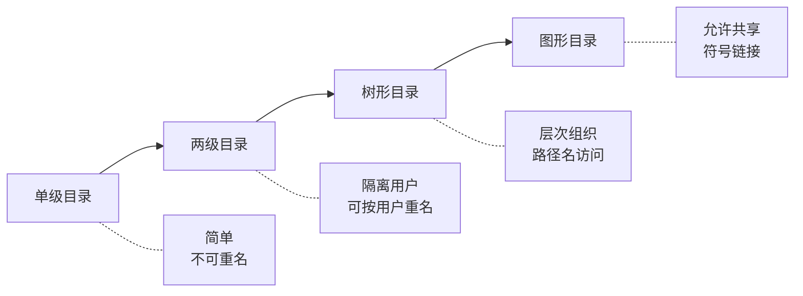

| 目录结构 | 特点 | 适用场景 |
|----------|------|----------|
| **单级目录** | 所有文件在同一目录，结构最简单 | 早期单用户系统 |
| **两级目录** | 按用户分目录，目录下可重名 | 多用户分时系统 |
| **树形目录** | 层次化组织，支持路径名 | **最通用**，Linux/Windows采用 |
| **图形目录** | 允许目录共享（硬链接/符号链接），可能出现环 | 需要文件共享的场景 |

### 11.2.2 路径名

- **绝对路径**：从根目录 `/` 开始的完整路径，如 `/home/user/file.txt`
- **相对路径**：从当前工作目录开始的路径，如 `../file.txt`、`./subdir/file.txt`

### 11.2.3 目录查询技术

| 方法 | 原理 | 优点 | 缺点 |
|------|------|------|------|
| **线性检索法** | 顺序扫描目录项，逐个比对文件名 | 实现简单 | 目录大时效率低 |
| **Hash法** | 对文件名哈希，直接定位目录项位置 | 平均O(1)查找 | 哈希冲突需处理 |

---

## 11.3 虚拟文件系统（VFS）

### 11.3.1 VFS 概述

**虚拟文件系统（Virtual File System, VFS）** 是 Linux 内核中的一个软件抽象层，位于用户进程和具体文件系统之间。它为用户空间提供统一的系统调用接口，同时屏蔽底层不同文件系统（ext4、NTFS、FAT32、NFS 等）的实现差异。

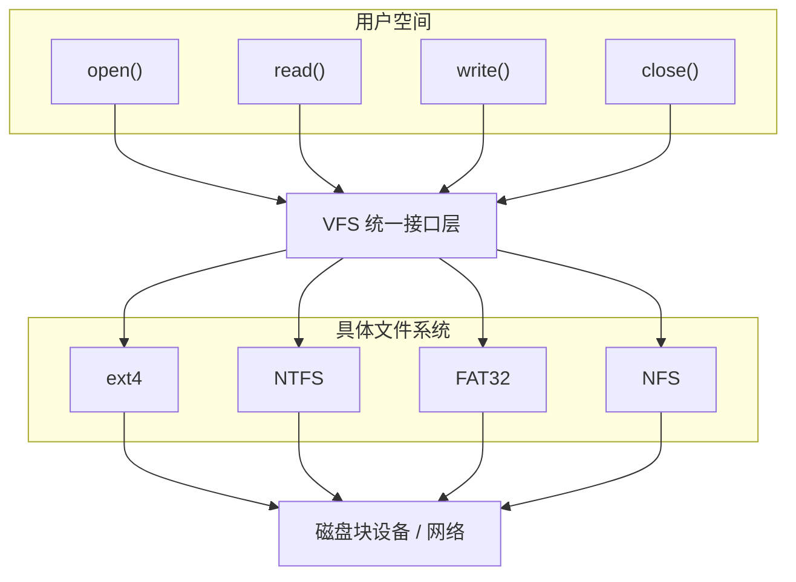

### 11.3.2 VFS 四大核心对象

VFS 定义了四个核心数据结构对象，它们是文件系统在内核中的表示：

#### （1）超级块对象（super_block）

描述一个**已安装的文件系统**的全局信息，相当于磁盘上超级块的内存映像。

```c
struct super_block {
    struct super_operations *s_op;   // 超级块操作函数表
    struct file_system_type *s_type;  // 文件系统类型
    struct dentry *s_root;            // 根目录项
    unsigned long s_blocksize;        // 块大小（字节）
    unsigned long s_blocks;           // 总块数
    unsigned long s_bfree;            // 空闲块数
    unsigned long s_bavail;           // 可用块数
    unsigned long s_inodes;           // inode总数
    unsigned long s_freeinodes;       // 空闲inode数
    dev_t s_dev;                      // 设备号
    unsigned char s_blocksize_bits;   // 块大小位数
    char s_id[32];                    // 文件系统标识符
    // ...
};
```

| 关键字段 | 说明 |
|----------|------|
| `s_op` | 超级块操作表（`alloc_inode`、`destroy_inode`、`write_inode` 等） |
| `s_root` | 指向该文件系统根目录的 dentry |
| `s_type` | 文件系统类型（ext4、NFS 等） |
| `s_blocksize` | 块大小，通常为 1KB/2KB/4KB |

#### （2）索引节点对象（inode）

描述**单个文件**的元数据（不包含文件名），是文件在内核中的唯一标识。

```c
struct inode {
    struct inode_operations *i_op;   // inode操作函数表
    struct super_block *i_sb;        // 所属超级块
    struct address_space *i_mapping; // 页缓存映射
    unsigned long i_ino;             // inode编号
    dev_t i_rdev;                    // 设备号（设备文件）
    umode_t i_mode;                  // 文件类型和权限
    nlink_t i_nlink;                 // 硬链接计数
    uid_t i_uid;                     // 所有者UID
    gid_t i_gid;                     // 所属组GID
    ksize_t i_size;                  // 文件大小（字节）
    struct timespec i_atime;         // 最后访问时间
    struct timespec i_mtime;         // 最后修改时间
    struct timespec i_ctime;         // inode状态改变时间
    unsigned short i_bytes;          // 最后不满块的字节数
    blkcnt_t i_blocks;               // 占用块数
    union { ... } u;                 // 具体文件系统的inode信息
};
```

**关键说明**：
- **inode 不含文件名**：文件名存储在目录项（dentry）中。
- **i_count**（引用计数）：内核中引用该 inode 的活跃对象数，为 0 时可释放。
- **i_nlink**（链接计数）：硬链接的数量，为 0 时文件真正被删除。

#### （3）目录项对象（dentry）

描述**目录项**（文件名到 inode 的映射关系），是路径解析的核心。

```c
struct dentry {
    struct dentry_operations *d_op;  // dentry操作函数表
    struct super_block *d_sb;        // 所属超级块
    struct inode *d_inode;           // 指向关联的inode
    struct dentry *d_parent;         // 父目录项
    struct list_head d_subdirs;      // 子目录项列表
    struct dentry *d_alias;          // inode别名链表
    const char *d_name;              // 文件名
    unsigned int d_flags;            // 状态标志
    int d_count;                     // 引用计数
    // ...
};
```

**目录项缓存（dentry cache）**：
- 系统维护全局 dentry 缓存，加速路径查找
- 三级缓存：未使用链表、使用中链表、哈希表
- 避免重复从磁盘读取目录信息，显著提高路径解析性能

#### （4）文件对象（file）

描述**进程与已打开文件**之间的交互，是 `open()` 系统调用的结果。

```c
struct file {
    struct file_operations *f_op;   // 文件操作函数表
    struct path f_path;             // 包含dentry和vfsmount
    struct inode *f_inode;          // 关联的inode
    atomic_long_t f_count;          // 引用计数
    unsigned int f_flags;           // 打开标志(O_RDONLY, O_WRONLY...)
    fmode_t f_mode;                 // 访问模式
    loff_t f_pos;                   // 当前读写偏移量
    struct mutex f_pos_lock;        // 偏移量互斥锁
    unsigned long f_version;        // 版本号
    void *private_data;             // 文件系统私有数据
    // ...
};
```

**文件对象的关键特性**：
- **每打开一次文件就创建一个 file 对象**，多个进程可以同时打开同一文件（各自有独立的 file 对象和偏移量）。
- **file 对象在内存中**，不是持久化的；关闭文件后释放。

### 11.3.3 四大对象的关系图

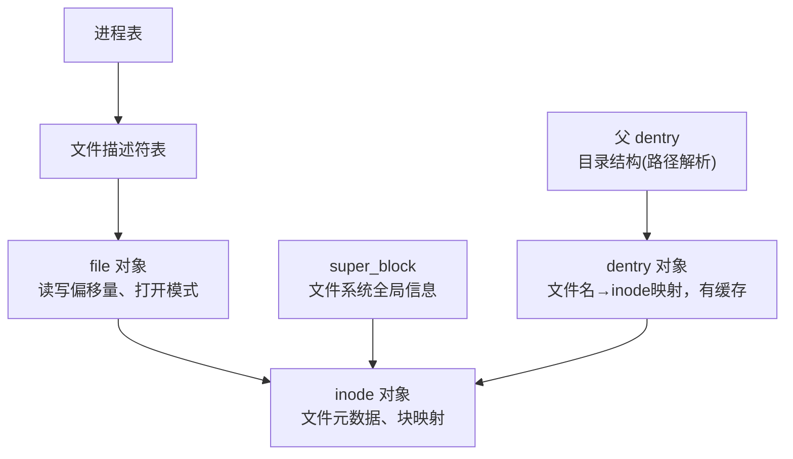

**一对一关系**：
- `super_block` ←→ 一个已挂载的文件系统
- `inode` ←→ 一个文件（磁盘上唯一）

**多对一关系**：
- 多个 `dentry` 可指向同一个 `inode`（硬链接时）
- 多个 `file` 可指向同一个 `inode`（多进程打开同一文件）
- 一个 `file` 只关联一个 `dentry`

### 11.3.4 VFS 主要操作函数表

| 操作函数表 | 作用 | 主要操作 |
|-----------|------|----------|
| `super_operations` | 超级块操作 | `alloc_inode`、`destroy_inode`、`write_inode`、`put_super`、`statfs` |
| `inode_operations` | inode操作 | `lookup`（目录查找）、`create`、`mkdir`、`link`、`unlink` |
| `file_operations` | 文件读写操作 | `read`、`write`、`open`、`release`、`mmap`、`ioctl` |
| `dentry_operations` | 目录项操作 | `d_revalidate`（验证有效性）、`d_compare`、`d_hash` |

---

## 11.4 文件系统调用的实现

### 11.4.1 open 系统调用

`open()` 是最核心的文件系统调用，完成从路径到文件对象的完整解析：

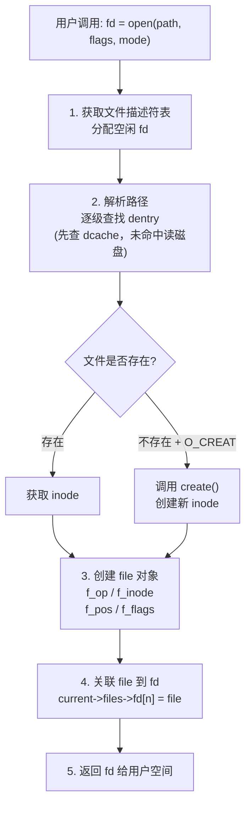

### 11.4.2 read 系统调用

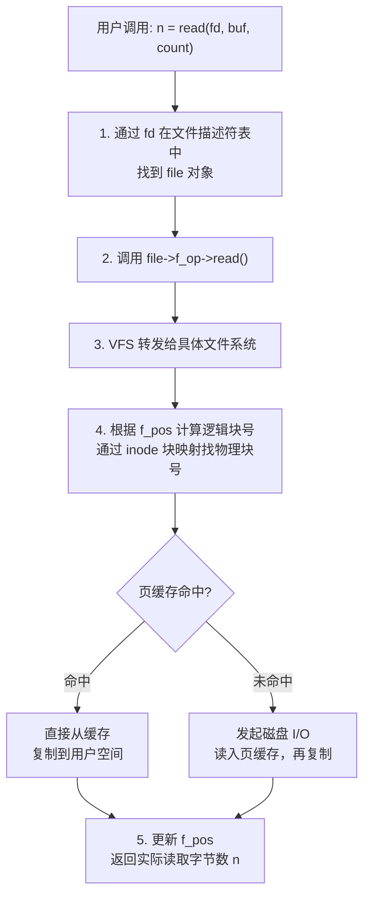

### 11.4.3 write 系统调用

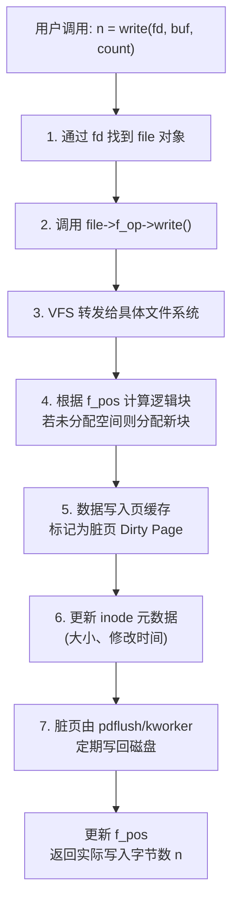

**延迟写回（Delayed Write）机制**：
- 数据先写入页缓存，立即返回成功
- 后台线程定期将脏页刷回磁盘
- 大幅提高写性能，但崩溃时可能丢失最近写入的数据
- 可通过 `sync`/`fsync`/`fdatasync` 强制刷盘

### 11.4.4 文件描述符表

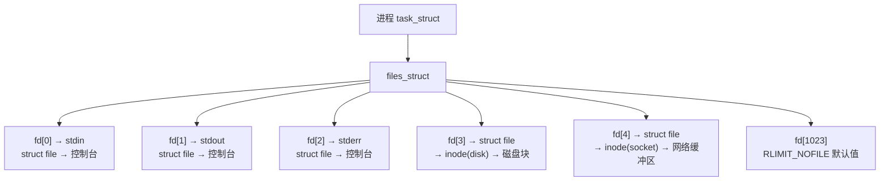

---

## 11.5 目录管理的实现

### 11.5.1 目录的物理存储

目录本质上是一个**特殊文件**，其内容是目录项（文件名到 inode 号的映射）的列表。

**ext2/ext3 目录存储**：目录是一个线性列表，每个目录项包含：
| inode号 (4B) | 记录长度 (2B) | 文件名长 (1B) | 文件名 (变长, 填充) |
|:---:|:---:|:---:|:---:|

**ext4 目录存储**：使用 **HTree（Hash Tree / B+树变体）** 索引组织，大幅提高大目录的查找性能。

### 11.5.2 路径解析流程

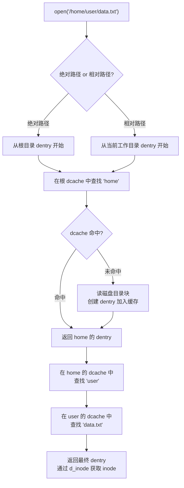

**dentry cache 的三级加速**：
- **未使用链表（unused）**：引用计数为 0 的 dentry，可回收
- **使用中链表（in-use）**：正在被引用的 dentry
- **哈希表（hash table）**：按 (父dentry, 文件名) 哈希，快速查找

### 11.5.3 硬链接与符号链接

| 特性 | 硬链接（Hard Link） | 符号链接（Symbolic Link） |
|------|---------------------|--------------------------|
| **实现原理** | 多个目录项指向**同一个 inode** | 独立文件，内容为目标路径字符串 |
| **inode 变化** | 不创建新 inode，仅增加 i_nlink | 创建新 inode，类型为符号链接 |
| **跨文件系统** | 不可以（同一 inode 只能在一个文件系统中） | **可以**（存储路径字符串） |
| **指向目录** | 不允许（防止环路） | 允许 |
| **删除原文件** | 链接仍有效（文件数据仍在） | 链接变成悬空引用（dangling link） |
| **ls 显示** | 无特殊标记 | 以 `→` 指向目标 |

```bash
# 硬链接
ln /home/user/file.txt /home/user/hard_link
# 两个文件名指向同一 inode，i_nlink = 2

# 符号链接
ln -s /home/user/file.txt /home/user/sym_link
# sym_link 是一个新文件，内容为 "/home/user/file.txt"
```

---

## 11.6 ext4 文件系统详解

### 11.6.1 ext4 磁盘布局

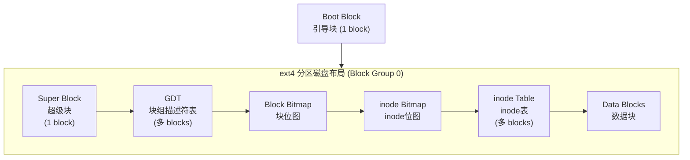

每个 Block Group 结构：

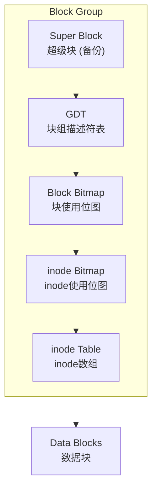

### 11.6.2 超级块（Super Block）

超级块记录文件系统的全局配置信息：

| 字段 | 说明 |
|------|------|
| `s_blocks_count` | 文件系统的总块数 |
| `s_rblocks_count` | 保留块数（给 root 用户） |
| `s_free_blocks_count` | 空闲块数 |
| `s_inodes_count` | inode 总数 |
| `s_free_inodes_count` | 空闲 inode 数 |
| `s_block_size` | 块大小（1024/2048/4096 字节） |
| `s_blocks_per_group` | 每个块组的块数 |
| `s_inodes_per_group` | 每个块组的 inode 数 |
| `s_mount_time` | 最后挂载时间 |
| `s_write_time` | 最后写入时间 |
| `s_state` | 文件系统状态（干净/有错误） |
| `s_magic` | 魔数，ext4 为 `0xEF53` |

### 11.6.3 块组描述符表（GDT）

每个块组对应一个**块组描述符（Group Descriptor）**，所有描述符组成 GDT：

```c
struct ext4_group_desc {
    __u32 bg_block_bitmap;      // 块位图所在块号
    __u32 bg_inode_bitmap;      // inode位图所在块号
    __u32 bg_inode_table;       // inode表起始块号
    __u16 bg_free_blocks_count; // 空闲块数
    __u16 bg_free_inodes_count; // 空闲inode数
    __u16 bg_used_dirs_count;   // 已用目录数
    __u16 bg_flags;             // 组标志
    __u32 bg_reserved[3];       // 保留字段
};
```

### 11.6.4 inode 结构

ext4 inode 大小默认为 **256 字节**（ext2/ext3 为 128 字节）：

```c
struct ext4_inode {
    __u16 i_mode;          // 文件类型和权限
    __u16 i_uid;           // 所有者UID
    __u32 i_size_lo;       // 文件大小（低32位）
    __u32 i_atime;         // 最后访问时间
    __u32 i_ctime;         // inode改变时间
    __u32 i_mtime;         // 最后修改时间
    __u32 i_dtime;         // 删除时间
    __u16 i_gid;           // 所属组GID
    __u16 i_links_count;   // 硬链接计数
    __u32 i_blocks_lo;     // 块数（低32位）
    __u32 i_flags;         // inode标志
    __u32 i_block[15];     // 块指针数组（关键！）
    __u32 i_generation;    // 文件版本号
    __u32 i_file_acl;      // 扩展属性
    __u32 i_size_hi;       // 文件大小（高32位）
    // ...
};
```

**块指针数组 `i_block[15]` 的结构**（传统映射）：

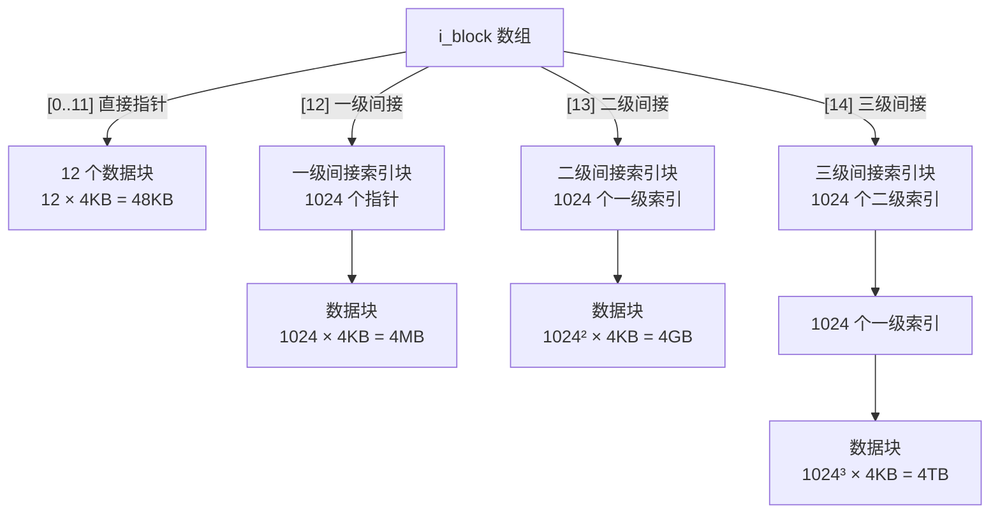

假设块大小 4KB，块号 4B：
- **直接指针**：12 × 4KB = 48KB
- **一级间接**：1024 × 4KB = 4MB
- **二级间接**：1024² × 4KB = 4GB
- **三级间接**：1024³ × 4KB = 4TB
- **总计最大**：约 4TB+

### 11.6.5 ext4 Extents 替代传统块映射

ext4 引入 **Extents** 机制取代传统的间接块映射，提高大文件存储效率：

```
传统方式(间接块映射): 
  每个逻辑块需要一次间接查找 → 碎片多时效率低

Extents 方式:
  extent = (起始逻辑块号, 起始物理块号, 块数)
  一个 extent 可表示连续的多个块
  大文件只需少量 extent 描述 → 大幅减少元数据开销

示例:
  文件A占块 0-99(连续):
    extent 1: {逻辑块0, 物理块500, 长度100}
  vs 传统方式需要 100 个块指针

  ext4 inode 使用 i_block[60] 空间存储 extent 树头节点
```

---

## 11.7 文件系统日志（Journaling）

### 11.7.1 日志的基本原理

**问题背景**：系统崩溃时，文件系统元数据可能处于不一致状态（如分配了块但 inode 未更新）。传统修复（fsck）需要扫描整个文件系统，耗时巨大。

**日志原理**：将元数据修改操作**先写入日志区（Journal Area）**，确认日志写入完成后，再异步更新实际数据区。崩溃恢复时只需**重放日志**即可恢复一致性。

```
正常写入流程:
  1. 修改元数据 M'
  2. 将 M' 写入日志区 (Journal Write)       ← 日志记录
  3. 等待日志刷盘 (Journal Commit)            ← 提交点
  4. 将 M' 写入实际位置 (Metadata Write)     ← 实际更新
  5. 标记日志条目为已完成                     ← 清除标记

崩溃恢复:
  - 扫描日志区，找到未完成的事务
  - 重放事务中的修改 → 恢复一致性
  - 比 fsck 快几个数量级
```

### 11.7.2 三种日志模式对比

| 日志模式 | 数据处理 | 元数据处理 | 安全性 | 性能 | 默认？ |
|----------|----------|-----------|--------|------|--------|
| **Journal（完整日志）** | 数据+元数据都写入日志 | 完整日志 | **最高** | **最慢**（写三遍） | 否 |
| **Ordered（有序日志）** | 数据先于元数据写入磁盘 | 元数据写入日志 | **高** | **适中** | **是** |
| **Writeback（回写日志）** | 无保证 | 元数据写入日志 | 较低 | **最快** | 否 |

```
Journal 模式:
  数据 → 日志区 → 数据区（写两次数据）
  元数据 → 日志区 → 数据区

Ordered 模式:
  数据 → 数据区（直接写）
  元数据 → 日志区 → 数据区（先提交日志再更新）

Writeback 模式:
  数据 → 数据区（不经过日志，可能先于元数据写入）
  元数据 → 日志区 → 数据区
```

### 11.7.3 ext3/ext4 日志实现细节

- 日志存储在单独的文件中（通常是 `.journal` 文件，inode 8）
- 日志区域形成**循环缓冲区**，写满后从头覆盖
- 每个日志事务包含：
  - **事务描述符块**：记录事务序号和起始时间
  - **元数据块**：实际要写入的元数据副本
  - **提交块**：标记事务完成
- **Checkpoint** 机制：日志重放后，将实际元数据更新到磁盘，清理已完成的日志条目

---

## 11.8 特殊文件系统

### 11.8.1 /proc 文件系统

`/proc` 是一个**虚拟文件系统（procfs）**，不占用磁盘空间，动态地在内存中生成，提供内核运行时信息的接口。

#### 常用文件及用途

| 文件/目录 | 信息内容 | 用途示例 |
|-----------|----------|----------|
| `/proc/cpuinfo` | CPU型号、频率、缓存、核心数 | `cat /proc/cpuinfo` |
| `/proc/meminfo` | 内存总量、空闲、缓存、交换区 | `cat /proc/meminfo` |
| `/proc/loadavg` | 系统平均负载（1/5/15分钟） | `uptime` 命令底层实现 |
| `/proc/interrupts` | 各CPU中断统计 | 硬件中断调试 |
| `/proc/ioports` | I/O端口使用情况 | 设备驱动调试 |
| `/proc/dma` | DMA通道使用情况 | 硬件冲突排查 |
| `/proc/filesystems` | 已注册的文件系统类型 | `cat /proc/filesystems` |
| `/proc/version` | 内核版本信息 | `uname -a` 底层实现 |
| `/proc/net/` | 网络统计信息目录 | `netstat` 底层数据 |
| `/proc/[pid]/` | 进程信息（详见下表） | `ps`/`top` 底层数据源 |

#### /proc/[pid]/ 进程信息

| 文件 | 内容 |
|------|------|
| `cmdline` | 进程启动命令行参数（NUL分隔） |
| `status` | 进程状态摘要（名称、状态、内存、PID等） |
| `stat` | 进程状态（机器可读格式） |
| `maps` | 进程内存映射（虚拟地址、权限、文件映射） |
| `fd/` | 文件描述符符号链接（指向实际文件） |
| `cwd` | 当前工作目录的符号链接 |
| `exe` | 可执行文件的符号链接 |
| `environ` | 环境变量列表 |
| `limits` | 资源限制（ulimit 设置） |
| `stack` | 内核栈信息（可用于调试死锁） |
| `io` | 进程 I/O 统计 |
| `oom_score` | OOM killer 评分 |

#### 通过 /proc 与内核交互

```bash
# 读取内核参数
cat /proc/sys/net/ipv4/ip_forward

# 修改内核参数（立即生效）
echo 1 > /proc/sys/net/ipv4/ip_forward

# 等价于 sysctl 命令
sysctl -w net.ipv4.ip_forward=1
```

### 11.8.2 /sys 文件系统

`/sys` 是 **sysfs** 虚拟文件系统，导出内核设备驱动模型的信息，主要为 udev 设备管理服务提供数据。

#### 主要目录结构

| 目录 | 内容 |
|------|------|
| `/sys/block/` | 所有块设备（如 sda、nvme0n1） |
| `/sys/class/` | 按设备类分类（如 net、tty、disk） |
| `/sys/devices/` | 全局设备树（物理拓扑） |
| `/sys/dev/` | 按设备号索引的设备信息 |
| `/sys/fs/` | 文件系统相关参数 |
| `/sys/module/` | 已加载内核模块的信息 |
| `/sys/power/` | 电源管理信息 |

```bash
# 查看磁盘设备信息
ls /sys/block/sda/
cat /sys/block/sda/size          # 磁盘块数
cat /sys/block/sda/queue/scheduler  # I/O调度算法

# 查看网络设备
cat /sys/class/net/eth0/speed    # 网络速率(Mbps)

# 加载/卸载内核模块
echo 1 > /sys/module/xxx/...
```

### 11.8.3 其他特殊文件系统

| 文件系统 | 挂载点 | 类型 | 说明 |
|----------|--------|------|------|
| **devtmpfs** | `/dev` | 字符/块设备文件 | 设备节点文件系统，由内核自动创建基础设备节点 |
| **tmpfs** | `/tmp`、`/run` | 内存文件系统 | 基于内存，读写极快，掉电丢失 |
| **devpts** | `/dev/pts` | 伪终端 | 支持多路伪终端（PTY） |
| **sysfs** | `/sys` | 虚拟 | 设备驱动模型信息（详见上节） |
| **procfs** | `/proc` | 虚拟 | 内核和进程信息（详见上节） |
| **debugfs** | `/sys/kernel/debug` | 虚拟 | 内核调试接口 |
| **securityfs** | `/sys/kernel/security` | 虚拟 | 安全模块信息 |
| **hugetlbfs** | 挂载点可配 | 虚拟 | 大页（Huge Page）文件系统 |
| **cgroupfs** | `/sys/fs/cgroup` | 虚拟 | 控制组资源限制 |

---

## 11.9 文件系统创建与挂载

### 11.9.1 mkfs 命令原理

`mkfs`（make filesystem）用于在磁盘分区上创建文件系统：

```bash
# 创建 ext4 文件系统
mkfs.ext4 /dev/sda1
mkfs.ext4 -b 4096 -L "data" /dev/sda1  # 指定块大小和卷标

# 创建 FAT32 文件系统
mkfs.vfat -F 32 /dev/sdb1
```

**mkfs 内部操作**：
```
1. 读取/创建超级块，写入文件系统元数据
2. 初始化块组描述符表（GDT）
3. 创建位图（块位图 + inode位图）
4. 创建 inode 表（初始化为全零）
5. 创建根目录 inode（编号 2，类型为目录）
6. 在根目录中写入 "." 和 ".." 目录项
7. 若有日志（ext3/ext4），创建日志区
```

### 11.9.2 mount 命令原理

```bash
# 挂载文件系统
mount -t ext4 /dev/sda1 /mnt/data
mount -o ro /dev/sdb1 /mnt/readonly   # 只读挂载
mount -t vfat /dev/sdc1 /mnt/usb      # U盘挂载

# 卸载
umount /mnt/data
```

**mount 系统调用流程**：
```
1. 验证用户权限（需要 root 或 CAP_SYS_ADMIN）
2. 读取分区超级块，验证文件系统类型和完整性
3. 在内核中创建 VFS super_block 对象
4. 调用文件系统特定的 mount 操作:
   - 分配具体文件系统的 super_block 结构
   - 解析挂载选项（ro/rw/noatime/data=...）
   - 将根 inode 映射到 VFS inode
5. 将 super_block 关联到挂载点目录的 dentry
6. 更新挂载表 /proc/mounts

卸载（umount）流程:
1. 将所有脏数据刷回磁盘（sync）
2. 释放 super_block 对象
3. 断开与挂载点的关联
4. 释放相关缓存
```

---

## 11.10 文件系统综合对比

| 特性 | FAT32 | NTFS | ext3 | ext4 |
|------|-------|------|------|------|
| **开发公司** | Microsoft | Microsoft | Linux社区 | Linux社区 |
| **最大文件** | 4GB | 16TB | 2TB | **16TB** |
| **最大分区** | 2TB（32GB用32位） | 256TB | 16TB | **1EB** |
| **日志** | 无 | 有 | 有 | 有 |
| **权限控制** | 无 | ACL（精细） | Unix权限 | Unix权限+ACL |
| **压缩/加密** | 不支持 | 支持 | 不支持 | 不支持（需其他层） |
| **文件名长度** | 8.3/长文件名 | 255字符 | 255字符 | 255字符 |
| **簇大小** | 512B~64KB | 512B~64KB | 1KB~64KB | 1KB~64KB |
| **碎片处理** | 易产生碎片 | MFT减少碎片 | 有碎片 | Extents减少碎片 |
| **配额** | 不支持 | 支持 | 支持 | 支持 |
| **快照** | 不支持 | 支持（VSS） | 不支持 | 不支持（需LVM） |
| **兼容性** | 几乎所有OS | Windows为主 | Linux | Linux |
| **典型应用** | U盘、嵌入式 | Windows系统盘 | Linux服务器 | Linux服务器（主流） |

**选择建议**：
- 需要跨平台兼容 → FAT32/exFAT
- Windows系统盘 → NTFS
- Linux服务器/桌面 → ext4（或 XFS、Btrfs）

---

## 11.11 常见考点汇总

| 考点 | 要点 |
|------|------|
| **VFS 四大对象** | super_block（文件系统全局信息）、inode（文件元数据）、dentry（目录项映射）、file（进程打开文件）；记住各对象的职责和相互关系 |
| **VFS 对象关系** | inode不含文件名（在dentry中）；多进程打开同一文件→多个file→同一个inode；硬链接→多个dentry→同一个inode |
| **open 系统调用流程** | 分配fd→路径解析（逐级查dentry/cache）→查找/创建inode→创建file对象→关联到fd |
| **ext4 磁盘布局** | 超级块→块组描述符表→块位图→inode位图→inode表→数据块；每个块组包含这些结构 |
| **inode 块映射** | 12个直接指针+1个一级间接+1个二级间接+1个三级间接；4KB块大小时最大文件约4TB |
| **ext4 Extents** | 用（起始逻辑块, 起始物理块, 长度）三元组描述连续块，比间接映射更高效 |
| **文件系统日志** | Journal/Ordered/Writeback三种模式；Ordered为默认；日志保证崩溃后快速恢复一致性 |
| **硬链接 vs 符号链接** | 硬链接：同inode，不能跨文件系统，不能链接目录；符号链接：独立文件存路径，可跨文件系统 |
| **/proc 文件系统** | 虚拟文件系统，内存中动态生成；提供进程和内核信息；可通过读写文件与内核交互 |
| **/sys 文件系统** | sysfs，导出设备驱动模型；/sys/block（块设备）、/sys/class（设备类）、/sys/devices（设备树） |
| **文件描述符表** | 进程级 fd→file→inode→磁盘块；0=stdin, 1=stdout, 2=stderr；进程fork时共享file对象 |
| **dentry cache** | 三级缓存加速路径查找：未使用链表/使用中链表/哈希表 |
| **FAT32 vs NTFS vs ext4** | 记住关键区别：FAT32无日志无权限（4GB限制），NTFS支持ACL日志压缩，ext4支持Extents和大文件 |
| **mkfs vs mount** | mkfs创建文件系统（初始化超级块/位图/inode表）；mount将设备关联到目录树（创建VFS对象） |
| **目录本质** | 目录是特殊文件，内容是目录项列表（inode号+文件名映射）；ext4用B+树组织 |
