# 第12章 设备管理

> **本章题库**：[第12章 真题](真题分类/第12章_设备管理_真题.md) | [名校真题汇总](真题分类/名校真题汇总.md)

## 思维导图

```mermaid
mindmap
  root((设备管理))
    I/O系统
      I/O系统的功能
        外部设备的控制
          接收并识别CPU命令
          数据交换
          设备状态报告
          地址识别和数据缓冲
        I/O设备的分配与回收
        设备映射
        缓冲区管理
        设备独立性
          与设备无关的软件层
          设备命名统一化
          统一的错误处理
        I/O调度
          合并相邻请求
          优化I/O顺序
      I/O系统的组成
        I/O硬件
          I/O设备
            输入设备 输出设备 存储设备
            字符设备 块设备 网络设备
          设备控制器 Device Controller
            控制器与CPU的接口
            I/O逻辑
            控制器与设备的接口
          I/O端口与I/O控制器
            寄存器映射(MMIO)
            端口映射(I/O Port)
          总线与通道
            系统总线 I/O总线
            PCI PCIe USB SCSI
        I/O软件
          中断处理程序
          设备驱动程序
          设备独立性软件
          用户层软件
    I/O软件层次
      用户层软件
        用户I/O库函数
          printf scanf等
          格式化输出 输入处理
        Spooling技术
      设备独立性软件
        设备驱动程序统一接口
        设备命名与映射
          /dev/sda等设备文件
          设备号 主设备号+次设备号
        保护与权限检查
          设备访问权限控制
        缓冲管理
          单缓冲 双缓冲
          循环缓冲 缓冲池
        块大小处理
        分配与释放设备
        I/O调度
        错误报告与处理
        分配独占设备
        提供设备独立的块大小
      设备驱动程序
        接收上层抽象命令
          不依赖具体硬件
        向设备控制器发送命令
          解释命令 转化为寄存器操作
        检查设备状态
          忙闲 联机 就绪
        中断处理
          DMA传输完成中断
          错误中断
        DMA传输控制
          设置源地址 目标地址
          设置传输长度
          启动DMA传输
        设备的初始化与释放
        内核模块方式加载
      中断处理程序
        CPU响应中断请求
          保存现场
          判断中断源
        执行中断服务例程ISR
          读取设备状态
          处理数据传输
          唤醒等待进程
        中断返回
          恢复现场
          调度就绪进程
      硬件层
        设备控制器
          控制寄存器 命令寄存器
          状态寄存器 数据寄存器
        I/O端口空间
          专用I/O指令
          内存映射I/O
        总线与接口
    I/O控制方式
      程序I/O方式
        CPU发出I/O命令
        CPU不断查询设备状态
        等待完成 忙等待
        特点: 简单但CPU利用率极低
      中断驱动I/O方式
        CPU发出I/O命令后继续执行
        设备完成后发出中断
        CPU响应中断 处理数据
        特点: CPU与设备并行
      DMA方式
        CPU设置DMA控制器参数
        DMA控制器直接传输数据
        传输完成后中断通知CPU
        特点: 块传输不需CPU干预
        传输单位: 数据块
        CPU干预: 仅在开始和结束时
      通道方式
        通道是专用I/O处理器
        可执行通道程序
        一次I/O操作可处理多个块
        特点: CPU几乎不干预
        类型: 字节多路通道
               数组选择通道
               数组多路通道
    设备管理数据结构
      设备控制表DCT
        每个设备一张
        设备类型 设备状态
        相关控制器指针
        重复执行次数和时间
      控制器控制表COCT
        每个控制器一张
        控制器状态
        相关通道指针
      通道控制表CHCT
        每个通道一张
        通道状态
        相连控制器列表
      系统设备表SDT
        整个系统一张
        记录所有设备信息
        设备驱动程序入口
      静态分配
        系统初始化时分配
        运行期间不改变
        可能造成设备浪费
      动态分配
        运行时按需分配
        释放后可再分配
        需要分配与回收算法
    缓冲技术
      引入缓冲的原因
        CPU与I/O设备速度不匹配
        减少中断频率
        提高设备利用率
      单缓冲
        一个缓冲区
        CPU与设备交替使用
        缓冲区非空时设备不能写
      双缓冲
        两个缓冲区交替使用
        CPU与设备可并行工作
        速度基本匹配时效果好
      循环缓冲
        多个缓冲区组成循环队列
        in指针和out指针
        适合生产和消费速度都很快的场景
      缓冲池 Buffer Pool
        系统共用的缓冲区集合
        多种缓冲区队列
        收缓冲区 输入队列
        发缓冲区 输出队列
        空缓冲区 空队列
    SPOOLing技术
      基本概念
        Simultaneous Peripheral Operation On-Line
        外围设备同时联机操作
        将独占设备改造为共享设备
      SPOOLing系统组成
        输入井
          磁盘上的缓冲区域
          暂存输入数据
        输出井
          磁盘上的缓冲区域
          暂存输出数据
        输入进程(预输入进程)
          将输入设备数据送入输入井
        输出进程(缓输出进程)
          将输出井数据送至输出设备
        缓冲区
          内存中的数据传输缓冲
      SPOOLing应用——打印机
        用户进程请求打印
        系统将打印数据送入输出井
        输出进程spooling处理
        多个进程可同时请求打印
        实际打印机串行输出
        逻辑上共享实际独占
      SPOOLing的特点
        提高I/O速度
          磁盘速度远快于外设
        将独占设备改造为共享设备
          打印机→共享逻辑设备
        实现虚拟设备
          每个进程感觉独占
    Linux设备管理
      设备文件系统/dev
        字符设备 character device
          按字节流访问
          键盘 终端 打印机
        块设备 block device
          按块(如512B/4KB)访问
          硬盘 SSD U盘
        设备号
          主设备号 标识驱动程序
          次设备号 标识同类设备中的具体设备
        设备文件mknod
          mknod /dev/mydev c 250 0
          c=字符设备 b=块设备
      udev设备管理机制
        基于sysfs动态创建设备节点
        udev守护进程udevd
        设备事件触发规则匹配
        /etc/udev/rules.d/规则文件
        支持设备热插拔
        替代devfs的现代方案
      Linux I/O调度
        Noop(无操作)
          不排序 直接下发
          SSD和虚拟化常用
        Deadline(截止时间)
          读写分别维护队列
          设定截止时间避免饥饿
        CFQ(完全公平排队)
          按进程分配I/O时间片
          传统HDD默认算法
        BFQ(预算公平排队)
          改进的CFQ
          交互式场景响应更好
        Kyber
          快速队列+同步队列
          SSD友好
    常见考点
      I/O控制方式对比
        程序I/O 中断 DMA 通道
      缓冲技术方案对比
        单缓冲 双缓冲 循环缓冲 缓冲池
      SPOOLing原理
        输入输出井 进程 数据流
      I/O软件层次
        四层结构及各层职责
      DMA与通道的区别
        DMA是硬件控制器
        通道是专用I/O处理器
```

---

## 12.1 I/O 系统概述

### 12.1.1 I/O 系统的功能

I/O 系统负责管理计算机中所有输入/输出设备，其核心功能包括：

| 功能 | 说明 |
|------|------|
| **设备控制** | 接收 CPU 的命令，控制设备完成数据传输、状态查询等操作 |
| **设备分配与回收** | 按照分配策略将设备分配给请求的进程，使用完毕后回收 |
| **缓冲管理** | 管理内存中的缓冲区，协调 CPU 与设备之间的速度差异 |
| **设备映射** | 将逻辑设备名映射到物理设备 |
| **设备独立性** | 提供统一的设备访问接口，屏蔽硬件差异 |
| **I/O 调度** | 合并相邻请求，优化 I/O 执行顺序 |
| **错误处理** | 检测和报告设备错误，尝试恢复 |

### 12.1.2 I/O 系统的硬件组成

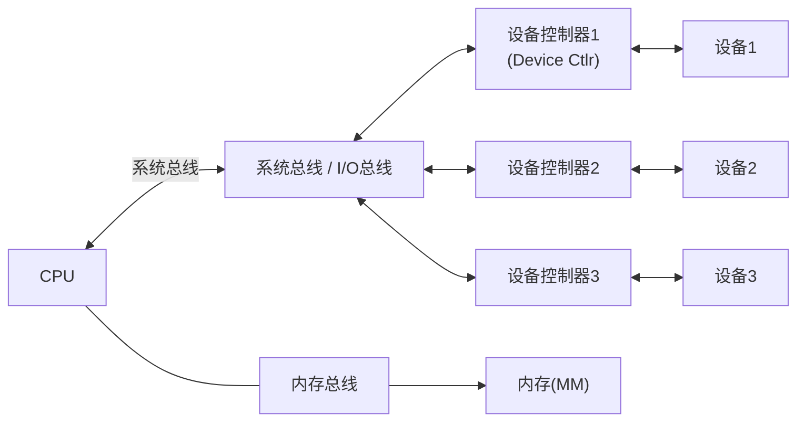

#### 设备控制器（Device Controller）

设备控制器是 CPU 与设备之间的接口硬件，负责控制一个或多个设备。

| 组成部分 | 说明 |
|----------|------|
| **控制寄存器** | CPU 通过写入控制寄存器向设备发送命令（读/写/复位等） |
| **状态寄存器** | CPU 读取状态寄存器了解设备当前状态（忙/就绪/出错） |
| **数据寄存器** | 暂存传输的数据（通常为 FIFO 缓冲） |
| **I/O 逻辑** | 解析 CPU 命令，控制设备执行具体操作 |
| **控制器与设备的接口** | 连接物理设备，传输数据和控制信号 |

#### I/O 端口寻址方式

| 方式 | 说明 | 优点 | 缺点 |
|------|------|------|------|
| **独立 I/O 端口（Port-Mapped I/O）** | 使用专用 I/O 指令（如 x86 的 `IN`/`OUT`） | 地址空间独立 | 指令集复杂 |
| **内存映射 I/O（MMIO）** | 设备寄存器映射到内存地址空间 | 统一地址空间，编程方便 | 占用内存地址空间 |

---

## 12.2 I/O 软件层次

I/O 软件通常分为**四层**，从下到上依次为：

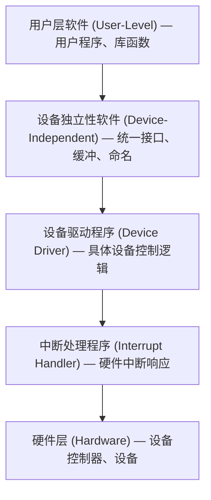

### 12.2.1 第一层：中断处理程序

中断处理程序是 I/O 软件的最底层，直接与硬件交互。

**中断处理流程**：

```
1. CPU 收到中断信号（来自设备控制器）
2. 保存当前进程的上下文（PC、寄存器、PSW）
3. 识别中断源（查询中断控制器，如 APIC/PIC）
4. 跳转到对应的中断服务例程（ISR）执行:
   a. 读取设备状态寄存器，确认操作完成或出错
   b. 若为数据传输完成:
      - 从设备数据寄存器/缓冲区读取数据到内存
      - 更新 buffer 指针和计数
   c. 若为 DMA 传输完成:
      - 确认 DMA 传输结果
   d. 唤醒正在等待该 I/O 操作的进程
      - 将进程状态从"阻塞"改为"就绪"
      - 放入就绪队列
5. 恢复被中断进程的上下文
6. 执行中断返回指令（CPU 切换回用户态或内核态）
```

**关键注意事项**：
- 中断处理程序执行在**中断上下文**中，不能睡眠/阻塞
- 应尽量短小精悍，将耗时操作推迟到驱动程序的下半部（bottom half）处理
- Linux 中支持软中断（softirq）和 tasklet 机制处理延迟工作

### 12.2.2 第二层：设备驱动程序

设备驱动程序是操作系统内核中**唯一**了解设备硬件细节的模块。

**主要职责**：

| 职责 | 说明 |
|------|------|
| **命令翻译** | 将上层抽象 I/O 请求（如 read/write）翻译为设备控制器能理解的具体命令 |
| **参数设置** | 向设备控制器的寄存器写入参数（起始地址、传输长度、操作类型等） |
| **状态检查** | 轮询或等待中断，确认设备完成操作 |
| **错误处理** | 检测设备错误，尝试重试或向上层报告 |
| **DMA 控制** | 为 DMA 传输设置源/目标地址和长度，启动 DMA |
| **设备初始化** | 设备上电时配置寄存器，执行自检 |
| **中断处理** | 处理设备中断的上半部（top half） |

**驱动程序的内核接口**：

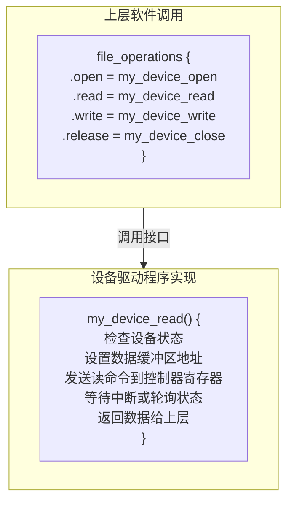

### 12.2.3 第三层：设备独立性软件

设备独立性软件（也称 I/O 核心子系统）为上层提供**统一的设备访问接口**，屏蔽不同设备的差异。

**主要功能**：

| 功能 | 说明 |
|------|------|
| **设备命名与映射** | 将逻辑设备名映射到物理设备（通过设备号和 `/dev` 下的设备文件） |
| **设备保护** | 检查用户是否有权限访问设备（基于文件权限机制） |
| **缓冲管理** | 管理缓冲区（单缓冲/双缓冲/循环缓冲/缓冲池），协调速度差异 |
| **块大小处理** | 屏蔽不同设备的块大小差异，提供统一的逻辑块大小 |
| **设备分配与回收** | 按策略分配独占设备，使用完成后回收 |
| **I/O 调度** | 合并请求、排序队列，优化磁盘 I/O 性能 |
| **错误报告** | 统一的错误码和错误处理机制 |
| **分配独占设备** | 处理独占设备（如打印机）的互斥访问 |
| **分配与释放缓冲区** | 管理缓冲池中的缓冲区分配和释放 |

### 12.2.4 第四层：用户层软件

用户层软件包括用户程序和 I/O 库函数，通过系统调用接口与内核交互。

```mermaid
flowchart TD
    A["用户程序: printf("Hello")"] -->|"用户代码"| B["C库函数 printf/format — 用户层I/O库"]
    B -->|"系统调用"| C["write(1, buf, len)"]
    C --> D["内核 I/O 软件层次..."]
```

---

## 12.3 I/O 控制方式

I/O 控制方式是操作系统管理 CPU 与外设之间数据传输的策略，其发展体现了 CPU 从直接参与 I/O 到逐步解放的过程。

### 12.3.1 程序 I/O（Programmed I/O / Polling）

**原理**：CPU 直接参与数据传输全过程，通过不断查询设备状态来判断操作是否完成。

```
程序I/O工作流程:

CPU执行:
  while (设备状态 != 就绪)     ← 忙等待(Busy-Waiting)
      ;                        ← 空转，CPU空耗
  从数据寄存器读取一个字;       ← CPU逐字(节)传输
  写入内存缓冲区;
  更新计数器;
  if (未完成) goto while;

CPU ←──(每字节)──► 设备控制器 ←──► 设备
      CPU全程参与
```

| 优点 | 缺点 |
|------|------|
| 实现简单，硬件成本低 | **CPU 利用率极低**（忙等待） |
| 适合简单嵌入式系统 | CPU 被锁定在查询循环中 |
| | CPU 与设备**完全串行**，无法并行 |

**CPU 利用率计算示例**：
```
假设: CPU处理一个字需 1μs
      设备传输一个字需 100μs
      传输 1000 个字

程序I/O:
  CPU等待: 1000 × (100-1) = 99000μs (忙等待)
  CPU工作: 1000 × 1 = 1000μs
  CPU利用率: 1000/100000 = 1%   ← 极低！
```

### 12.3.2 中断驱动 I/O（Interrupt-Driven I/O）

**原理**：CPU 发出 I/O 命令后**不再等待**，继续执行其他任务。设备完成后**主动通知** CPU（中断）。

```
中断驱动I/O工作流程:

1. CPU发出I/O命令
   → 将一个字的数据从设备读入设备控制器缓冲区
2. CPU继续执行其他进程...
   │                    设备控制器同时传输数据...
   │                    设备完成后发出中断信号 ──────┐
   ↓                                                  ↓
3. CPU收到中断，暂停当前进程，保存上下文
4. 执行中断处理程序:
   a. 从设备控制器缓冲区读取数据到内存
   b. 唤醒等待I/O的进程
5. 恢复被中断的进程继续执行
```

| 优点 | 缺点 |
|------|------|
| CPU 与设备可以**并行工作** | 每传输一个字/字节就要中断一次 |
| CPU 利用率大幅提高 | 中断处理有开销 |
| 适合中低速设备 | 高速设备会产生大量中断 |

**CPU 利用率计算示例**：
```
假设: 同上
      中断处理时间 5μs/次

中断驱动I/O:
  CPU工作: 1000 × 1 = 1000μs (处理请求)
  中断处理: 1000 × 5 = 5000μs
  CPU利用率: 6000/100000 = 6%   ← 比程序I/O好很多，但仍不高
```

### 12.3.3 DMA（Direct Memory Access，直接内存访问）

**原理**：设置 DMA 控制器，数据不再经过 CPU，由 DMA 控制器**直接在内存和设备之间传输**。CPU 仅在**传输开始前**设置参数，**传输完成后**接收中断通知。

#### DMA 控制器结构

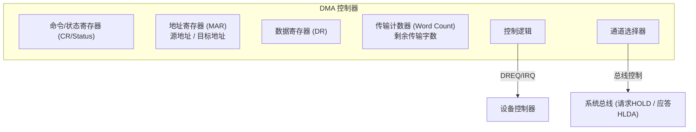

#### DMA 数据传输时序

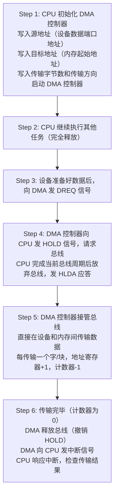

#### DMA 传输模式

| 传输模式 | 说明 | 特点 |
|----------|------|------|
| **单字节传输（Single）** | 每次 DMA 请求传输 1 个字节 | 每次都要申请总线，效率低 |
| **块传输（Block/Burst）** | 每次请求连续传输一整块数据 | 期间独占总线，CPU 无法访问内存 |
| **请求传输（Demand）** | 只要设备持续发出请求就持续传输 | 最灵活，按需传输 |
| **级联模式（Cascade）** | 多个 DMA 控制器级联，扩展通道数 | 用于复杂系统 |

#### DMA 三种工作模式（总线使用方式）

| 模式 | 原理 | CPU影响 |
|------|------|---------|
| **周期窃取（Cycle Stealing）** | DMA 在 CPU 不使用总线时传输数据，每次传输一个字后释放总线 | 轻微影响CPU |
| **突发模式（Burst/Block）** | DMA 连续占用多个总线周期，一次性传输完所有数据 | 期间CPU无法使用总线 |
| **透明模式（Transparent）** | 仅在 CPU 不需要总线时才传输 | **对CPU无影响**，但硬件复杂 |

#### DMA vs 中断驱动 I/O

| 特性 | 中断驱动 I/O | DMA |
|------|-------------|-----|
| 传输单位 | 每个字/字节 | **每个数据块** |
| CPU 干预次数 | **每传输一个字一次中断** | **每传输一块仅 2 次**（开始+结束） |
| CPU 利用率 | 中等 | **高** |
| 硬件成本 | 低 | 中等（需 DMA 控制器） |
| 适用场景 | 中低速字符设备 | 高速块设备（磁盘、SSD） |

**CPU 利用率计算示例（DMA）**：
```
假设: 同前条件
      DMA每次传输一个块(如512B=256个字)
      DMA初始化+中断处理共 20μs

DMA方式:
  传输1000个字 = 4个块(每块256字)
  CPU工作: 4 × 20 = 80μs
  CPU利用率: 80/100000 = 0.08%   ← 几乎完全释放CPU！
```

### 12.3.4 通道方式（Channel）

**通道（Channel）** 是一种专用的 **I/O 处理器**，拥有自己的指令系统（通道指令），可以独立执行通道程序，完成复杂的 I/O 操作序列。

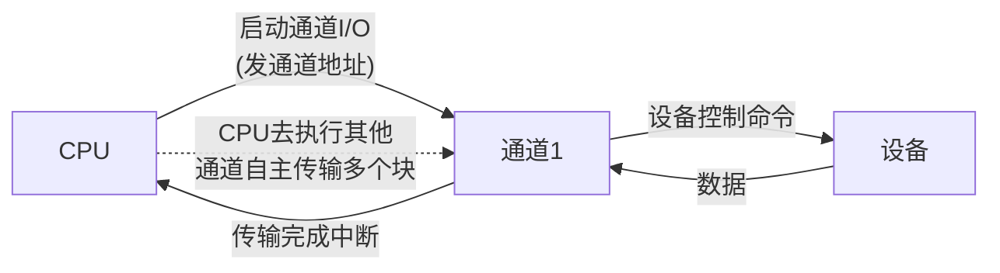

**通道的工作过程**：
```
1. CPU 编写通道程序（Channel Program）放入内存
2. CPU 向通道发送启动命令:
   - 通道程序首地址
   - I/O 设备标识
3. CPU 继续执行其他任务（完全释放）
4. 通道独立执行通道程序:
   - 解释通道指令
   - 向设备控制器发送命令
   - 控制数据传输
   - 可处理多个块、多个设备的I/O操作
5. 通道程序执行完毕:
   - 向 CPU 发中断通知
6. CPU 响应中断，检查操作结果
```

#### 通道类型

| 通道类型 | 英文名称 | 原理 | 特点 | 适用设备 |
|----------|----------|------|------|----------|
| **字节多路通道** | Byte Multiplexer Channel | 以字节为单位**分时**交叉传输多个低速设备的数据 | 每个设备分时共享通道带宽 | 键盘、鼠标、终端等**低速字符设备** |
| **数组选择通道** | Selector Channel | 以**数据块**为单位选择一个高速设备独占通道 | 一次只能连接一个设备传输 | 磁盘、磁带等**高速设备** |
| **数组多路通道** | Block Multiplexer Channel | 以**数据块**为单位，分时交叉传输多个高速设备的数据 | 结合前两种优点，高带宽多路复用 | 多个**高速块设备**并行 |

```
字节多路通道示意（时间片轮转）:
  设备A: |==|  |==|  |==|  |==|  ...
  设备B:    |==|  |==|  |==|  |==| ...
  设备C:       |==|  |==|  |==|  |==| ...
  通道:   A  B  C  A  B  C  A  B  C  ...

数组选择通道示意（独占方式）:
  设备A: |========|              |========|
  设备B:           |独占期间不服务B|         |独占期间不服务B|
  通道:        A传输          空闲       A传输

数组多路通道示意（块级交叉）:
  设备A: |==块A1==|  |==块A2==|  |==块A3==| ...
  设备B:    |==块B1==|  |==块B2==|  |==块B3==|...
  通道:   A  B     A  B     A  B     A  B  ...
```

#### 通道 vs DMA

| 特性 | DMA | 通道 |
|------|-----|------|
| 本质 | 硬件控制器 | **专用 I/O 处理器** |
| 指令系统 | 无（仅传输控制） | **有自己的指令集** |
| 执行能力 | 只能做数据传输 | 可执行通道程序（条件判断、循环等） |
| I/O 操作 | 一次传输一块 | 可执行复杂的**I/O 程序**，处理多个块 |
| CPU 干预 | 开始+结束 | 极少（几乎不干预） |
| 硬件成本 | 中等 | 高 |
| 适用场景 | 单个高速设备 | 大型机、服务器等需要大量 I/O 的系统 |

### 12.3.5 I/O 控制方式综合对比

| 控制方式 | CPU 参与度 | 数据传输路径 | 传输单位 | 适用场景 |
|----------|-----------|-------------|----------|----------|
| **程序 I/O** | **全程参与** | CPU → 设备 → CPU | 字/字节 | 简单嵌入式 |
| **中断驱动** | 每字节参与 | 设备 → CPU → 内存 | 字/字节 | 低速字符设备 |
| **DMA** | 仅开始和结束 | 设备 → DMA → 内存 | **数据块** | 高速块设备 |
| **通道** | 极少（启动和完成） | 设备 → 通道 → 内存 | **多个块** | 大型机/服务器 |

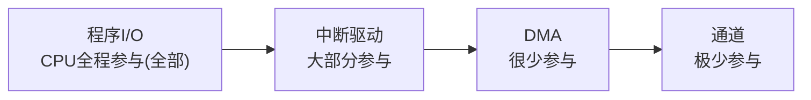

---

## 12.4 设备管理数据结构

操作系统使用四张关键数据结构来管理 I/O 系统：

### 12.4.1 设备控制表 DCT（Device Control Table）

**每个设备一张** DCT，描述单个设备的信息：

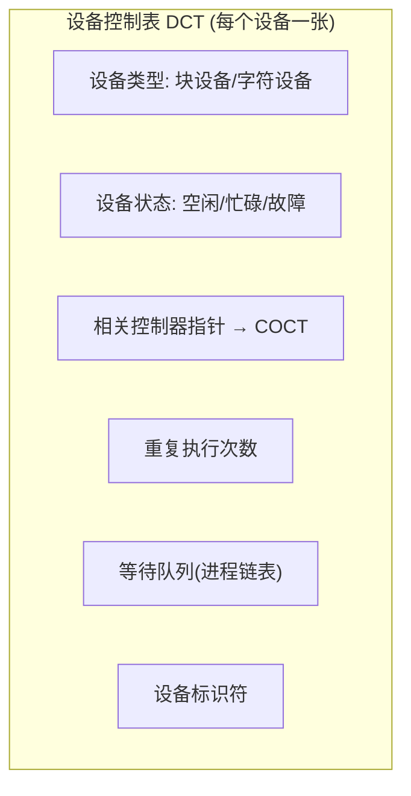

### 12.4.2 控制器控制表 COCT（Controller Control Table）

**每个控制器一张** COCT，描述控制器信息：

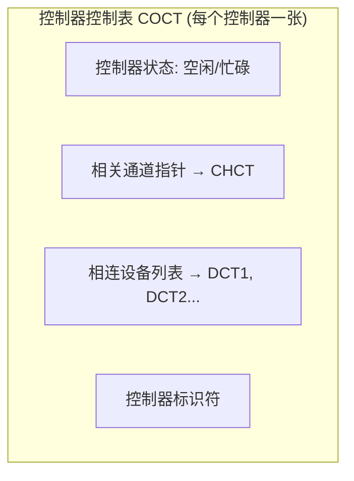

### 12.4.3 通道控制表 CHCT（Channel Control Table）

**每个通道一张** CHCT，描述通道信息：

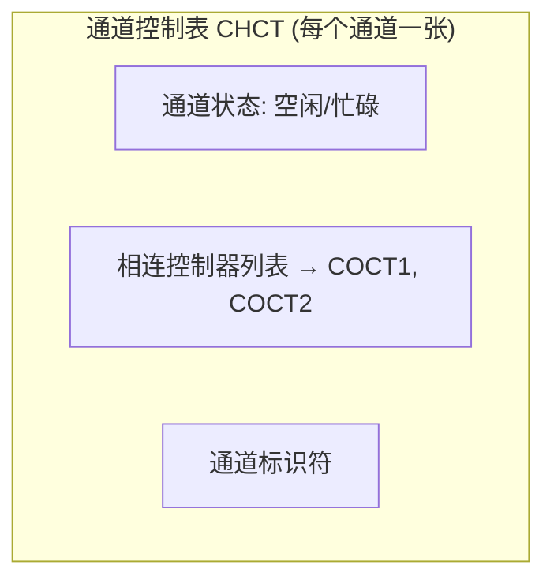

### 12.4.4 系统设备表 SDT（System Device Table）

**整个系统一张** SDT，记录所有设备的汇总信息：

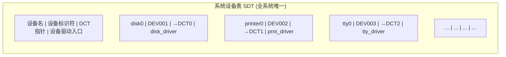

### 12.4.5 四张表的关系

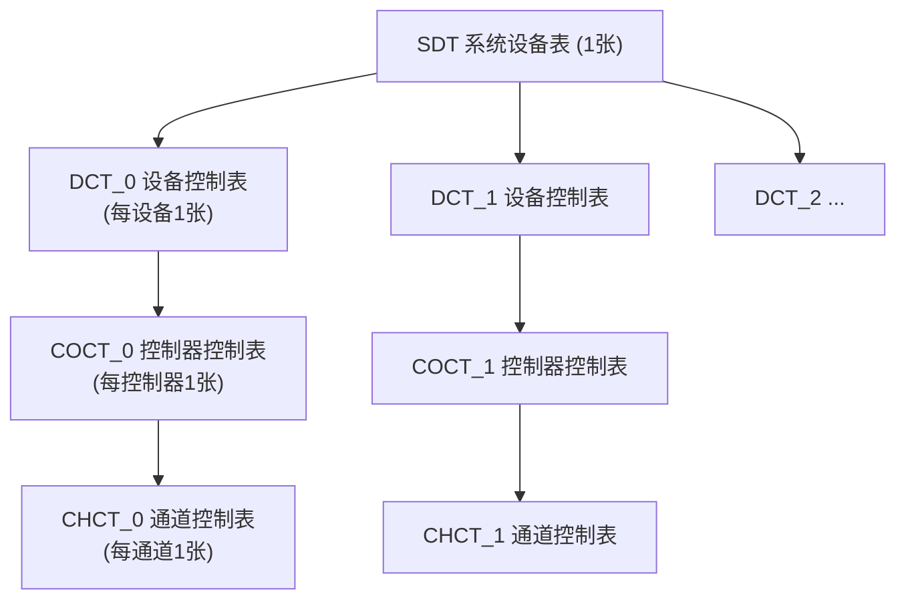

### 12.4.6 设备分配方式

| 分配方式 | 原理 | 优点 | 缺点 |
|----------|------|------|------|
| **静态分配** | 系统启动时将设备分配给各用户/进程，运行期间不改变 | 实现简单，不会死锁 | 设备利用率低，用户独占设备 |
| **动态分配** | 进程在运行时按需请求设备，使用后立即释放 | 设备利用率高，灵活 | 可能产生死锁，需要分配策略 |

**动态分配的分配策略**：

| 策略 | 说明 |
|------|------|
| **先来先服务（FCFS）** | 按请求顺序分配 |
| **优先级分配** | 高优先级进程优先获得设备 |
| **最短寻找时间优先** | 优先分配给移动距离最小的请求（磁盘） |

**设备分配步骤**：
```
1. 根据请求设备名查 SDT，获取 DCT 指针
2. 检查设备状态:
   → 若空闲: 检查分配安全性（是否有死锁风险）
   → 若忙碌: 将请求进程放入 DCT 等待队列
3. 分配设备，更新 DCT 状态
4. 查找相关 COCT，检查控制器状态
5. 查找相关 CHCT，检查通道状态
6. 控制器和通道都可用时，分配成功
7. 若控制器或通道忙碌，需等待
```

---

## 12.5 缓冲技术

### 12.5.1 为什么需要缓冲

| 问题 | 解决方案 |
|------|----------|
| CPU 速度（ns 级）远快于 I/O 设备（ms 级） | 缓冲区暂存数据，匹配速度差异 |
| 减少设备中断频率 | 数据凑满缓冲区后再处理，而非每字节中断 |
| 提高 CPU 和设备的并行度 | CPU 写入缓冲区后即可继续，设备后台输出 |
| 支持数据的预取和延迟写入 | 预读数据到缓冲区，写操作先缓冲再异步刷出 |

### 12.5.2 单缓冲（Single Buffer）

**原理**：在内存中分配**一个缓冲区**，操作系统和用户进程共享使用。


设备和用户进程**不能同时使用**缓冲区。

**时间线**：
```
设备填充缓冲区:  ████████░░░░░░░░░░░░░░░░
CPU处理缓冲区:   ░░░░░░░░░░████████░░░░░░
                  设备等待... ↑ CPU等待...
```

**计算平均耗时（读操作）**：
```
设处理一块数据: CPU处理时间 T
                设备传输时间 M (M < T 时)

使用单缓冲: max(M, T) + C
C = 数据从缓冲区到用户空间的拷贝时间
```

| 特点 | 说明 |
|------|------|
| 缓冲区非空时设备不能写入 | 设备和用户进程**串行**使用缓冲区 |
| 系统开销最小 | 只需一个缓冲区 |
| 适用于简单系统 | 速度差异不大的场景 |

### 12.5.3 双缓冲（Double Buffer）

**原理**：分配**两个缓冲区**，设备写入一个缓冲区的同时，CPU 可以从另一个缓冲区读取数据。

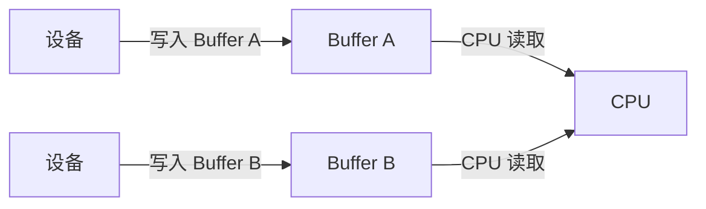

当 Buffer A 写满后切换，设备和 CPU 交替使用两个缓冲区。

**时间线**：
```
设备: ████████░░░░░░████████░░░░░░████████
CPU:  ░░░░░░░░████████░░░░░░████████░░░░░░
       两个缓冲区交替使用，设备和CPU几乎不间断工作
```

**计算平均耗时**：
```
使用双缓冲: max(M, T)  (无需额外拷贝时间C)
若 M = T: CPU和设备完全并行，无等待
```

| 特点 | 说明 |
|------|------|
| 设备和 CPU 可以**并行**工作 | 消除了单缓冲的等待时间 |
| 速度基本匹配时效果最好 | M ≈ T 时几乎无等待 |
| 开销适中 | 仅需两个缓冲区 |

### 12.5.4 循环缓冲（Circular Buffer / Ring Buffer）

**原理**：分配**多个缓冲区**组成环形队列，维护 `in` 指针（生产者写入位置）和 `out` 指针（消费者读取位置）。

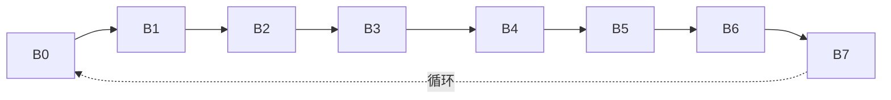

- **out** 指向的位置：下一个要读取的缓冲区
- **in** 指向的位置：下一个要写入的缓冲区
- 当 `in == out` 时：缓冲区**空**
- 当 `(in+1)%N == out` 时：缓冲区**满**

**示例**：空缓冲区 B3 B4 B5 B6 B7；已填充缓冲区 B0 B1 B2

**工作流程**：
```
生产者(设备):                          消费者(CPU):
  while (缓冲区满)                      while (缓冲区空)
      等待;                                 等待;
  从设备读取数据;                        从缓冲区取出数据;
  写入 buf[in];                         从 buf[out] 读取;
  in = (in + 1) % N;                   out = (out + 1) % N;
```

| 特点 | 说明 |
|------|------|
| 适合生产和消费速率都较快的场景 | 多个缓冲区交替使用，减少等待 |
| 需要处理缓冲区满/空的同步 | 通常使用信号量或条件变量 |
| N 个缓冲区时最大并行度为 N-1 | 一个缓冲区用于切换 |

### 12.5.5 缓冲池（Buffer Pool）

**原理**：系统维护一个**公共的缓冲区池**，包含多个缓冲区，根据不同用途组织成多个队列。是**最通用**的缓冲方案。

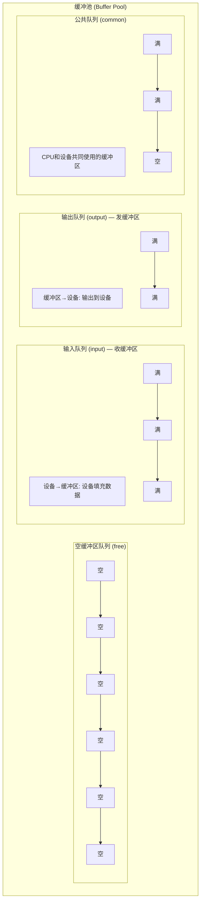

#### 缓冲池工作流程

```
收数据（输入操作）:
  1. 从空缓冲区队列取一个空缓冲区 → buf
  2. 将 buf 挂入输入队列（设备填充）
  3. 设备将数据写入 buf
  4. buf 写满后移出输入队列
  5. CPU 从 buf 中提取数据处理
  6. buf 清空后归还空缓冲区队列

发数据（输出操作）:
  1. CPU 将数据写入一个空缓冲区 buf
  2. 将 buf 挂入输出队列
  3. 输出进程将 buf 中的数据发送到设备
  4. buf 送完后归还空缓冲区队列
```

### 12.5.6 缓冲技术综合对比

| 方案 | 缓冲区数量 | CPU与设备并行度 | 实现复杂度 | 适用场景 |
|------|-----------|----------------|-----------|----------|
| **单缓冲** | 1 | 低（串行使用） | 最简单 | 嵌入式/简单系统 |
| **双缓冲** | 2 | 中（交替并行） | 简单 | 速度基本匹配的场景 |
| **循环缓冲** | N（固定） | 高（多缓冲轮转） | 中等 | 生产消费速率都快 |
| **缓冲池** | M（动态分配） | 最高（多队列复用） | 复杂 | **通用操作系统** |

---

## 12.6 SPOOLing 技术

### 12.6.1 基本概念

**SPOOLing（Simultaneous Peripheral Operation On-Line）** 即**外围设备同时联机操作**，是一种将**独占设备改造为共享设备**的经典技术。

**核心思想**：利用磁盘作为大容量缓冲区，在输入端和输出端都使用 SPOOLing 技术，使独占设备在逻辑上变为共享设备。

### 12.6.2 SPOOLing 系统组成

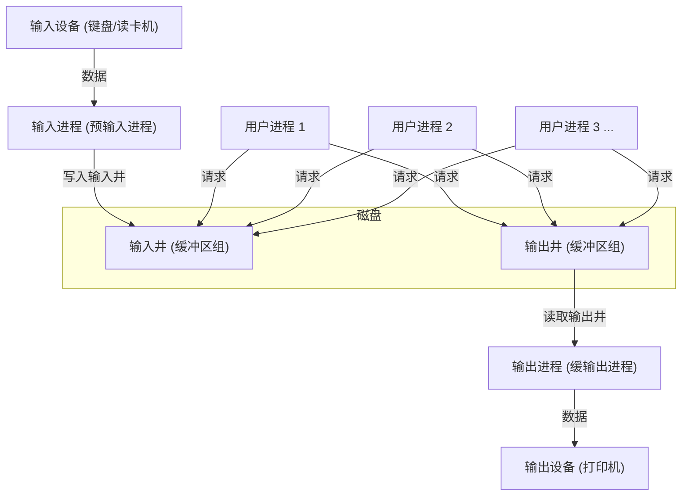

| 组成部分 | 位置 | 功能 |
|----------|------|------|
| **输入井** | 磁盘 | 暂存从输入设备收集的数据，等待用户进程读取 |
| **输出井** | 磁盘 | 暂存用户进程的输出数据，等待输出设备送出 |
| **输入进程（预输入进程）** | 内存（常驻） | 在系统空闲时，将输入设备的数据读入输入井 |
| **输出进程（缓输出进程）** | 内存（常驻） | 在系统空闲时，将输出井的数据送往输出设备 |
| **缓冲区** | 内存 | 数据在井和设备之间传输的中转缓冲 |

### 12.6.3 SPOOLing 在打印机中的应用实例

**问题**：打印机是独占设备，多个进程不能同时使用。若让每个进程直接控制打印机，需要等待前一个进程打印完毕。

**SPOOLing 解决方案**：

```mermaid
flowchart TD
    A["进程A: printf("Hello")"] -->|"write系统调用"| Disk["磁盘输出井"]
    B["进程B: printf("World")"] -->|"write系统调用"| Disk
    C["进程C: printf("Test")"] -->|"write系统调用"| Disk
    Disk -->|"缓输出进程读取"| Mem["内存缓冲区"]
    Mem -->|"逐行取出并发送"| Printer["打印机 (独占设备)"]
    Printer -->|"物理打印输出纸张"| Out["打印结果"]
```

**关键优势**：
- 进程 A/B/C 都感觉**独占**打印机，可以立即返回
- 实际打印机按顺序串行打印各进程的输出
- **逻辑上多个进程共享**同一个物理打印机
- 磁盘作为大容量缓冲区，数据不会丢失

### 12.6.4 SPOOLing 的特点与意义

| 特点 | 说明 |
|------|------|
| **提高 I/O 速度** | 磁盘速度（ms 级）远快于外设速度（秒级），数据先高速写入磁盘，再低速输出 |
| **将独占设备改造为共享设备** | 打印机等独占设备通过 SPOOLing 变为逻辑上的共享设备 |
| **实现虚拟设备** | 每个用户/进程都感觉拥有自己的打印机，实际共享一台物理设备 |

**SPOOLing 的本质**：用**时间换空间，用磁盘换设备**。利用磁盘的高速和大容量，为低速独占设备建立虚拟共享环境。

---

## 12.7 Linux 设备管理

### 12.7.1 设备文件系统 /dev

Linux 采用**"一切皆文件"** 的哲学，设备也通过文件接口访问。

#### 设备类型

| 类型 | 说明 | 访问方式 | 典型设备 |
|------|------|----------|----------|
| **字符设备（Character Device）** | 按字节流顺序访问，不可随机寻址 | `read()`/`write()` | 键盘、鼠标、终端、串口、打印机 |
| **块设备（Block Device）** | 按固定大小的块（如 512B/4KB）访问，支持随机访问 | `read()`/`write()`/`lseek()` | 硬盘、SSD、U盘、光驱 |

#### 设备号

设备号由**主设备号**和**次设备号**组成：

```
设备号 = 主设备号(Major) | 次设备号(Minor)

主设备号(Major): 标识设备类型，对应一个设备驱动程序
次设备号(Minor): 标识同类型设备中的具体设备实例

示例:
  /dev/sda  主设备号=8,  次设备号=0  → 第一块SCSI/SATA磁盘
  /dev/sda1 主设备号=8,  次设备号=1  → sda的第一个分区
  /dev/sda2 主设备号=8,  次设备号=2  → sda的第二个分区
  /dev/tty0 主设备号=4,  次设备号=0  → 第一个虚拟终端
```

#### 创建设备文件

```bash
# 手动创建设备文件（需要知道主/次设备号）
mknod /dev/mydevice c 250 0    # 创建字符设备 c=character
mknod /dev/myblock  b 251 0    # 创建块设备 b=block

# 查看设备号
ls -l /dev/sda
# brw-rw---- 1 root disk 8, 0 Jan  1 00:00 /dev/sda
# ↑块设备  主设备号8  次设备号0
```

### 12.7.2 udev 设备管理机制

**udev** 是 Linux 内核的设备管理器，**动态管理** `/dev` 下的设备文件。

#### udev 工作原理

```
设备热插拔事件流:

1. 设备插入(如USB设备)
   ↓
2. 内核检测到设备，创建设备对象
   ↓
3. 内核发出 uevent (内核事件)
   ↓
4. udevd 守护进程接收 uevent
   ↓
5. 根据规则文件匹配:
   /etc/udev/rules.d/*.rules
   /lib/udev/rules.d/*.rules
   ↓
6. 执行规则定义的操作:
   - 创建设备节点(/dev/xxx)
   - 设置权限和所有者
   - 创建符号链接(/dev/disk/by-id/xxx)
   - 执行自定义脚本(如挂载)
   ↓
7. 设备可用!
```

#### udev 规则示例

```bash
# /etc/udev/rules.d/99-custom.rules

# USB设备插入时创建固定名称的符号链接
SUBSYSTEM=="block", ATTRS{idVendor}=="1234", SYMLINK+="myusb"

# 设置设备权限
SUBSYSTEM=="tty", MODE="0666"

# 设备插入时自动执行脚本
ACTION=="add", SUBSYSTEM=="block", RUN+="/usr/local/bin/auto-mount.sh"
```

#### udev vs devfs

| 特性 | devfs（已淘汰） | udev（现代方案） |
|------|----------------|-----------------|
| 实现方式 | 内核空间 | **用户空间** |
| 设备发现 | 内核在设备注册时创建节点 | 内核发出事件，用户空间规则匹配 |
| 灵活性 | 有限 | **高度灵活**（支持复杂规则） |
| 命名 | 基于驱动注册顺序 | 基于设备属性（稳定名称） |
| 依赖 | 需要内核 devfs 支持 | 依赖 sysfs 导出的设备信息 |

### 12.7.3 Linux I/O 调度算法

Linux 内核提供了多种 I/O 调度算法，可根据场景选择：

| 调度算法 | 原理 | 特点 | 适用场景 |
|----------|------|------|----------|
| **Noop（None）** | 不排序，直接将请求下发到设备 | 零开销 | **SSD**、虚拟化、简单设备 |
| **Deadline** | 为每个请求设置截止时间，保证不超过等待时限 | 避免饥饿，适合实时性要求 | 数据库服务器 |
| **CFQ（Complete Fair Queuing）** | 为每个进程维护独立的 I/O 队列，按时间片轮转 | 公平性好，适合多任务 | 传统 HDD（Linux 默认） |
| **BFQ（Budget Fair Queuing）** | 改进的 CFQ，基于预算分配 I/O 带宽 | 交互式响应更好 | 桌面系统、嵌入式 |
| **Kyber** | 双队列模型（同步/异步请求分离） | 低延迟，轻量级 | NVMe SSD |

```bash
# 查看当前I/O调度算法
cat /sys/block/sda/queue/scheduler
# [mq-deadline] kyber bfq none

# 临时修改
echo bfq > /sys/block/sda/queue/scheduler

# 永久修改（内核启动参数）
# 在 /etc/default/grub 中加入:
# elevator=bfq
```

---

## 12.8 常见考点汇总

| 考点 | 要点 |
|------|------|
| **I/O 控制方式** | 四种方式的原理和对比：程序I/O（忙等待）、中断驱动（每字节中断）、DMA（每块仅开始和结束时干预）、通道（专用I/O处理器，执行通道程序） |
| **DMA 工作原理** | CPU设置参数→设备发DREQ→DMA请求总线→接管传输→完成中断；三种传输模式（单字节/块/请求）；三种总线使用方式（周期窃取/突发/透明） |
| **通道类型** | 字节多路通道（低速设备分时）、数组选择通道（高速设备独占）、数组多路通道（高速设备分时） |
| **DMA vs 通道** | DMA是硬件控制器，通道是专用I/O处理器（有自己的指令系统）；通道可执行复杂I/O程序 |
| **I/O 软件四层** | 中断处理程序→设备驱动程序→设备独立性软件→用户层软件；每层的职责 |
| **设备管理四张表** | SDT（系统级，1张）→ DCT（设备级，每设备1张）→ COCT（控制器级）→ CHCT（通道级）；关系和数量 |
| **设备分配** | 静态分配（预分配，利用率低）vs 动态分配（按需，可能死锁） |
| **单缓冲** | 一个缓冲区，设备和CPU串行使用，平均耗时 max(M,T)+C |
| **双缓冲** | 两个缓冲区交替，设备和CPU可并行，平均耗时 max(M,T) |
| **循环缓冲** | N个缓冲区环形队列，in/out指针，适合高速生产消费 |
| **缓冲池** | 公共缓冲区集合，多队列（空/输入/输出/公共），**通用操作系统采用** |
| **SPOOLing 原理** | 输入井+输出井+输入进程+输出进程；将独占设备改造为共享设备；核心是磁盘做缓冲 |
| **SPOOLing 打印机** | 进程写入输出井→缓输出进程读取→物理打印；多进程逻辑共享一台打印机 |
| **设备文件** | /dev 下的字符设备(c)和块设备(b)；主设备号(驱动程序)+次设备号(具体设备) |
| **udev 机制** | 基于 sysfs 的用户空间设备管理；uevent→规则匹配→创建设备节点；支持热插拔 |
| **Linux I/O 调度** | Noop(SSD)、Deadline(实时)、CFQ(HDD默认)、BFQ(桌面)；可用sysfs动态切换 |
